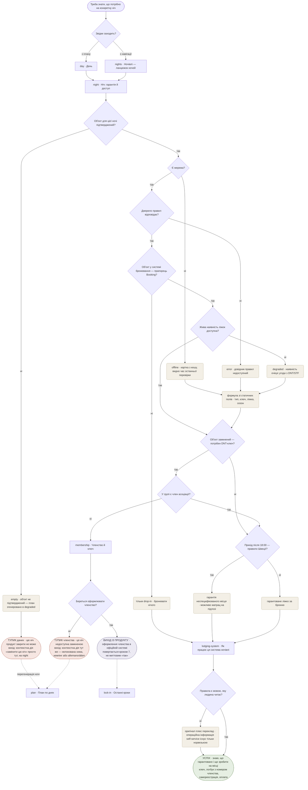
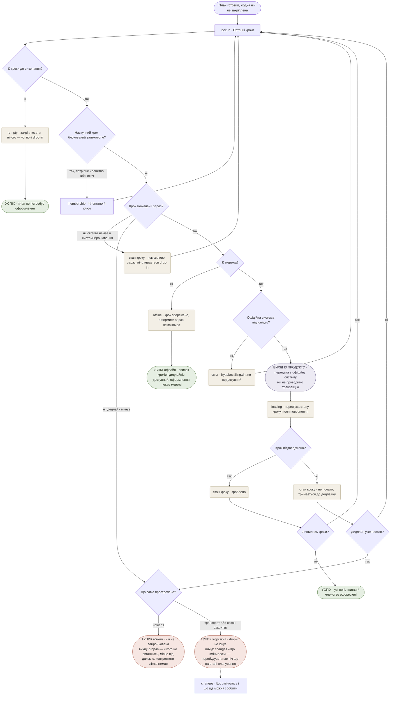
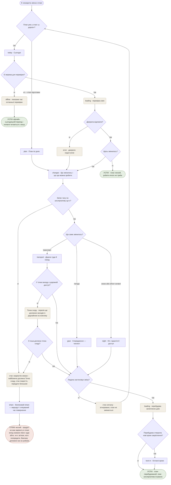
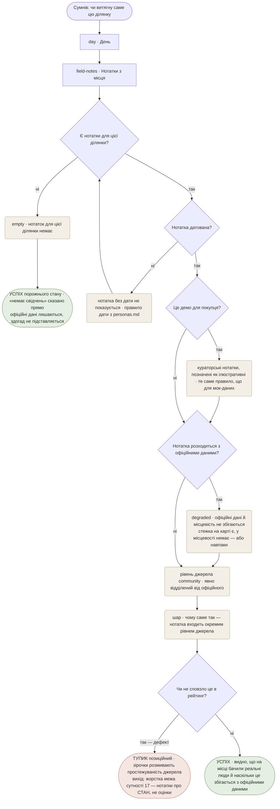
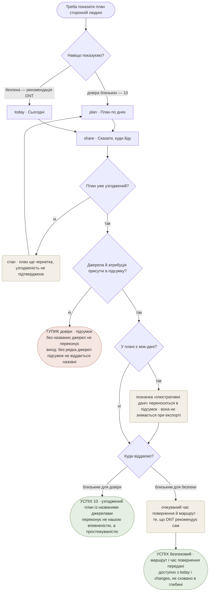

# User flows — Nestwood

Маршрути **primary-персони** (Kristin — член асоціації, знає систему) через екрани зі [sitemap.md](./sitemap.md). Нових екранів тут не вигадується: кожен вузол-екран існує в дереві sitemap або в навігації.

**Правило**: у кожного тупика названо вихід, і кожен названий вихід існує в дереві — вихід, якого немає, це дефект, а не чесність.

**База**: [sitemap.md](./sitemap.md) (сутності, екрани, навігація, трасування), [../concept/jtbd.md](../concept/jtbd.md), [../concept/personas.md](../concept/personas.md).

## Як читати

| Форма | Значення |
|---|---|
| `[Прямокутник]` | **екран** — існує в sitemap.md |
| `{Ромб?}` | **точка рішення** — гілки «так» / «ні» |
| `(Заокруглений)` | **стан або шар** — `loading`, `error`, `empty`, `degraded`, `offline`, інлайн-шар |
| `([Овал])` | **кінець** — успіх, тупик або вихід із продукту |

**Правило тупика**: у кожного тупика названо **вихід**, і кожен названий вихід мусить існувати в sitemap. Вихід, якого немає в дереві, — не чесність, а дефект (саме на цьому впала перша версія).

**Правило офлайну**: жоден потік не зациклюється на очікуванні мережі. «Працюй із тим, що є» — це завершення сценарію.

---

## MAIN JOB — узгодженість чотирьох джерел

> *«Коли я планую багатоденний похід у горах, я хочу бути впевненою, що маршрут, ночівля, спорядження й погода узгоджені між собою, щоб не бути сама тим, хто зводить чотири розрізнені джерела в одне ціле.»*

```mermaid
flowchart TD
    START(["Запуск застосунку"]) --> QACT{"Є активний або близький похід?"}
    QACT -->|так| FRESH("loading · перевірка свіжості<br/>один запит на весь план")
    FRESH --> plan["plan · План по днях"]
    QACT -->|ні| catalogue["catalogue · Карта<br/>каталог за сезонною доречністю · фільтри = бриф"]

    catalogue --> QFIT{"Фільтри дали маршрути?"}
    QFIT -->|"ні"| NOFIT("empty на catalogue · у цьому регіоні в цей місяць нічого не сходиться<br/>виходи: інший місяць · сусідній регіон · коротша дистанція · «зібрати маршрут»")
    NOFIT --> assemble["assemble · Зібрати маршрут<br/>скільки днів, звідки старт"]
    NOFIT -.-> catalogue
    QFIT -->|так| route

    assemble --> QCHAIN{"Ланцюжок ночей складається?"}
    QCHAIN -->|"ні"| GAP("empty на assemble · названо, ДЕ саме розрив<br/>«між Sitasjaure й Vaisaluokta 38 км — це не денний перехід»<br/>виходи: намет на 4-ту ніч · інший фініш · +1 день")
    GAP --> assemble
    QCHAIN -->|так| route["route · Картка маршруту<br/>карта, профіль, складність, превʼю формули гарантії, досяжність, умови"]

    route --> QINPUT{"Склад групи й членство відомі?"}
    QINPUT -->|"ні — холодний старт"| ASK("рядок на route · «нас двоє · є членство DNT»<br/>два поля, бо вони змінюють ВІДПОВІДЬ, а не сортування")
    QINPUT -->|"так — з акаунта"| QGEN
    ASK --> QGEN{"Є мережа для генерації?"}
    QGEN -->|ні| OFFGEN("offline на route · «Скласти мій план» заблоковано, бриф збережено")
    OFFGEN --> ENDGEN(["ЧЕСНИЙ КІНЕЦЬ · плану без мережі не існує<br/>генерація стартує сама, коли з'явиться мережа"])
    QGEN -->|так| LOAD("loading на plan · названі етапи<br/>стежки Turrutebasen → ночівлі → ключі й сезон → погода met.no")

    route -.зберегти маршрут.-> SAVED(["ЧЕСНИЙ КІНЕЦЬ · маршрут збережено<br/>повернення з plans, фільтри не втрачені"])

    LOAD --> QSRC{"Усі джерела відповіли?"}
    QSRC -->|ні| QCRIT{"Недоступне джерело критичне?"}
    QCRIT -->|так| ERR("error на plan · план не складається<br/>[ Повторити ] [ Змінити параметри ]")
    ERR --> DEAD1(["ТУПИК · без критичного джерела плану немає<br/>здогад замість даних не підставляється"])
    DEAD1 -.-> PARAMS
    QCRIT -->|ні| DEG("degraded · поле «чого в плані свідомо немає»")
    DEG --> plan

    QSRC -->|так| QLOADOK{"Навантаження вкладається в задані дні?"}
    QLOADOK -->|"ні"| OVER("конфлікт · «40 год ходу на 2 доби» за Naismith<br/>виходи: +2 дні · коротший варіант · інший фініш")
    OVER --> LOAD
    QLOADOK -->|так| QNIGHT{"Ночівля знайдена на кожну ніч?"}
    QNIGHT -->|ні| QHARD{"Дати жорсткі — прапорець «не рухаються»?"}
    QHARD -->|ні| PARAMS
    QHARD -->|так| ALT("empty на plan · у ці дати не сходиться<br/>2–3 виходи з наслідком: «на день коротше — 64 км» · «інший фініш» · «зрушити дати»")
    ALT --> LOAD
    QNIGHT -->|так| plan

    plan --- SRC("©Kartverket у хромі · «ілюстративні дані» на самому полі наявності ліжок")
    plan --- ASSUME("зона «на чому це стоїть» · «для 2 осіб · 1 член DNT · темп середній — змінити»")
    plan --> QNET{"Є мережа?"}
    QNET -->|ні| OFF("offline · план, ночівлі й останній відомий розклад із кешу<br/>видно час останньої перевірки")
    OFF --> WINOFF(["УСПІХ офлайн · план, ночівлі й транспорт доступні, свіжість не гарантована"])
    plan --> transport["transport · Дорога туди й назад"]
    OFF -.читається з кешу.-> transport
    plan --> day["day · День"]
    plan --> gear["gear · Спорядження — чеклист"]
    day --> gear
    day --> night["night · Ніч: гарантія й доступ"]
    day --> WHY("шар · чому саме так — named-contributor breakdown")

    plan --> QHOR{"Дати в межах прогнозу ~10 днів?"}
    QHOR -->|ні| NORM("сезонна норма · окремий рівень довіри, поза вердиктом<br/>продукт сам повернеться з прогнозом за ~10 днів до виходу")
    QHOR -->|так| VERD
    NORM --> VERD("вердикт узгодженості · продукт стверджує сам, а не питає<br/>+ чотири сигнали в рядку кожного дня")

    VERD --> QCONF{"Є конфлікт?"}
    QCONF -->|ні| WIN(["УСПІХ · план сходиться<br/>далі: lock-in закріпити, share показати, або офлайн-пакет"])
    QCONF -->|так| NAMED("конфлікт названо: який день і які саме елементи")
    NAMED --> QFIX{"Яким входом правимо?"}
    QFIX -->|"контекстна дія в місці наслідку"| LOAD2("loading · перегенерація")
    QFIX -->|"склад групи, членство, темп"| ASSUME
    QFIX -->|"дати, регіон, маршрут"| PARAMS["Параметри походу · фільтри catalogue + «змінити маршрут» на plan"]
    QFIX -->|"складне формулювання"| TALK("шар · розмовне уточнення")
    ASSUME --> LOAD2

    PARAMS --> QLOCK{"Є вже закріплені кроки в lock-in?"}
    QLOCK -->|так| WARNL("попередження · що саме зламається із закріпленого")
    WARNL --> LOAD2
    QLOCK -->|ні| LOAD2

    TALK --> QUNDERSTOOD{"Запит зрозумілий і в межах шару?"}
    QUNDERSTOOD -->|ні| TERR("error шару · не зрозуміли запит або зміна поза межами")
    TERR --> plan
    QUNDERSTOOD -->|так| LOAD2
    LOAD2 --> QFEAS{"Правка дає розв'язний план?"}
    QFEAS -->|так| plan
    QFEAS -->|ні| IMPOSS("стан «неможливо» · таку зміну план не витримує")
    IMPOSS --> DEAD3(["ТУПИК уточнення · попередній план збережено незмінним<br/>вихід: plan з поясненням, що саме не сходиться"])
    DEAD3 -.-> plan

    classDef state fill:#f3efe6,stroke:#b3a888,color:#2f2f2f;
    classDef dead fill:#f6e6e2,stroke:#c08376,color:#2f2f2f;
    classDef win fill:#e6efe3,stroke:#7c9a6d,color:#26301f;
    classDef exit fill:#eceaf3,stroke:#8d86a8,color:#2c2937;
    class LOAD,LOAD2,FRESH,OFFGEN,ERR,DEG,OFF,SRC,ASSUME,WHY,TALK,TERR,IMPOSS,ALT,NORM,VERD,NAMED,WARNL,NOFIT,GAP,ASK,OVER state;
    class DEAD1,DEAD3 dead;
    class WIN,WINOFF win;
    class ENDGEN,SAVED exit;
```

**Рішення в потоці**

0. **Є активний або близький похід?** — визначає, який дім людина бачить: **Плани**, якщо похід активний або старт за день-два, **Карта** в решті випадків. Вхід у план іде **через перевірку свіжості**: один запит на весь план, а не на кожен день. Це той самий виклик, що живить `Зміну/сигнал`, тобто вхід у `changes` береться звідси, а не з окремого механізму.
1. **Фільтри дали маршрути?** — гілка «ні» це не помилка, а нормальний результат, і тепер у неї **чотири виходи** замість трьох: інший місяць, сусідній регіон, коротша дистанція і **«зібрати маршрут»**. Останній — головна зміна: наш власний тупик став точкою входу в генеративну фічу, тобто в те, чого не може жоден конкурент.
2. **Ланцюжок ночей складається?** — розвилка генеративного входу. Порожній результат тут **називає, де саме розрив і чому** («між Sitasjaure й Vaisaluokta 38 км — це не денний перехід»), а не каже «нічого не знайдено». Komoot поріже 200 км за цільовою довжиною дня й підкладе generic-житло; ми ріжемо по місцях, де реально можна спати.
2а. **Склад групи й членство відомі?** — прогресивне профілювання в потоці. Для повторного користувача гілка «так» (усе з акаунта), для холодного старту — **рядок на картці, не екран**. Питаємо саме ці два, бо вони змінюють **відповідь**: бронь це N ліжок, спорядження частково спільне, а членство — змінна №4 формули гарантії. Бюджет не питається взагалі (опційний, рішення №6), точні дати — у потоці 7.
2б. **Є мережа для генерації?** — генерація це серверний виклик `claude-opus-5`, тому без мережі плану не буде **взагалі**. Кнопка блокується, бриф зберігається, генерація стартує сама при появі мережі. **Стан тепер живе в одному місці — на `route`**, а не на двох різних екранах залежно від персони, як було у візарді.
2в. **Навантаження вкладається в задані дні?** — «200 км за два дні» дає ~40 годин ходу і **мусить стати конфліктом до того, як план згенерується як норма**. Рахується названим опублікованим методом (Naismith + Langmuir, поправка Tranter на форму й вагу рюкзака), і метод видно в інтерфейсі. Це єдина розвилка потоку, яка працює **там, де офіційної градації немає** — тобто в більшості випадків.
3. **Усі джерела відповіли?** → **Недоступне джерело критичне?** — без Kartverket/Lantmäteriet плану немає; без живої наявності ліжок план є, просто чесно неповний. Відмова рендериться **на `plan`**, там же, де показувався б результат (continuity of place), із повтором і переходом у параметри — а не викидає людину у форму після чотирьох тапів.
4. **Ночівля на кожну ніч?** → **Дати жорсткі?** — прапорець із фільтрів вирішує, що рухати: вікно чи маршрут. **Тупика тут більше немає** *(рішення №11)*: продукт знає причину, тому дає 2–3 конкретні виходи з наслідком у рядку, і тап одразу генерує.
5. **Дати в межах прогнозу?** *(нове, рішення №9)* — поза горизонтом met.no (~10 днів) граф «погода» показує **сезонну норму, явно позначену**, і вона **не входить у вердикт**. Інакше план стверджував би узгодженість із погодою на дати, для яких прогнозу не існує — тобто той самий Zillow-антипатерн, який ми критикуємо, на happy path.
6. **Є конфлікт?** *(замінило `QAGREE`, рішення №8)* — **головна правка всієї ревізії**. Раніше потік вів людину через `night`, `gear`, `transport` і потім питав її, чи все сходиться — тобто робив її інтеграційним шаром рівно там, де MAIN JOB обіцяє це зняти. Тепер узгодженість **обчислюється**: зведений вердикт зверху `plan` плюс чотири сигнали в рядку кожного дня, а конфлікт названо конкретно.
7. **Яким входом правимо?** *(рішення №10)* — три входи за типом зміни: контекстна дія в місці наслідку, «Параметри походу» — фільтри й «змінити маршрут» — для дат, регіону й маршруту, вільний текст для складного. Розвилка **«є вже закріплені кроки в `lock-in`?»** обов'язкова: зміна дат після оформленої броні ламає 7, і людина мусить побачити це **до** застосування, а не після.
8. **Запит зрозумілий і в межах шару?** + **Правка дає розв'язний план?** — перша ловить запит поза межами шару (градація, транзакції, вигадані дані), друга — нерозв'язну конфігурацію. Друга тепер стосується **всіх трьох входів правки**, не лише текстового.

**Стани**: `loading` (генерація з названими етапами, перегенерація і **перевірка свіжості на вході**) · `error` (критичне джерело — **на `plan`**) · `error` шару (незрозумілий запит) · `неможливо` (правка нездійсненна) · `empty` (**план не склався в задані параметри — з готовими виходами**) · `degraded` (план із полем «чого в ньому немає») · **`норма замість прогнозу`** (дати поза горизонтом) · **`конфлікт` / `сходиться`** (вердикт узгодженості) · `offline` — **двох різних природ**: на дії генерації означає «плану не буде», у плані «читай те, що є» · **©Kartverket у хромі** — не крок потоку, а постійний елемент, тому підвішений ребром без напрямку.

**`plan` має всі стани, і це наслідок рішення №12**: генерація, її відмови й результат живуть на одному екрані. Людину не викидає у форму, а екран, який ніс MAIN JOB, більше не існує тільки в успішному вигляді.

**Кінці**

- **Успіх** — план **сходиться, і це сказав продукт**, а не людина після обходу чотирьох екранів; далі `lock-in`, `share` або офлайн-пакет із встановленням.
- **Успіх офлайн** — окремий термінал, а не пауза: план, ночівлі **й останній відомий розклад транспорту** читаються з кешу, видно час останньої перевірки. До ревізії офлайн-гілка нікуди не вела, а `transport` у неї не входив.
- **Чесний кінець** — мережі для генерації немає. **Єдина точка продукту, де офлайн не має продуктового результату**, і це межа архітектури, а не недоробка UI: генерація серверна, взятись плану нізвідки. Правило «офлайн-сценарій мусить завершуватись» виконано — людину відпускають із збереженим брифом, а не лишають чекати мережу. Хвіст: план, що чекає генерації, потребує стану у **`plans` «Плани»**.
- **Тупик 1** — критичне джерело недоступне. Рендериться на `plan`, вихід — повтор або «Параметри походу». Здогад замість даних не підставляється. **Єдиний тупик, що лишився у воронці.**
- **Тупик 3** — правка нездійсненна. Вихід: попередній план **лишається цілим**, і показано, що саме не сходиться. Найважливіша частина — не зламати вже наявний план невдалою правкою.

---

## 2 — що конкретно потрібно для кожної ночівлі *(Top Job #1)*

⚠️ **У цього потоку є вхід до того, як план існує.** **Превʼю формули гарантії стоїть на `route`, картці маршруту** — по хижах вздовж маршруту, у вигляді, який ще не знає складу групи й членства, і прямо про це каже: «для тебе це виглядатиме інакше — залежить від членства й складу групи».

Це не скорочення потоку, а **другий вхід у нього**: неповнота на картці вмотивовує генерацію й одночасно демонструє те, чого не вміє жоден конкурент. Повний потік нижче лишається чинним для стану «план уже є».

> *«Коли я не знаю (чи не до кінця знаю) локальну систему ночівлі — типи об'єктів, потребу в ключі чи членстві, правила й час приходу, — я хочу зрозуміти, що саме мені потрібно зробити на кожну ніч, щоб не опинитися без даху над головою й не порушити правила.»*

**Рішення в потоці** — це буквально **чотири змінні формули** з Ось A ([personas.md](../concept/personas.md)), розкладені в порядку, у якому вони звужують відповідь:

1. **Об'єкт підтверджений?** *(нове)* — flow MAIN дозволяє згенерувати план у `degraded`, тобто ніч без підтвердженого об'єкта потрапляє сюди легально. До ревізії не було визначено, що тоді показано.
2. **Мережа / джерело правил** *(нове)* — обидві відмови ведуть **одразу в статичну гілку**, минаючи питання про живу наявність. До ревізії офлайн-шлях вливався так, що далі було можливе «жива наявність доступна — так», чого офлайн не буває.
3. **Прапорець `Booking`** — тип об'єкта. Немає в системі бронювання (`rastskydd`, `vindskydd`, частина хиж) — уся гілка броні відпадає.
4. **Жива наявність доступна?** — єдине реально заблоковане поле. «Ні» не зупиняє потік: формула добудовується зі статичних полів публічної схеми NTB.
5. **Замкнений об'єкт + членство** — не ціна, а умова доступу: ключ DNT це ексклюзивна перевага членства.
6. **Час приходу 18:00** — шведське правило, що змінює зміст гарантії, а не факт її наявності.
7. **Мова правил** — розвилка з дослідження UiO/UiB і звіту іноземки 2022.

**Стани**: `empty` (об'єкт не підтверджений) · `error` (довідник правил) · `offline` · `degraded` (наявність очікує угоди).

**Кінці**

- **Успіх** — людина знає **обидві** частини: що гарантовано і що зробити на місці.
- **Вихід із продукту** — оформлення членства. Виправлено: раніше «оформлює членство?» було миттєвим «так», тоді як flow 7 показує той самий крок як передачу з перевіркою повернення. Один крок не може коштувати різного в двох потоках.
- **Тупик членства** — замкнена хижа + жодного члена + відмова оформлювати. **Вихід — контекстна дія в точці збою** — заміна ночівлі просто на `night`. Відновлення, що живе на іншому екрані та ще й через вільний текст, змушувало людину переформульовувати те, що продукт уже знає.
- **Тупик даних** — об'єкт не підтверджений навіть статично. Той самий вихід, той самий принцип.

---

## 7 — довести план до реально закріплених ночівель

⚠️ **Три класи.** Job дослівно каже «щоб **ночівлі, квитки й членство** справді оформлені». Тепер `lock-in` веде три черги з різними дедлайнами й різними системами передачі:

| Клас | Куди передаємо | Дедлайн задає |
|---|---|---|
| **Ночівлі** | офіційна система DNT/STF, **послідовно, по одній транзакції** | сезон відкриття, заповнюваність |
| **Квитки** | deep link у чекаут оператора з підставленими параметрами; квиток потім **зберігається в `transport`** | розклад і ціна, що росте |
| **Членство** | оформлення в асоціації (`membership`) | потрібне **до** броні замкненої хижі, тобто блокує ночівлі |

**Тут же питаються точні дати.** Вони свідомо не питались на вході (поза горизонтом met.no місяця достатньо) — а тут від них залежать дедлайни, тому це перше місце, де дата має ціну.

⚠️ **Квитки зберігаємо, не продаємо.** Транзакцію не проводимо, і причина не технічна: продаж транспорту разом із ночівлею робить нас **організатором пакетної подорожі** за EU Package Travel Directive — інший тип компанії з відповідальністю за кожен елемент. Плюс це рівно та роль, за яку DNT зараз банить комерційних операторів у своїх хижах.

> *«Коли мій план готовий, але жодна ніч ще нічим не закріплена, я хочу довести його до стану, коли ночівлі, квитки й членство справді оформлені, щоб не тримати в голові список із N окремих транзакцій.»*

**Рішення в потоці**

1. **Є кроки до виконання?** — `empty` тут не збій, а нормальний результат: маршрут виключно по drop-in-об'єктах закріплювати нічого.
2. **Крок блокований залежністю?** — членство → ключ → доступ до замкнених self/ubetjent хиж. Порядок іде з офіційної системи, не з нашого UI.
3. **Крок можливий зараз?** — три різні «ні»: об'єкта немає в системі бронювання (нормально), дедлайн минув (тупик), немає мережі (відкладено, але зі своїм успішним кінцем).
4. **Дедлайн уже настав?** *(нове)* — до ревізії «не почато» вело в тупик **безумовно**, тобто людина, що повертається завтра, у моделі такої можливості не мала.
5. **Що саме прострочено?** *(нове)* — раніше один вузол покривав і ночівлю, і транспорт. Пропущений потяг drop-in не має: тупики різні за жорсткістю й за виходом.

**Цикл, а не лінія**: потік повертається в `lock-in` після кожного кроку, бо DNT вимагає *«complete the booking and payment for one cabin before proceeding to the next»*.

**Стани**: `empty` · `offline` · `error` · `loading` (перевірка після повернення) · стани кроку: «неможливо зараз», «зроблено», «не почато».

**Кінці**

- **Успіх A** — оформлювати не було чого. **Успіх B** — усі кроки закриті. **Успіх офлайн** — список і дедлайни доступні; оформлення чекає мережі.
- **Вихід із продукту** — передача в офіційну систему. Продуктова межа, не помилка.
- **Тупик м'який** — ніч не заброньована. Вихід чесний: нікого не виганяють.
- **Тупик жорсткий** — транспорт або сезон. Вихід у **`changes`**, і він тепер досяжний: до ревізії `changes` був прив'язаний до стану «у дорозі», тобто вихід із тупика вів у замкнені двері.

---

## 3 + 6 — зміна погоди й транспорту, поки альтернатива ще існує

> *3: «Коли прогноз погоди змінюється — **під час підготовки чи вже в дорозі**, — я хочу дізнатися, що саме в моєму поході це зачіпає, щоб встигнути відреагувати.»*
> *6: «…я хочу знати, чи справді туди можна дістатись і повернутись у мої дати, щоб не залишитись відрізаною на місці без варіантів.»*

Обидва зведені в один потік свідомо: механізм спільний, і він **не про сповіщення, а про запас часу**.

⚠️ **Дві речі, від яких залежить цей потік.** **`Точка сходу` (сутність 19) має постійну поверхню — вкладку «Безпека»**, разом із координатами й лавинною обстановкою: як наповнення стану `варіантів немає` вона зʼявлялась би саме тоді, коли вже пізно. І **сигнал доставляється push'ем**, а не віджетом і не безперервним трекінгом — саме тому застосунок нативний одразу: web push на iOS працює лише для встановленого застосунку.

**Рішення в потоці**

1. **План уже «у дорозі»?** *(нове)* — вхід роздвоєний. До ревізії потік починався тільки з `today`, тобто зміни на етапі підготовки не мали куди приходити, хоча 3 прямо їх називає.
2. **Є мережа?** — перше рішення, а не останнє: offline-first обов'язковий, і `today` мусить бути корисним без мережі. Тепер офлайн має **свій успішний кінець**, а не повернення в ту саму перевірку.
3. **Запас часу на альтернативу ще є?** — **головне рішення продукту в цій частині**, і воно стоїть перед типом зміни. Elvah не потрібне було повідомлення в момент скасування: їй потрібен був сигнал за день-два, поки існував варіант звернути на Riksgränsen або Beisfjord.
4. **Дорожній доступ до точки виходу?** — розвилка, якої немає в жодного конкурента: замінний автобус до Katterat неможливий, бо дороги туди немає. Тепер вона веде не в глухий тупик, а в **перелік ще досяжних точок сходу** (сутність 19).
5. **Перебудова створила нові кроки закріплення?** *(нове)* — перебудований день може вимагати нової броні. До ревізії потік завершувався на `plan`, і 7 після перебудови не існував.

**Стани**: `offline` (зі своїм кінцем) · `loading` (перевірка й перебудова) · `error` (джерело недоступне — і саме воно **є** зміною плану, тому веде в `changes`, а не в глухий кут) · `варіантів немає` (новий стан `changes`) · стан сигналу «зігноровано».

**Кінці**

- **Успіх A** — змін немає. **Успіх B** — план перебудований, поки альтернатива існувала. **Успіх офлайн** — сьогоднішній перехід і ночівля з кешу.
- **Тупик чесний** — запасу часу немає. Це єдиний тупик продукту без продуктового розв'язання, і тепер у нього **існуючий** вихід: стан `варіантів немає` з найближчою досяжною точкою сходу, станом покриття й безпековим share. Раніше вихід складався з трьох речей, жодної з яких у продукті не було.

---

## 11 — чи це реально для людини як я

⚠️ У цього потоку **немає вмісту на старті**. Він стоїть на відгуках, а відгуків нуль — і, на відміну від польових нотаток, засіяти їх чесно неможливо: доглядач хижі може повідомити стан броду, але не «якщо вона змогла, то і я зможу». Або приймаємо 11 як необслужений на запуску, або підставляємо **куровані чужі трипрепорти з атрибуцією** — те саме джерело, з якого 11 і взявся. Відкрите питання в `CLAUDE.md`.

> *«Коли я не знаю, чи мій рівень підготовки підходить для такого походу, я хочу відчувати, що це реально для людини як я, а не тільки для досвідчених, щоб не почуватись одна в цьому рішенні.»*

Потік доданий після критики: `field-notes` не проходив через жоден сценарій, а стан `degraded` «розходження офіційних даних із місцевістю» — **підстава існування цього екрана** — не був протрасований ніде.

**Рішення в потоці**

1. **Є нотатки для цієї ділянки?** — `empty` тут найімовірніший стан, а не крайній випадок: у продукту без користувачів своїх нотаток немає.
2. **Нотатка датована?** — правило дати з personas.md, застосоване як фільтр у продукті, а не тільки в дослідженні.
3. **Це демо для покупця?** — розвилка, яку sitemap вимагає прямо: вигаданих «відгуків користувачів» у демо бути не може, тому або кураторські й позначені, або слот.
4. **Розходження з офіційними даними?** — те, заради чого екран існує. Норвежці описують розходження в обидва боки й самі правлять Kartverket через «Rett i kartet».
5. **Чи не сповзло це в рейтинг?** — не UI-рішення, а контроль межі. Винесений у потік навмисно: це найтонша межа продукту, і зісковзнути з неї можна тихо.

**Стани**: `empty` (нотаток немає) · `degraded` (розходження карти з місцевістю) · відфільтрована нотатка без дати · кураторський режим демо.

**Кінці**

- **Успіх** — видно стан на місці й наскільки він збігається з офіційними даними.
- **Успіх порожнього стану** — окремий кінець: «свідчень немає» сказано прямо. Порожньо тут не збій.
- **Тупик позиційний** — не стан людини, а стан продукту: якщо шар сповз у рейтинги, ми втратили простежуваність джерела, тобто єдине, що продаємо.

---

## 10 — мати чим підтвердити реалістичність плану

> *«Коли близька людина висловлює сумнів у моєму рішенні йти в похід, я хочу мати щось конкретне, що підтверджує реалістичність мого плану, щоб не почуватися нерозважливою в її очах.»*

Потік доданий після критики: E не проходив через жоден сценарій, і саме на ньому виявилась суперечність рівнів — глибока рідкісна дія, яку інший потік називав аварійним виходом.

**Рішення в потоці**

1. **Навіщо показуємо?** — перша ж розвилка розділяє дві підстави, які sitemap просив не змішувати: 10 про довіру близьких, безпековий share про безпеку. Форма одна, входи різні, рівні різні.
2. **План уже узгоджений?** — чернетку віддавати назовні не можна: підсумок обіцяє реалістичність.
3. **Джерела й атрибуція присутні?** — підсумок без названих джерел не переконує **й порушує CC BY 4.0**, якщо містить дані Kartverket.
4. **Є мок-дані?** — позначка **переноситься в експорт**. Це найлегше місце випадково збрехати: усередині продукту позначка є, а у витягнутому підсумку її немає.

**Стани**: план-чернетка · перенесення мок-позначки в експорт.

**Кінці**

- **Успіх 10** — узгоджений план із названими джерелами; переконує простежуваність, не наша впевненість.
- **Успіх безпековий** — маршрут і очікуваний час повернення передані; доступно з `today` і `changes`.
- **Тупик довіри** — підсумок без рядка джерел назовні не віддається. Технічний тупик із коротким виходом, але записаний явно, бо це водночас юридична вимога.

---

## Що ці потоки показали окремо від діаграм

1. **Тупик «немає запасу часу» — єдиний без продуктового виходу**, і саме він виявив, що аварійний вміст був спроєктований найгірше з усього: вихід складався з трьох речей, жодної з яких не існувало. Наслідок ширший за один вузол — записане правило навігації №9: **аварійний вміст не буває глибоким**.
2. **`degraded` не блокує жоден потік.** Ні в MAIN, ні в 2 відсутність живої наявності не зупиняє людину. Прямий доказ тези CLAUDE.md: заблоковане рівно одне поле.
3. **7 — єдиний потік із виходом із продукту**, і він циклічний через вимогу самої DNT. Найкраще місце в демо, щоб показати межу «ми не оператор ночівлі», не пояснюючи її словами.
4. **`empty` виявився нормальним результатом чотири рази**: закріплювати нічого, змін немає, нотаток для ділянки немає, об'єкт не підтверджений. Три перші потребують свого копірайтингу — «нічого не знайдено» тут неправильна інтонація.
5. **Офлайн має чотири різні успішні кінці**, а не один: план із кешу, ночівля з кешу, список кроків без оформлення, сьогоднішній перехід. Це підтверджує, що offline-first у нас справді констрейнт стеку, а не фіча — і що його не можна змоделювати одним станом.
6. **Один екран народився з навігації, а не з jobs** (`nights`) і **одна сутність — із критики потоків** (19, Точка сходу). Обидва механізми появи варто тримати видимими: перший — потреба структури, другий — дірка, знайдена перевіркою. Ні той, ні той не є голосом людини, тому обидва перші в черзі на перевірку.
7. **Офлайн виявився двома різними станами, а не одним**. Скрізь у продукті офлайн означає «працюй із тим, що є» і має успішний кінець — а у візарді він означає «плану не буде», бо генерація серверна. Обидва чесні, але поведінка й копірайтинг у них протилежні, і зводити їх в один стан не можна. Механізм пропуску той самий, що з сутністю 19: **дірку знайшов не аудит потоків, а спроба скласти замовлення на макети** — перевірка «що саме тут малювати» ловить те, чого не ловить перевірка «чи є тут job».
