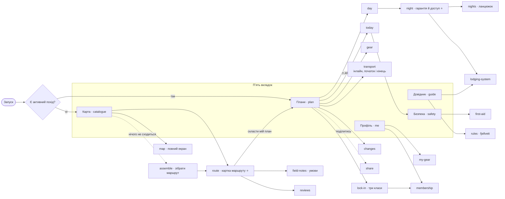
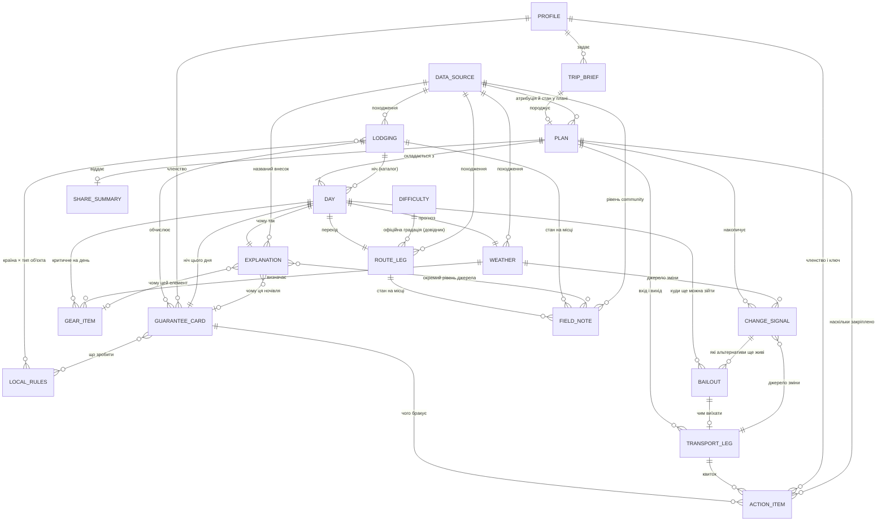

# Sitemap — Nestwood

**Статус**: чинна структура — **пʼять вкладок, 27 екранів, 12 jobs**, матриця трасування закривається в обидві сторони. Розділи: **«Сутності»** (інвентаризація об'єктів), **«Екрани»** (дерево), **«Навігація»** (модель руху, рівні, глибина в тапах), **«Трасування»** (матриця job × екран зі списками сиріт) і **«Рішення»**. Потоки — в окремому файлі [flows.md](./flows.md).

База: [../concept/personas.md](../concept/personas.md), [../concept/jtbd.md](../concept/jtbd.md), [../research/research.md](../research/research.md), схема NTB із [github.com/Turistforeningen](https://github.com/Turistforeningen) (`Hytteadmin`/`Turadmin`, модель `cabin.js`).

---

## Сутності

### Правила, за якими складено список

1. **Кожна сутність має вказаний job з [jtbd.md](../concept/jtbd.md)**, який її породжує. Сутність без job — у розділ «Під питанням», не тут.
2. **`[?]`** — об'єкт, поле або зв'язок, який ми лише припускаємо: job є, але форма об'єкта з джерел не виводиться.
3. **Похідні сутності позначені окремо.** Частина об'єктів не зберігається, а обчислюється (картка гарантії, пояснення рішення) — але людина має справу саме з ними, тому вони в списку як сутності, не як поля.
4. **Дизайн-принципи ≠ jobs.** «Деградувати чесно», offline-first, «показувати офіційну градацію, не вигадувати свою» — це констрейнти, які проявляються **полями всередині** сутностей, а не окремими об'єктами. Там, де така вимога — єдина підстава для об'єкта, він у «Під питанням».
5. Назви полів для об'єктів ночівлі беруться з **реальної публічної схеми NTB**, а не вигадуються — щоб мок-шар мав форму справжніх відповідей (вимога CLAUDE.md).

---

### 1. Профіль хайкера

**Що це**: те, що продукт знає про людину, а не про конкретний похід.

**Склад:**
- Фізична форма / темп — у формі, яка **не перетворюється на власну шкалу складності** (див. констрейнт у сутності 6)
- Досвід у цьому домені — окремо від загального досвіду походів `[?]` за формою, але сама потреба доказана: 62-річний швед із трьома Гімалаями має нульову впевненість саме у фьєллі ([personas.md](../concept/personas.md), Живі голоси, п.2)
- Наявне спорядження — вхід для 4
- Уподобання (тип ночівлі, темп, комфорт)
- **Членство**: асоціація (DNT / STF / немає), номер членства, наявність DNT-ключа. Це не CRM-поле — це змінна №4 у формулі гарантії й умова доступу до замкнених хиж
- Мова інтерфейсу й мова, якою людина **не** читає (норвезька/шведська) — вхід для сутності 15
- **Персистентність (акаунт) — є.** Обґрунтування нижче, і воно **не** «персоналізація»

**Job**: 1 (форма й час), 2 (членство як змінна доступу), 4 (наявне спорядження), 9 («враховує саме мою форму»), 11. Персистентність окремо — 7, 2, 3.

**Чому акаунт, і чому не через персоналізацію.** Персоналізація в нашому потоці забезпечується візардом у межах сесії й акаунта не потребує. Акаунт тримається на трьох інших jobs, і кожен з них — про те, що мусить **пережити закриту вкладку**:

| Що зберігається | Job | Чому це не може бути станом сесії |
|---|---|---|
| Стан закріплення плану (`Крок закріплення`, сутність 18) | **7** | Ланцюжок хиж DNT — N послідовних транзакцій, які людина робить не за один раз: *«you must complete the booking and payment for one cabin before proceeding to the next»*. Стан, що обнуляється, робить сутність 18 безглуздою |
| Членство й номер членства, наявність DNT-ключа | **2** | Це **credential доступу**, не преференція: від нього залежить формула гарантії, і логбук вимагає номер навіть після онлайн-броні |
| Канал доставки сигналу | **3** | Сигнал із запасом часу («звернути на Riksgränsen за день до того») мусить дійти до людини, якої немає у вкладці браузера |
| Інвентар спорядження | **4** | Спорядження довготривале, не на кожен похід. Переписувати щоразу — рівно те тертя, яке ми обіцяємо зняти |

**Наслідок для екранів, який з цього треба взяти буквально**: акаунт — сховище credential'а, інвентаря й стану закріплення, **а не екран преференцій**. Якби ми виправдали його персоналізацією, спроєктували б не те.

**Акаунт не є входом у продукт.** Реєстрація не стоїть перед цінністю: план генерується, і акаунт з'являється в момент, коли є що зберегти (закріплення, credential, доставка сигналу). Причина операційна й пітчева одночасно — демо перед покупцем не має починатися з форми реєстрації.

**Зв'язки**: живить `Запит на похід` → `План`; членство напряму визначає `Картка гарантії й доступу`; наявне спорядження порівнюється з `Чеклистом спорядження`.

---

### 2. Запит на похід (trip brief)

**Що це**: параметри **цього конкретного** походу — відділені від профілю свідомо, бо в Lukas'а вікно поїздки вже куплене й є жорстким констрейнтом, а не преференцією.

**Склад:**
- Вікно дат + **прапорець «жорстке / не рухається»** (куплений переліт — 3/6 ламаються саме об нього)
- Регіон / країна (визначає, яка половина Ось A застосовується)
- Бажана тривалість і/або дистанція
- Точка старту й фінішу, або «кільце»
- Наявність запасного дня — прямо названо носієм болю: *«Korkat av mig att inte ha en reservdag»* (Elvah)
- **Іменований маршрут як заготовка параметрів** (Kungsleden, Aurlandsdalen, Hardangervidda hut-to-hut) — опційний вхід. Це **не** каталожний об'єкт і не окрема сутність: обране ім'я лише заповнює регіон, старт/фініш і орієнтовну тривалість. Підстава — не job, а спосіб, у який Lukas формулює намір (див. «Під питанням»)
- Бюджет — **опційне** поле. Підтвердженого болю під ним немає (H3), тому воно не стоїть бар'єром перед планом; job-підкріплена частина (ціна членства як частина варіанту ночівлі) живе в `Картці гарантії й доступу`, а не тут
- **Розмір групи — обовʼязкове поле.** Тримати його під гіпотезою H1 було помилкою категорії: ми виключили *персону-організатора* через брак доказів і разом із нею викинули **арифметику**. Бронь — це N ліжок, а не «місце»; формула гарантії має випадок «група без жодного члена асоціації»; частина спорядження спільна; квитки й вартість — на людину. Без цього поля Top Job #1 не рахується

**Job**: 1, 6 (чи взагалі можна дістатись у ці дати), MAIN.

**Поверхня**: крок A2 (дати, регіон) + крок A3 (що саме хочу пройти) + опційний A6 (бюджет). 

**Зв'язки**: `Профіль` + `Запит` → `План`; вікно дат → `Транспортне плече`, `Сезонні дати` в об'єкті ночівлі, `Прогноз погоди`.

---

### 3. План походу

**Що це**: контейнер, у якому чотири джерела нарешті узгоджені між собою. Головна сутність продукту — рівно тому, що MAIN JOB про узгодженість, а не про маршрут.

**Склад:**
- Упорядкований список `Днів плану`
- Підсумок: усього днів, км, набір висоти, кількість ночівель по типах
- Стан: чернетка / прийнятий / у дорозі
- **Час останньої перевірки** і стан свіжості даних — механізм live re-sync (research §4, №3)
- **Перелік того, чого в плані свідомо немає** (недоступне джерело, непідтверджена наявність) — не помилка, а поле першого класу
- **Наскільки план закріплений** — агрегат по `Крокам закріплення` (сутність 18)
- Належність до акаунта: план переживає сесію, бо стан закріплення накопичується днями (7). Окремої сутності «збережений похід» це не створює — це той самий `План` із персистентністю
- `[?]` Версії / історія змін — потрібні, якщо розмовне уточнення переписує вже прийнятий план

**Job**: MAIN («щоб не бути сама тим, хто зводить чотири джерела»).

**Зв'язки**: `Дні` (1:N), `Транспортні плечі` (на вході й виході), `Зміни/сигнали` (N), `Поділюваний підсумок`, `Джерела даних`.

---

### 4. День плану

**Що це**: одиниця, у якій узгодження або відбувається, або ні. Усі чотири елементи MAIN JOB перетинаються саме тут.

**Склад:**
- Дата, номер дня
- Перехід: звідки → куди, дистанція, набір/скид висоти, оцінка часу
- **Офіційна градація складності** (сутність 6) — не наша оцінка
- Ночівля цієї ночі → `Об'єкт ночівлі` + `Картка гарантії й доступу`
- Погода цього дня → `Прогноз`
- Спорядження, критичне саме для цього дня (визначається погодою + типом ночівлі)
- `Пояснення рішення` — чому день саме такий
- Точка сходу / альтернатива на цей день → `Точка сходу` (сутність 19). **Не гіпотеза**: об'єкт виведено в сутність після критики потоків
- `[?]` День відпочинку без переходу

**Job**: 1, 2, 3, 4, 5, MAIN.

**Зв'язки**: належить `Плану`; посилається на `Ділянку маршруту`, `Об'єкт ночівлі`, `Прогноз`, `Спорядження`, `Пояснення`.

---

### 5. Ділянка маршруту (трек)

**Що це**: геометрія переходу з власним походженням і власним застереженням про надійність.

**Склад:**
- Геометрія (GeoJSON), довжина, профіль висоти
- Джерело + обов'язкова атрибуція (©Kartverket, CC BY 4.0 / Lantmäteriet CC0) → `Джерело даних`
- Тип: офіційна маркована стежка / немаркована / поза стежкою
- **Стан маркування й розбіжність із місцевістю** — норвежці задокументували розходження в обидві сторони: позначені стежки не існують, існуючі не позначені ([jtbd.md](../concept/jtbd.md), «Деградувати чесно»). Це поле, а не примітка: обіцянка продукту — простежуваність джерела, не гарантія стану стежки
- Доступність офлайн

**Job**: 1 (скільки я пройду **на цьому рельєфі**), 5 (на чому стоїть порада).

**Зв'язки**: `День` → одна або кілька ділянок; ділянка → `Градація складності`, `Джерело даних`.

**Ризик моделі — знятий частково**: **іменований багатоденний маршрут** (Kungsleden, Aurlandsdalen, Hardangervidda hut-to-hut) Lukas тримає в голові як одиницю, але жоден job не формулює «вибери іменований маршрут». Рішення: він входить як **опційний вхід у візард** (заготовка параметрів `Запиту на похід`), а **не** як каталожна сутність і не як корінь навігації. Так закривається спосіб, у який людина формулює намір, і не заводиться структура конкурентів. Див. «Під питанням».

---

### 6. Офіційна градація складності

**Що це**: довідкова сутність, яку ми **посилаємось, а не обчислюємо**. Виділена окремо саме щоб зробити констрейнт структурним, а не пам'яткою в копірайті.

**Склад**: значення офіційної градації, назва системи градації, джерело, що воно означає людською мовою (у т.ч. перекладене), **і стан «не градуйовано»**.

**Джерело — перевірено ✓**: `gradering` є полем у відкритій **Turrutebasen** (Kartverket, живий WFS), коди за стандартом Merkehåndboka. Але заповнене нерівно: **Jotunheimen 1 із 92 фотрут, Hardangervidda 28 із 59, Narvik–Abisko 64 із 137** ([research.md](../research/research.md)). Тобто «не градуйовано» — типовий випадок, а не edge-case, і стан мусить бути спроєктований нарівні з рештою.

**Job**: 1 — **з жорстким констрейнтом**: DNT публічно заявив, що хоче зберегти єдину національну градацію й не створювати альтернативних систем. Персоналізація допускається в **підборі** маршруту під форму, і забороняється в **переоцінці** офіційної складності ([NRK, 2026-08-01](https://www.nrk.no/vestland/turister-far-trobbel-pa-tur-i-fjellet-i-norge---rode-kors-og-dnt-vil-se-pa-fjellvett-tiltak-1.17970478)).

**Зв'язки**: `Ділянка маршруту`, `День`, `Пояснення рішення` (як вхідний фактор, не як вихід).

**Примітка моделі**: технічно може лежати полем усередині `Ділянки маршруту`. Виділено окремо, бо продуктове правило «ніколи не власна шкала» має бути видимим у моделі даних, а не лише в документі.

⚠️ **Складність і навантаження — два різні об'єкти.**

Питання «чи не можна взяти градацію будь-якої країни й звести до шкали 1–10» ставилось і **відхилене**, і не лише через констрейнт DNT:

1. **Немає з чого рахувати.** У Jotunheimen поле порожнє в 91 випадку зі 92 — «усереднення» було б вигадуванням числа, а не інтерпретацією. Для **зібраного** маршруту ще гірше: він складається з ділянок, де градація є вибірково.
2. **Шкали не співмірні.** Merkehåndboka міряє характер рельєфу й технічні вимоги, шведські системи міряють інше. Мапінг «blå → 5» був би нашим редакційним рішенням, а не перекладом.
3. **Відповідальність.** З грудня 2026 EU Product Liability Directive охоплює ПЗ. Градація Kartverket — їхня; «4/10» — наше.

**Що дозволено натомість, і закриває ту саму потребу:**

- **пояснення** — оригінал головний, «що це означає людською мовою» поруч (уже в складі цієї сутності);
- **співмірні вимірювання** — км, набір, покриття, відкритість, броди: однакові для обох країн, тоді як шкали ні;
- **навантаження плану** — окремий об'єкт. «200 км за два дні» важко й по рівному, і це твердження **про план, а не про стежку**, тому з національними системами не конкурує. Рахується **названим опублікованим методом із посиланням в інтерфейсі** — Naismith + поправка Langmuir на спуск, поправка Tranter на форму й вагу рюкзака, або Munter — ніколи нашою формулою (інакше ламається 5). Геометрія й висоти присутні **завжди**, зокрема там, де `gradering` немає, тому це і є сигнал, що закриває діру. Поправка Tranter бере вагу рюкзака, отже **чеклист спорядження впливає на час переходу**: 4 і 1 зчеплені зсередини;
- **внутрішній скор придатності** — рахувати можна, показувати як оцінку маршруту не можна. На екран він виходить твердженням про людину: «у межах того, що ти вже ходила» / «на межі» / «понад твій рівень».

⚠️ **Навантаження ніколи не фарбується в зелений / синій / червоний / чорний** — ці чотири в нашому UI означають офіційну градацію, і число годин у них прочитається як складність рельєфу. Навантаження — текст і години.

---

### 7. Об'єкт ночівлі (хижа / fjällstuga / кемпінг)

**Що це**: статичний довідковий об'єкт офіційної інфраструктури. Джерело диференціатора: жоден generic-lodging suggester такої структури не має.

**Склад — поля з реальної публічної схеми NTB** (`cabin.js`), не вигадані:
- `betjeningsgrad`: Betjent / Servering / Selvbetjent / Ubetjent / Dagshytte / Nødbu / Stengt — **змінна №1 формули**
- `hyttetype`: DNT / Rabatt / Privat — приватні хижі зі знижкою для членів окремий випадок
- `nøkkel`: Ulåst / Spesialnøkkel / DNT-nøkkel
- `senger`: `{betjent, selvbetjent, ubetjent, vinter}` — місткість по рівнях обслуговування, включно з зимовою кімнатою
- `åpningstider`: `helårs` / `fra` / `til` — сезонні дати
- `fasiliteter`, у т.ч. прапорець `Booking` — чи об'єкт узагалі в системі бронювання
- `geojson` (Point), `fylke`, `kommune`, `juridisk_eier`, `vedlikeholdes_av`, `tilrettelegginger`, `ssr_id`, `tilkomst`
- **Шведський бік Ось A**: тип `fjällstuga` / `rastskydd` (лише аварійна ночівля) / `vindskydd` (без броні взагалі); обмежена кількість передбронюваних ліжок
- **Обмеження передброні (обидві країни)**: не всі ліжка доступні до передброні — частину тримають для drop-in
- **Стан живої наявності** — єдине реально заблоковане поле (закритий NTB). Має власний стан «недоступно», а не порожнє значення чи здогад

**Job**: 2 (Top Job #1).

**Зв'язки**: `День` (одна ніч → один об'єкт); живить `Картку гарантії й доступу`; тягне `Локальні правила`; посилається на `Джерело даних`.

---

### 8. Картка гарантії й доступу на ніч `похідна`

**Що це**: обчислена відповідь на 2 — найточніша форма нашого диференціатора. Не «ось хижа», а «ось що ти маєш зробити, і ось що тобі гарантовано».

**Склад:**
- **Вхід формули (чотири змінні)**: тип об'єкта × є бронь × час приходу × членство
- **Що гарантовано**: конкретне ліжко (є бронь) / місце під дахом, можливо матрац на підлозі (без броні). Спільний принцип обох країн: **нікого не виганяють** — у Швеції сформульовано прямо, у Норвегії як «у більшості випадків»
- **Дедлайн приходу**: 18:00 у Швеції (після — гарантія неспецифікованого місця)
- **Дії на місці, які бронь не закриває**: DNT-ключ (100 kr депозит, **виключно перевага членства**), логбук з іменем і номером членства навіть після онлайн-броні, самореєстрація й оплата в self-service
- **Умова, а не ціна**: група без жодного члена DNT не бачить замкнену self/ubetjent хижу як «доступну» — вона показується як «потрібне членство», з ціною членства як частиною варіанту
- Ступінь певності кожного рядка (статичний атрибут ✓ vs. жива наявність — недоступна)

**Job**: 2 (головний job MVP), 8 («не пропустила нічого важливого»).

**Зв'язки**: `День` × `Об'єкт ночівлі` × `Профіль (членство)` → картка; тягне `Локальні правила`; фігурує в `Поділюваному підсумку`.

**Чому окрема сутність, а не поля хижі**: об'єкт ночівлі однаковий для всіх, картка — різна для кожної людини й кожної ночі. Саме її не може виразити конкурент.

---

### 9. Прогноз погоди на день

**Склад:**
- Дата, джерело прогнозу, час отримання
- Температура, опади, вітер, видимість — на рівні, який впливає на рішення, не як мета-дані
- **Дельта від попередньої перевірки** — сама зміна є носієм цінності, не абсолютне значення
- Що саме в плані це зачіпає (перехід / ночівля / спорядження)

**Job**: 3, 4 (погода → спорядження).

**Джерело — перевірено ✓**: met.no Locationforecast 2.0 (CC BY 4.0, без ключа) і SMHI `snow1g` v1 (CC BY 4.0 SE). Два обмеження met.no ідуть прямо в архітектуру: ідентифікуючий `User-Agent` і заборона повторювати запит до часу з заголовка `Expires` — тобто **кеш обов'язковий, а не оптимізація**. Поза літом сюди ж додається лавинна небезпека: NVE Varsom (NLOD) у Норвегії, lavinprognoser.se (CC0, шість районів) у Швеції.

**Зв'язки**: `День` (1:1), живить `Спорядження` і `Зміну/сигнал`, входить у `Пояснення рішення` як названий фактор.

---

### 10. Зміна плану / сигнал із запасом часу

**Що це**: не «нотифікація». Носій болю сформулювала механізм точніше, ніж ми: сигнал у момент поломки безкорисний, потрібен сигнал **поки альтернатива ще існує** — *«I mitt huvud hade reservplanen varit att vika av mot Rikgränsen typ dagen innan, eller mot Beisfjord två dagar innan»* (Elvah, 2026-07-31).

**Склад:**
- Тип джерела зміни: погода / транспорт / сезон закриття об'єкта / джерело даних недоступне
- Коли виявлено; **скільки часу лишилось на реакцію** — поле першого класу, не побічне
- Які дні плану зачеплено
- Які альтернативи **ще** доступні (і які вже ні)
- Рекомендована дія
- Стан: побачено / застосовано / зігноровано

**Job**: 3 (як зміна погоди зачіпає вже складене), 6 (транспорт ламає жорсткий план).

**Зв'язки**: посилається на `План` і конкретні `Дні`; джерело — `Прогноз погоди`, `Транспортне плече`, `Джерело даних`; породжує нову версію `Плану`.

---

### 11. Спорядження: елемент і чеклист

**Склад:**
- Елемент: назва, категорія, критичність, **є в людини / потрібно взяти / потрібно купити**
- **Чому цей елемент у списку** — названий фактор: погода дня, тип ночівлі (у selvbetjent потрібен спальник, у betjent ні), рельєф, сезон
- Що можна **не** брати — job сформульований у два боки: «не тягнути зайве й не забути критичне»
- Прив'язка до дня, якщо критичність з'являється лише в конкретний день

**Job**: 4.

**Зв'язки**: `Профіль (наявне спорядження)` → різниця; `Прогноз погоди` і `Об'єкт ночівлі` → підстава; `Пояснення рішення`.

**Стан доказу**: у jtbd.md 4 позначений `[?]` по походженню — вихід продукту (чеклист) є, підтвердженого носія болю немає (єдина ілюстрація — 2017, США, похід із палаткою). Сутність лишається в основному списку, бо job у основному списку, але це перший кандидат на перевірку.

**Чия це потреба**: єдиний задокументований gear-фейл належить **secondary-персоні** (Lukas: дірка в каремат + дактейп, [personas.md](../concept/personas.md), «Болі»), а в Kristin job спорядження стоїть як `[?]`-гіпотеза з прямим застереженням «немає дослідження, як досвідчений член асоціації вирішує це завдання сьогодні». Екрани спорядження (A5, `gear`, `my-gear`) до ревізії були позначені як primary-only — це інвертувало доказову базу.

---

### 12. Транспортне плече до/від маршруту

**Що це**: окрема сутність, а не примітка до плану — три незалежні шведські голоси за один тиждень, і один задокументований випадок **відмови від регіону** через транспорт.

**Склад:**
- Напрямок: до старту / від фінішу
- Вид (потяг, автобус), оператор, рейс, час
- **Чи трейлхед має дорожній доступ** — критичне поле, а не деталь: замінний автобус до Katterat неможливий, бо дороги туди немає (*«men då Katterat inte har väg så blev det väldigt konstigt»*)
- Чи існує замінний транспорт і чи він фізично застосовний
- Альтернативні точки входу/виходу як план Б (Riksgränsen, Beisfjord)
- Стан: за розписом / затримка / скасовано
- `[?]` Реальний вплив на батарею й потребу зв'язку — задокументовано (*«det gäller att spara batteri till sådant om man ska åka tåg»*), але як поле сутності це припущення

**Job**: 6.

**Зв'язки**: `План` (початок і кінець), `Запит на похід` (жорстке вікно), породжує `Зміну/сигнал`.

**Джерело — перевірено ✓**: **Entur** JourneyPlanner v3 (NLOD, без ключа, обов'язковий `ET-Client-Name`) у Норвегії; **ResRobot v2.1** (CC0, ключ, 45 запитів/хв безкоштовно) плюс **Trafikverket** (CC0) у Швеції. Katterat є в наборі як `NSR:StopPlace:58610` з полями `cancellation`, `aimedDepartureTime`, `expectedDepartureTime` — механізм «сигнал із запасом часу» будується прямо на них.

⚠️ **Нюанс, який треба закласти в дизайн**: на Katterat `realtime: false`, на Oslo S — `true`. Тобто **саме там, де біль задокументований, живого потоку немає** — є розклад. Стан «останнє відоме за розкладом, живих даних немає» мусить існувати як окреме значення, а не мовчазно виглядати як підтверджений факт.

**Що не знаємо**: `[?]` чи це специфіка Malmbanan, чи властивість nordic-трейлхедів загалом. Для Норвегії свідчень цього рівня немає.

---

### 13. Пояснення рішення (named-contributor breakdown) `похідна`

**Склад:**
- Рішення, яке пояснюється (довжина дня, вибір хижі, елемент спорядження)
- Названі фактори з внеском: форма → довжина переходу, погода → спорядження, рельєф → хижа, офіційна градація → відбір
- Джерело кожного фактора → `Джерело даних`
- Що **не** враховано і чому (дані недоступні / не підтверджено)

**Job**: 5, 9, 10.

**Зв'язки**: `День`, `Спорядження`, `Картка гарантії`, `Джерело даних`, `Профіль`.

**Стан підстави — важливо не забути**: 5 знижений із «підтверджено національними даними про довіру до AI» до **«наша ставка»**. Скандинавського AI-скандалу не існує; SAR-критика — канадська. Механізм лишається (дешевий, не шкодить, поле вільне), але проєктувати його як центр продукту не можна, і в пітчі це ставка, не потреба.

---

### 14. Джерело даних і його стан

**Що це**: об'єкт, який людина реально бачить — бо саме на нього спирається обіцянка продукту й саме він іноді відсутній.

**Склад:**
- Назва (Kartverket, Lantmäteriet, DNT/UT.no, met.no), ліцензія й **рядок атрибуції** (©Kartverket — обов'язковий за CC BY 4.0)
- Час останнього оновлення
- Стан доступності: доступно / недоступно / **очікує угоди про дані з DNT/STF**
- **Позначка «ілюстративні мок-дані»** — жорстка вимога: демо ніколи не вдає живу наявність
- Відоме застереження про надійність (розбіжність карти й місцевості)

**Підстава — три різні за природою, і їх не можна зводити до одної ):**

| Підстава | Природа | Наслідок |
|---|---|---|
| 5 («на чому стоїть порада») | job — але **найслабший у наборі**, наша ставка | Може бути покритий шаром, не потребує власного екрана |
| **Атрибуція ©Kartverket** | **юридичне зобов'язання** CC BY 4.0 (CLAUDE.md, «Why now, why here») | Мусить бути видимим у продукті завжди, незалежно від сили 5 |
| **Позначка «ілюстративні мок-дані»** | **жорстке правило CLAUDE.md**: демо ніколи не вдає живу наявність | Те саме — і це умова того, щоб покупець не прочитав демо як введення в оману |

Раніше сутність трималась лише на 5. Це була помилка: **найжорсткіші зовнішні зобов'язання продукту успадковували статус найслабшого job'а** й тому випали з дерева екранів разом із ним. Два нижні рядки — констрейнти, а не jobs (правило 4), але констрейнти обов'язкові до виконання, тому сутність лишається в основному списку з явно розділеними підставами.

**Поверхня**: **персистентний рядок джерел** на `plan`/`day`/`night`, що розкривається в `шар` «Звідки це взято». Не стан і не окремий екран — присутній і в happy path, не лише в `degraded`. Причина: окремий екран легко не показати на демо, а стан з'являється лише коли щось зламалось — тоді як атрибуція є зобов'язанням у нормальному режимі теж.

**Зв'язки**: посилається з `Ділянки маршруту`, `Об'єкта ночівлі`, `Прогнозу`, `Пояснення`; недоступність породжує `Зміну/сигнал` і поле «чого в плані немає» в `Плані`.

---

### 15. Локальні правила й неписані норми

**Що це**: культурно-мовний шар. Найсильніше інституційно підтверджена сутність у списку — і єдина, яка **не лежить у жодному API**, ні відкритому, ні закритому.

**Склад:**
- Правило + до чого застосовується (країна × тип об'єкта)
- Категорія: прибирання за собою, взуття/тапочки, як діляться спальні місця, преміса honor-system (сам реєструєшся, сам платиш, сам прибираєш), логбук, поводження з провізією в self-service, fjellvett
- **Оригінал + переклад**: операційна інформація self-service хиж існує **тільки норвезькою** — задокументований бар'єр, не гіпотеза
- Джерело правила (офіційна сторінка / дослідження / асоціація)

**Job**: 8 («не пропустила нічого важливого в системі, якої не знаю»), 2.

**Зв'язки**: `Об'єкт ночівлі` (за типом), `Картка гарантії й доступу`, `День`.

**Чому це в основному списку, а не серед «приємно мати»**: академічне дослідження UiO/UiB (2021) показало, що приїжджий спотикається саме тут, а не на таксономії хиж; генсек DNT назвав це своєю нерозв'язаною задачею; заявлений засіб DNT — *«turveiledning og informasjon på flere språk»*. Тобто сутність — прямий аргумент у пітчі для DNT.

---

### 16. Поділюваний підсумок плану

**Склад:**
- Компактне представлення плану: дні, переходи, ночівлі, офіційна градація
- Що робить його **переконливим для сторонньої людини** — узгодженість і названі джерела, не наша впевненість
- Очікуваний час повернення й маршрут — у формі, придатній для передачі близьким
- Стан: чим поділились, з ким, коли `[?]`

**Job**: 10 («мати щось конкретне, що підтверджує реалістичність мого плану»).

**Зв'язки**: похідне від `Плану`, тягне `Пояснення рішення` і `Джерела даних`.

**Подвійна підстава — тримати роздільно**: половина цієї сутності (поділитись маршрутом і часом повернення) походить **не з job'а, а з рекомендації DNT** ([NRK, 2026-08-05](https://www.nrk.no/vestland/telenor-ut-mot-dnt-etter-redningsaksjonar-i-fjellet_-_-marknadsforer-omrade-utan-dekning-1.17973749)). job 10 — про довіру близьких, безпековий share — про безпеку. Форма може бути одна, підстави різні, і плутати їх не варто.

---

### 17. Польова нотатка спільноти

**Що це**: свідчення реальної людини про **стан на місці** — те, чого немає й не буде в жодному офіційному наборі. Не гіпотеза.

**Склад:**
- Автор: рівень досвіду, порівнюваність із читачем (для 11), **без рейтингу й без оцінки**
- Дата й ділянка/об'єкт, до якого прив'язано — нотатка без дати не має цінності (правило дати з personas.md)
- Тип спостереження: стан стежки, реальне маркування, вода, брід, сніг, погода на місці, стан хижі, транспорт
- **Розходження з офіційними даними, якщо є** — прямий випадок «на карті стежка є, у місцевості нема» і навпаки
- Рівень джерела: **community**, явно позначений і візуально відділений від офіційного

**Job**: 11 («відчувати, що це реально для людини як я»), плюс підпирає 1 і принцип «деградувати чесно».

**Зв'язки**: `Ділянка маршруту`, `Об'єкт ночівлі`, `Транспортне плече`; входить у `Пояснення рішення` **окремим рівнем джерела**; посилається на `Джерело даних` з типом community.

**Три підстави, у порядку сили** (11 — найслабша з них, і це важливо не переплутати):
1. **Розходження офіційних даних із місцевістю** — найсильніша. Норвежці описують його в обидві сторони й самі правлять Kartverket через «Rett i kartet». Це структурна діра в нашому головному активі, і закрити її офіційними даними неможливо за визначенням.
2. **Соціальна ціна наявної альтернативи** — StorUgglan новачкові: *«En sådan trådstart känns inte seriös»*. «Спитай спільноту» працює, але з ризиком бути осадженим. Це визначає **форму**: ми вбираємо функцію в себе, а не відправляємо на форум.
3. **11** — трипрепорт як peer-precedent (*«If she can do it, I can do it»*). Механізм задокументований, але неоднорідний, і є контрприклад.

**Жорстка межа**: нотатка — це **стан** («міст знесло, брід по пояс»), відгук — це **думка** («красиво, але людно»). Обидва тепер існують, але як **дві різні сутності в двох різних місцях**: нотатка тут (17, на ділянці й обʼєкті), відгук — сутність 22 на `lodging-system` і `night`. Раніше межа трималась тим, що відгуків не існувало; тепер вона тримається роздільністю. Що не змінилось: community ніколи не змішується з офіційним в одному рівні довіри — інакше ми втрачаємо єдину річ, яку продаємо.

**Що це означає для демо (наслідок, який не обійти)**: у продукту без користувачів немає своїх нотаток. Отже або нотатки в демо **кураторські й позначені як ілюстративні** (за тим самим правилом, що й мок-дані про хижі), або шар показується як слот. Вигаданих «відгуків користувачів» у демо для покупця бути не може — це рівно той антипатерн, за який ми критикуємо конкурентів.

---

### 18. Крок закріплення (action item)

**Що це**: сутність, що з'явилась разом із 7. План перестає бути картинкою й стає списком того, що реально треба оформити.

**Склад:**
- Що закріпити: ніч у конкретному об'єкті / квиток на транспорт / членство в асоціації / ключ
- Де це робиться — **офіційна система з передачею** (`hyttebestilling.dnt.no`, оператор транспорту, оформлення членства)
- Стан: не почато / зроблено / не потрібно / **неможливо зараз** (об'єкт не в системі бронювання — прапорець `Booking`)
- **Порядок і залежності** — не косметика: DNT-ланцюжок вимагає завершити оплату однієї хижі перед переходом до наступної, тобто послідовність є властивістю офіційної системи, а не нашою вигадкою
- Дедлайн (сезонні дати відкриття, час приходу 18:00, дата відправлення транспорту)
- Що з цього стає **умовою для інших кроків**: членство → доступ до ключа → замкнені self/ubetjent хижі
- Вартість кроку, де вона є (членство, квиток, депозит за ключ)

**Job**: 7.

**Зв'язки**: походить із `Картки гарантії й доступу` (що саме бракує), `Транспортного плеча`, `Профілю` (членство є / немає); агрегується в `Плані` як стан «наскільки план закріплений».

**Продуктова межа**: ми **не проводимо транзакцію**. Крок доводить людину до офіційної системи й тримає стан — юридичної відповідальності за доступність ліжок не виникає (research §2).

---

### 19. Точка сходу (bail-out) 

**Що це**: місце й момент, у якому маршрут можна залишити, не доходячи до запланованого фінішу.

**Чому піднято з «Під питанням»**: сутність лежала там з умовою — *«виносити в сутність, лише якщо wireframes покажуть, що людина порівнює альтернативи між собою»*. Критика потоків показала це раніше за wireframes: у flow 3+6 тупик «запасу часу немає» вів у «найближчу точку виходу», якої в продукті не існувало. Тобто найнебезпечніша точка продукту спиралась на об'єкт, який ми свідомо не будували.

**Склад:**
- Де: точка на маршруті або поза ним (станція, селище, дорога)
- **Дорожній доступ** — окреме поле, не атрибут: Katterat довів, що станція без дороги робить замінний транспорт фізично неможливим
- Скільки до неї від поточної позиції: відстань, набір висоти, оцінка часу
- **До якого дня плану вона ще досяжна** — момент, після якого варіант зникає. Це і є «запас часу» у формі поля, а не в формі повідомлення
- Чим виїхати → `Транспортне плече`
- Стан покриття зв'язку — **поле є, джерела немає**: ні Nkom, ні PTS не публікують покриття як придатний геопросторовий шар, лише статистику по домогосподарствах ([research.md](../research/research.md)). Показуємо «невідоме, перевірте в оператора» — це не тимчасова заглушка, а постійний стан

**Джерело даних для дорожнього доступу — перевірено ✓**: NVDB API Les v4 (NLOD, без автентифікації) віддає **нуль дорожніх сегментів навколо Katterat** проти п'ятнадцяти навколо сусідньої Bjørnfjell. Головна технічна невідомість цієї сутності закрита: прапорець обчислюється з відкритих даних.

**Job**: 3, 6.

**Поверхня**: **10 «Безпека»** — точка сходу нарешті отримує постійну поверхню, а не лише згадку в стані; плюс `changes` (перелік «які альтернативи ще доступні і які вже ні») і `День` на `day`. **Власного екрана-каталогу виходів не отримує** — інакше з'явився б каталог без job'а під ним.

**Зв'язки**: `День`, `Зміна/сигнал`, `Транспортне плече`, `План`.

**Доказова база**: Elvah порівнювала два виходи між собою, і **в кожного був свій дедлайн** — *«vika av mot Rikgränsen typ dagen innan, eller mot Beisfjord två dagar innan»*. Це буквально порівняння альтернатив із часовим вікном на кожній. Katterat додає доказ, що дорожній доступ мусить бути окремим полем.

**Жорстка межа**: це **не** аварійна кнопка й не SOS. Продукт показує, куди ще можна зійти й доки цей варіант живий. Виклик допомоги — не наша функція й не наша відповідальність.

---

### 20. Маршрут-кандидат 

**Що це**: багатоденний маршрут як **обʼєкт, який людина обирає**, — до того, як продукт починає зводити чотири джерела. Не ділянка (сутність 5) і не план (сутність 3): це те, **де** відбуватиметься похід.

**Чому піднято з «Під питанням»**: сутність лежала там із записаним ризиком — *«без цього обʼєкта генерація може виглядати відірваною від того, як людина шукає»*. Ризик підтвердився при першому ж макеті: візард питав дати, регіон і тривалість, а потім віддавав готовий план — тобто **вибір маршруту продукт робив непомітно для людини**. Наслідок серйозніший за незручність: якщо маршрут обрано неправильно, «чотири джерела узгоджені» нічого не варте — ми акуратно узгодили погоду й ночівлі навколо походу, якого людина не обирала.

**Склад:**
- Назва, якщо маршрут іменований (Kungsleden, Aurlandsdalen, Hardangervidda hut-to-hut) — **або** її відсутність: маршрут, зібраний із ділянок під бриф, рівноправний
- Геометрія цілого маршруту + **профіль висоти** — не ілюстрація, а те, чим людина оцінює «чи це той похід»
- Довжина, сумарний набір, орієнтовна кількість денних переходів
- **Офіційна градація по ділянках** (сутність 6) — показуємо, ніколи не перераховуємо
- Обʼєкти ночівлі вздовж маршруту → `Обʼєкт ночівлі` (сутність 7), із їхнім типом і сезоном
- Сезонне вікно: коли цей маршрут узагалі має сенс
- Дорожній доступ до входу й виходу → `Транспортне плече` (12), `Точка сходу` (19)
- Джерело й атрибуція → `Джерело даних` (14)

**Чого в складі немає — і це межа, а не пропуск**: рейтингу, популярності, кількості проходжень, фотографій-краєвидів. Рейтинг — центральна сутність AllTrails без жодного нашого job'а; фотознімків маршруту в нас **немає джерела** (Kartverket їх не дає, знімки STF/DNT не наші, користувачів у продукту ще немає). Єдине легітимне зображення — **знімок стану** в польовій нотатці (сутність 17): «міст знесло», «сніг на перевалі».

**Job**: 1 (скільки я реально пройду **на цьому маршруті**), MAIN (без обраного маршруту нема чого узгоджувати).

**Поверхня**: **`route` «Картка маршруту»** — центральний екран продукту, вхід із каталогу `catalogue` і з генеративного входу `assemble`; зведено вгорі **`plan`** з дією «змінити маршрут».

**Правило збірки.** Сутність допускає «маршрут, зібраний із ділянок під бриф, рівноправний» — але як це відбувається, ніде не було сказано:

- **пошук іде по графу хиж, не по вершинах карти.** Хижі DNT і STF історично стоять приблизно на день ходу одна від одної, тому граф розріджений, і задача — це **ланцюжок ночей**, а не геометрія. У Komoot мільйони вершин і жодного поняття «де я сплю»;
- ⚠️ **зібраний маршрут ніколи не сходить з офіційно маркованої мережі.** Не технічне обмеження: DNT і Røde Kors публічно кажуть, що приїжджі недооцінюють рельєф, тому продукт, який проводить лінію через бездоріжжя, стає тим, що ми самі критикуємо. Плюс поза мережею немає ні градації, ні права її вигадувати;
- **людина обирає старт і фініш з обмеженого набору** — місто, станція, точка входу, хижа — а не довільний піксель;
- **де ланцюжок не складається, кажемо де саме розрив і чому**: «між Sitasjaure й Vaisaluokta 38 км — це не денний перехід: намет на 4-ту ніч · інший фініш · +1 день». Це відповідь, якої не дає жоден із пʼятьох конкурентів;
- **назва генерується з кінців** — `Abisko → Kebnekaise, коротка версія`.

**Наслідок для стека**: `RouteSource` перестає бути моком зі списком іменованих маршрутів і стає **реальним графом**. Це єдиний пункт рішення №20, що збільшує обсяг роботи.

**Зв'язки**: `Маршрут-кандидат` → `Запит на похід` (заповнює регіон, старт/фініш, орієнтовну тривалість) → `План`; посилається на `Ділянки`, `Обʼєкти ночівлі`, `Градацію`, `Джерело даних`.

---

### 21. Фотографія 

**Що це**: знімок, привʼязаний до маршруту, обʼєкта ночівлі або стану на місці. Раніше був у забороненому списку — **заборону знято рішенням №21**.

**Чому раніше не було, і чому це не було помилкою**: підстава була не «фото це погано», а **немає джерела**. Kartverket знімків не дає, фото DNT/STF не наші, користувачів у продукту немає. Тепер, коли інтеграції вважаємо робочими, джерела називаються явно — і кожне тягне свою ліцензію.

**Склад:**
- Зображення + **джерело й ліцензія** (обовʼязково, як у сутності 14): офіційний банк туристичної ради, асоціація за угодою, Wikimedia Commons із сумісною ліцензією, або користувач
- Автор і дата зйомки; **геотег**, якщо є
- **Рівень**: `офіційне` / `спільнота` / `свідчення стану` — три різні речі, які не можна показувати як одну
- До чого привʼязане: `Маршрут-кандидат`, `Обʼєкт ночівлі`, `Ділянка`, `Польова нотатка`

**Три правила, без яких фото зламає нашу ж обіцянку:**
1. **Кожне фото несе джерело й ліцензію на самому знімку**, а не в загальному копірайті. Це та сама механіка, що з атрибуцією ©Kartverket, і вона перетворює фото з ризику на **підтвердження** простежуваності.
2. **Фото не замінює карту й профіль у прийнятті рішення.** Красивий кадр із перевалу не каже, чи витягне людина 22 км. Фото відповідає на «як це виглядає», карта — на «чи я туди дійду».
3. **Знімок стану обовʼязково датований** — недатоване фото броду гірше за його відсутність.

**Job**: 11 («чи це реально для людини як я»), 1 (оцінка рельєфу очима), 8.

---

### 22. Оцінка й відгук 

**Що це**: оцінка маршруту або обʼєкта ночівлі людиною, що там була, з текстом. Ми свідомо не робили цього: у документі стояло «рейтингів немає й не буде».

**Чому заборона була, і що з неї лишається чинним.** Аргумент був: рейтинг — центральна сутність AllTrails, під ним немає нашого job'а, і він розмиває простежуваність джерела. Перше й третє лишаються правдою. Але з цього не випливало «не робити» — з цього випливає **де саме тримати межу**, і тепер вона тримається правилами нижче, а не відсутністю сутності.

**Склад:**
- Оцінка (1–5) + текст
- **Коли людина там була** — окремо від дати публікації. Відгук без цієї дати не показується, за тим самим правилом, що й польова нотатка
- Досвід автора в домені — для порівнюваності (11)
- До чого привʼязано: `Маршрут-кандидат` або `Обʼєкт ночівлі`
- **Рівень джерела: `спільнота`** — завжди, без винятків

**Чотири жорсткі межі:**
1. **Оцінка ніколи не впливає на вердикт узгодженості.** Вердикт рахується з даних, не з думок.
2. **Оцінка ніколи не змінює офіційну градацію складності** — це публічна позиція DNT і наш констрейнт.
3. **Оцінка не сортує маршрути у `route`.** Сортування за рейтингом — це і є перетворення планувальника на машину популярності. У `route` маршрути впорядковані за **відповідністю брифу**; рейтинг видно, але він не ранжує.
4. **Відгук ≠ польова нотатка.** Відгук — це *думка* («красиво, але людно»), нотатка — це *стан* («міст знесло, брід по пояс»). Дві різні сутності, два різні місця, і змішувати їх не можна навіть візуально.

**Job**: 11 (головний), 8.

---

### 23. Умова на ділянці 

**Що це**: **структурована** характеристика ділянки, а не вільний текст: вода, брід, сніжник, характер поверхні, відкритість, мобільне покриття.

**Чому окремо від польової нотатки (17)**: нотатка — свідчення однієї людини в один день. Умова — характеристика, яку можна показати на всьому маршруті одразу, порівняти між маршрутами й покласти в основу підбору спорядження. Komoot має розбивку по поверхні, AllTrails — теги стану; у нас цього не було взагалі, і при цьому **DNT і Røde Kors публічно кажуть, що приїжджі недооцінюють саме характер норвезького рельєфу** — тобто це не «як у конкурентів», а буквально та інформація, брак якої наші таргети називають причиною аварій.

**Склад:**
- Тип: вода / брід / сніжник / поверхня / відкритість / покриття звʼязку
- Прив'язка до ділянки (сутність 5) і кілометражу
- **Джерело**: офіційне (Turrutebasen, оператор) / спільнота / обчислене з рельєфу — з різною вагою
- Сезонність: коли ця умова взагалі актуальна
- Ступінь певності

**Job**: 1, 4 (умова → спорядження), 8. Підпирає «деградувати чесно».

---

## Під питанням

Об'єкти, у яких **немає власного job'а** — або job є лише в гіпотезах. Тут вони свідомо, щоб не потрапити в модель даних непоміченими.

| Об'єкт | Чому не в основному списку |
|---|---|
| **Розмовне уточнення плану** (реплика/сесія уточнень) | Рішення про патерн ухвалене (research «Питання 3»: візард — каркас, розмовний шар — надбудова над **уже згенерованим** планом). Але job'а під ним немає: ситуація «коли мені показують план і хочу його змінити» **провалює тест ситуації №1 з jtbd.md** — вона не існує без нашого продукту. Це фіча, ухвалена з пітч-логіки (усі чотири AI-гравці категорії пішли в розмовний бік), а не з болю. Тримати як фічу, не як сутність, породжену людиною. |
| **Бюджет / кошторис походу** | H3: єдине джерело — назва вхідного поля в CLAUDE.md; ні персона, ні дослідження не документують болю навколо бюджету. **Але вузька, job-підкріплена частина існує** — ціна членства як частина варіанту ночівлі, і вона вже живе в `Картці гарантії й доступу` (сутність 8). Повноцінна сутність «бюджет» — ні. як вхід лишається, але **опційним** (крок A6, пропускається за замовчуванням) — гіпотезу не видаляємо й не робимо бар'єром перед цінністю. CLAUDE.md виправлено відповідно. |
| **Група / учасники** | H1: персону-організатора виключено з personas.md через брак даних; єдина дотична знахідка — загальна корпоративна порада Komoot. |
| **Шаблон походу для повторного планування** (не збережений похід) | Межу тут треба тримати точно, бо вона зсунулась. **Збережений похід і збережений профіль — job-підкріплені** (7: стан закріплення переживає сесію; 2: членство як credential) і живуть у сутностях 3 і 1, окремої сутності не потребують. **Гіпотезою лишається саме шаблон/реюз** — «не починати з нуля щоразу» (H2): повторюваність «щороку» в дослідженні не задокументована. Тобто акаунт є, а «створити новий похід на базі минулого» — ще ні. |
| **Покрокове підтвердження готовності** | H4, і є **контрсигнал**: єдине свіже датоване джерело про перший похід показує інший механізм подолання тривоги — питання живій спільноті, а не покрокове підтвердження від інструменту. |
| **Офлайн-пакет плану** | Offline-first — обов'язковий констрейнт (DNT/NRK; шведи пішли з офіційного застосунку Lantmäteriet саме через відсутність офлайну на iOS), але жоден job не описує його як об'єкт, з яким людина має справу. Проявляється **полем доступності офлайн** у `Ділянці маршруту`, `Дні` й `Плані`. |

| **Відгук / рейтинг / оцінка користувача** | **Жодного job'а — і межа тут тонка, тому названа явно.** Комюніті-шар ми будуємо (сутність 17), але як **польові нотатки про стан**, не як рейтинги. Рейтинг — центральна сутність AllTrails; наша обіцянка стоїть на простежуваності джерела, і зірочки її розмивають. Не додавати «бо так у конкурентів» і не дозволяти сутності 17 сповзти в рейтинг. |
| **Внесок користувача в комюніті-шар** (написати свою нотатку) | Читання нотаток job має (11), **написання — ні**: жодне джерело не описує людину, яка хоче звітувати. Акаунт цього більше не блокує (він тепер є), але підстава лишилась та сама — немає носія — плюс модерація й наповнення, яких у демо не буде. У v1 шар односторонній. |
| **Бронювання як транзакція** | Ми свідомо **не оператор ночівлі** (research §2: orchestration-шар без юридичної відповідальності за доступність ліжок). Бронь існує в моделі як **змінна стану** в `Картці гарантії й доступу` («є бронь / немає»), а не як наша транзакція. Якщо це зміниться — зміниться бізнес-модель, не лише сутність. |

---

## Екрани

**Чернетка, крок 2.** Глибина свідомо мінімальна — рівні додаються на кроці 3. Дерево виведене з того, що людина намагається зробити, і з сутностей вище; структура конкурентів із [research.md](../research/research.md) не переносилась (перевірка: у нас немає ні окремого пошуку/каталогу трейлів як кореня, ні картки маршруту з рейтингом — двох речей, на яких тримаються UT.no, Komoot і AllTrails).

### Позначки

| | Значення |
|---|---|
| **P** | Потрібен primary-персоні (Kristin — член асоціації, знає систему) |
| **S** | Потрібен secondary-персоні (Lukas — приїжджий, системи не знає) |
| `шар` | Інлайн-шар усередині екрана, **не окремий екран** (і не стан) |
| **[СИРОТА]** | Job'а немає — підстава інша, названа явно |

**Jobs**: [MAIN](../concept/jtbd.md#main-job) · [1](../concept/jtbd.md#j1-скільки-я-реально-пройду) · [2](../concept/jtbd.md#j2-що-конкретно-потрібно-для-кожної-ночівлі) · [3](../concept/jtbd.md#j3-як-зміна-погоди-зачіпає-вже-складене) · [4](../concept/jtbd.md#j4-чи-спорядження-відповідає-маршруту-й-погоді) · [5](../concept/jtbd.md#j5-на-чому-стоїть-порада-якій-я-довіряю-свою-безпеку) · [6](../concept/jtbd.md#j6-як-я-взагалі-дістануся-до-початку-й-від-кінця-маршруту) · [7](../concept/jtbd.md#j7-довести-план-до-реально-закріплених-ночівель) · [8, 9](../concept/jtbd.md#emotional-jobs) · [10, 11](../concept/jtbd.md#social-jobs)

### Дерево

**Форма навмисно звичайна.** AllTrails, Komoot і Outdooractive усі влаштовані як Explore / Saved / Profile, і збіг із ними — підтвердження, що каркас правильний. Наслідок, який треба сказати прямо, бо він визначає, куди йде робота:

> **Навігація нас не відрізнить. Відрізнять два екрани — картка маршруту й план.** Усе, що робить це Nestwood'ом, живе всередині них. Якщо ці два зроблені як у всіх, ми ще один каталог із гарною навігацією.

---

**Ієрархія — чотири рівні, і «назад» веде рівно до батька:**

```
Маршрути
└ Куди можна піти                       ← хаб вкладки
  ├ Картка маршруту ⭐
  │ ├ Карта маршруту
  │ ├ Нотатки з місця
  │ └ Відгуки
  └ Зібрати маршрут

Плани
└ Мої походи                            ← хаб вкладки
  └ План по днях ⭐                      ← хаб походу
    ├ День
    │ └ Ніч
    ├ Ночівлі — ланцюжок ночей
    ├ Спорядження
    ├ Дорога туди й назад
    ├ Що змінилось і що ще можна зробити
    ├ Що лишилось закріпити
    ├ Офлайн-пакет
    ├ Підсумок для передачі
    └ Сьогодні

Довідник                                Безпека              Профіль
└ Довідник            ← хаб             └ Безпека  ← хаб     └ Я  ← хаб
  ├ Як працює ця система ночівлі          └ Перша допомога     ├ Моє спорядження
  └ Правила й fjellvett                                        ├ Членство й ключ
                                                               └ Налаштування
```

**Модель руху — чотири механізми, і кожен має свій елемент керування:**

| Рівень | Механізм | Керування |
|---|---|---|
| 1 · Розділ | **таббар**, пʼять вкладок | перемикання, стан вкладки не втрачається |
| 2 · Хаб | коренева сторінка вкладки | **без «назад»** — це дно |
| 3 · Заглиблення | push у стек вкладки | **`‹ назва батька`** у шапці |
| 4 · Аркуш | модальне завдання (фільтри, правка припущень, поділитися) | **`✕ закрити`**, не «назад» |

**Перехресні посилання лишаються, але не замінюють ієрархію.** З ночі можна стрибнути в «Як працює ця система ночівлі» — але «назад» веде до **оголошеного батька**, а не туди, звідки прийшов. Батько живе в `TREE` у `_generate.py` (вкладеність = ієрархія), звідти рендериться шапка, і `_audit.py` перевіряє збіг.

**Хаб проти заглиблення — правило:** якщо в екрана більше **чотирьох** підпорядкованих поверхонь, він хаб і будується як **овервью + панель фасетів**. Менше — звичайне заглиблення.

**Позиція екрана — `<джоб>.<крок у його потоці>`**, і вона ж стоїть у шапці кожного макета. Перше число — job, друге — порядок екрана в потоці цього job'а; `0` — MAIN. Три поверхні з не-job-підставою позначені `—`, одна тримається гіпотезою й позначена `H6`. Екран, якому не знайшлось позиції, або не має job'а, або не має місця в потоці — тобто не мав би існувати.

#### Вкладка 1 · **Маршрути** — вхід і каталог

- **`catalogue` · 0.1. Куди можна піти** — карта Скандинавії + список маршрутів, перемикач «список / карта», фільтри чіпами · job MAIN, 1 · P S
  *Порядок — за **сезонною доречністю**, не за близькістю: багатоденка ніколи не «поруч» із геопозицією, близькість — логіка одноденних прогулянок AllTrails і для нашого об'єкта безглузде сортування. Геопозиція працює як факт на картці («ти в Осло, вхід у гори за 2 год потягом»), не як порядок.*
  ⚠️ **Фільтри — це бриф.** Регіон, місяць, скільки днів, режим ночівлі. Людина ставить їх, щоб *дивитись*, ми читаємо як вхідні дані плану. Звідси жорсткий критерій: **фільтр існує, тільки якщо він одночасно параметр плану** — рейтинг, популярність і «топ-10» не проходять його *за побудовою*, а не за обіцянкою.
  - `зона` куровані регіони й добірки — «коли туди має сенс» · job 1 · P **S**
  - `стан` **нічого не сходиться** → вихід у `assemble` «зібрати маршрут»
- **`route` · 0.2. Картка маршруту** ⭐ — центральний екран продукту · job MAIN, 1, 2, 6, 8, 11 · P S
  *Тут приймається рішення «чи це для мене», **до** того як план існує. Тому сюди піднято все, що раніше було видно лише після генерації.*
  - `зона` карта, профіль висоти, довжина, набір, кількість переходів · 1
  - `зона` **блок складності — три різні речі з трьома різними підставами**: факти (км, набір, найважчий день) · **офіційна градація по ділянках** із назвою системи й станом «не градуйовано» · **навантаження за названим методом** (Naismith / Langmuir / Tranter) · job 1 · P S
  - `зона` **превʼю формули гарантії по хижах вздовж маршруту** · job 2 · P S
    ⚠️ **Не прикраса.** До того як план існує, це **єдине місце, де 2 видно взагалі**. При малюванні його виріжуть першим «щоб не перегружати картку» — і саме цього не можна допустити.
  - `зона` **досяжність старту й фінішу** — включно з випадком «дійти можна, автобус не доїде» · job 6 · P S
  - `зона` сезонне вікно — коли маршрут має сенс і чи хижі відкриті · 1, 2
  - `зона` фото з джерелом, ліцензією й рівнем (сутність 21) · 11, 8
  - `зона` **чесна неповнота** + дія «скласти мій план»: «для тебе це виглядатиме інакше — залежить від членства й складу групи» · job 2, 9 · P S
    *Неповнота вмотивовує наступний крок **і одночасно демонструє диференціатор**, замість ховати його. Тут же — той один рядок, який питаємо в холодного користувача: склад групи + членство.*
- **`field-notes` · 11.2. Нотатки з місця** — стан стежки, маркування, вода, броди, сніг · **розходження офіційних даних із місцевістю** (головна підстава) + 11, 1 · P S
  *Прив'язка **до ділянки й дати**, не до маршруту цілком — саме це робить нотатку придатною для багатоденки, тоді як відгук рівня трейла в AllTrails для пʼятиденного маршруту марний.*
  ⚠️ Нотатка **може** впливати на план (змитий місток — факт, який ми зобов'язані врахувати), **оцінка — ніколи**. Раніше обидві були під одним запобіжником, і це було занадто грубо.
  *Типи чіпами при написанні: `стежка · вода · брід · сніг · місце для намету · маркування`. Місце для намету — третій цінний тип: у країнах з allemansrätten знання «де реально стати» не існує в жодному офіційному наборі.*
- **`reviews` · 11.1. Відгуки** — окремим списком, ніколи не змішані з нотатками · job 11 · P S *(сутність 22)*
  ⚠️ **11 на старті порожній** — і, на відміну від нотаток, засіяти його чесно неможливо: доглядач хижі може повідомити стан броду, але не «якщо вона змогла, то і я зможу». Відкрите питання в `CLAUDE.md`.
- **`map` · 1.1. Карта маршруту** — шари: маршрут, хижі за типом, точки сходу, транспорт, вода й броди · job 1, 2, 6 · P S
  *Поверхня, не розділ. Входи: `catalogue`, `route`, план, день, «Сьогодні».*
- **`assemble` · 0.5. Зібрати маршрут** — скільки днів, звідки стартую, чого уникати · job MAIN, 1 · P S
  *Віддає **той самий об'єкт**, що каталог — звичайну картку маршруту з позначкою «зібрано під твій запит». Окремого дерева екранів під генеративний вхід не існує.*
  ⚠️ **Ніколи не сходить з маркованої мережі**, і шукає **по графу хиж**, не по вершинах карти. Де ланцюжок ночей не складається — кажемо, де саме розрив і чому.
  *Другий вхід — із профілю, для повторного користувача, який уже пройшов усе іменоване у своєму регіоні.*

#### Вкладка 2 · **Плани** — те, що вже про мене

- **`plans` · —. Мої походи** — активний / майбутні / минулі, **бейдж «скільки закріпити»** · **[не-job: сховище]** · P
  ⚠️ **Вкладка відкривається не списком, а самим активним планом** — тому 7 стоїть на глибині нуль: «чого бракує» видно першим екраном. Список — це другий стан вкладки (немає активного походу) і обов'язковий шлях назад із плану, інакше минулі походи стають недосяжними.
  *Дім продукту контекстний: план, коли похід активний або старт за день-два; карта в решті випадків. **Вкладка, що з'являється і зникає, гірша за стан у стабільній вкладці** — тому «Сьогодні» це стан цієї вкладки, а не шоста.*
- **`plan` · 0.3. План по днях** ⭐ — вердикт узгодженості + чотири сигнали в рядку кожного дня · job MAIN · P S
  - `зона` зведення маршруту — карта, профіль, «змінити маршрут» · MAIN, 1
  - `зона` **на чому це стоїть** — «для 2 осіб · 1 член DNT · темп середній», правиться на місці · **9, 5** · P S
    *Це те, що тримає 9 при прогресивному профілюванні замість питань наперед.*
  - `зона` скільки це коштує — ночі + членство + транспорт, на групу й на людину · 7
  - `дія` експорт GPX / на годинник · 3, 6 · `дія` зберегти й дублювати похід · 7
  - `шар` розмовне уточнення («зроби день 3 коротшим») · **[не-job: ухвалена фіча]** · межі й два стани — без змін
  - `шар` **«Звідки це взято»** — джерела, ліцензії, час оновлення, стан «очікує угоди з DNT/STF» · 5 + **зобов'язання** · P S
- **`day` · 0.4. День** — перехід, погода, що критично саме сьогодні · job 1, 3, 4 · P S
  - `зона` умови на ділянках дня → `field-notes` · `зона` карта дня → `map`
  - `зона` **навантаження дня**: «24 км, +900 м → ~9 год за Naismith» із назвою методу · job 1 · P S
  - `шар` офіційна градація — показується, ніколи не перераховується · `шар` чому саме так · 5, 9
- **`night` · 2.1. Ніч** — формула тип × бронь × час приходу × членство · job 2, 8 · P S
  *Тут же стан «наявність очікує угоди з DNT» і позначка мок-даних **на рядку наявності ліжок**.*
- **`nights` · 2.2. Ночівлі — ланцюжок ночей** · job 2, 7 · P S
  *Втратив окремий вхід у глобальній навігації — компенсовано тим, що вкладка відкривається в план, а превʼю формули стоїть на `route`.*
- **`gear` · 4.1. Спорядження** · job 4 · P **S**
  *Вага рюкзака з чеклиста **входить у розрахунок часу переходу** (поправка Tranter) — 4 і 1 зчеплені зсередини, а не декларацією. Плюс сповіщення за два дні до старту: «ось список, ти спакувався?» — саме той момент, коли спорядження збирають.*
- **`transport` · 6.1. Дорога туди й назад** — до старту й від фінішу, **зі збереженими квитками** · job 6, 7 · P S
  ⚠️ **Квитки зберігаємо, не продаємо.** Купівля — deep link у чекаут оператора з підставленими параметрами (модель Skyscanner, афілійована). Продаж транспорту разом із ночівлею робить нас **організатором пакетної подорожі** за EU Package Travel Directive — інший тип компанії, і саме та роль, за яку DNT зараз банить комерційних операторів.
- **`changes` · 3.1. Що змінилось і що ще можна зробити** · job 3, 6 · P S
  *Центральне поле — скільки часу лишилось на реакцію. Не привʼязаний до стану «у дорозі».*
- **`lock-in` · 7.1. Що лишилось закріпити** · job 7 · **P**
  ⚠️ **Три класи**: **ночівлі · квитки · членство** — різні дедлайни, різні системи передачі. Раніше екран будувався тільки навколо ночівель, хоча 7 дослівно каже «ночівлі, квитки й членство».
- **`offline-pack` · —. Офлайн-пакет** — що всередині й скільки мегабайт · **[не-job: констрейнт]** · P S
  *Обіцяємо «офлайн-пакет для цього маршруту», а не «офлайн усюди».*
- **`share` · 10.1. Підсумок для передачі** — два регістри: довіра близьких (10) і безпековий share, який рекомендує сам DNT · job 10 · P S
  - `дія` PDF / друк — паперова копія на випадок мертвого телефона
- **`today` · 3.2. Сьогодні** — поточний перехід, ночівля на цю ніч, офлайн, **SOS постійно на екрані** · job 3, 6 · P S
  *Стан активного плану, не окрема вкладка. Польовий режим: темний, контрастний, великий — але **метрика режиму це секунди екрана, а не колір тла**.*

#### Вкладка 3 · **Довідник** — як це працює

- **`guide` · 8.1. Довідник** — пошук + фільтр по країнах · job 8 · **S** · P (низько)
  *Вічнозелений, не стрічка: «як працює Selvbetjent-хижа» буде правдою через пʼять років, «10 лайфхаків серпня» — ні. Тому **довідник, а не фід**.*
  ⚠️ **Кожна стаття несе джерело** — за тим самим правилом, що фото й нотатки. Інакше довідник стане єдиною поверхнею без простежуваності, і саме тією, де людина читає правила, від яких залежить її ніч.
- **`lodging-system` · 2.3. Як працює ця система ночівлі** — правила, неписані норми, оригінал + переклад · job 2, 8 · **S**
  *Найсильніший пітч-аргумент: DNT сам назвав «informasjon på flere språk» своєю нерозв'язаною задачею, і цього вмісту немає в жодному API.*
- **`rules` · 8.2. Правила й fjellvett** · 8 + **інституційна підстава** · **S**

#### Вкладка 4 · **Безпека** — не влізти в біду і що робити, якщо вліз

- **`safety` · 6.2. Безпека** — SOS, 112/113, мої координати, **найближча точка сходу**, лавинна небезпека · job 3, 6 (точка сходу) + **H6** (SOS) · P S
  *Розділення, без якого екран зламається: **в біді** потрібні дії — миттєво, офлайн, без думання; **до походу** потрібне читання. Тому екран відкривається діями, а читання — нижче й у Довіднику.*
  ⚠️ **Половина має job**: точка сходу (сутність 19) нарешті отримує дім, і разом із координатами й лавинами обслуговує 3/6. **SOS job'а не має** — тримається як **гіпотеза H6** з названою інституційною підставою (Røde Kors і DNT публічно просять fjellvett-opplysning), а не як вигаданий job.
  *Мусить бути **живою, а не листівкою**: статичний розділ правил ні job'а, ні користі не дає.*
- **`first-aid` · H6. Перша допомога** — офлайн · **H6**, не job · P S
  ⚠️ **Медичний зміст ми не пишемо.** Цитата з атрибуцією (Røde Kors / Röda Korset) — та сама механіка, що з ©Kartverket. З грудня 2026 EU Product Liability Directive охоплює ПЗ.

#### Вкладка 5 · **Профіль** — я і застосунок

- **`me` · 9.1. Я** — форма, вага, темп, членства; **імпорт зі Strava/Garmin** як фактичне джерело форми замість самооцінки · job 1, 2, 9 · P S
  ⚠️ Метрики форми — **вхід для добору**, ніколи наша власна шкала складності. Констрейнт DNT.
  *Тепер це ще й **головне джерело префілу**: форма, членство й інвентар звідси — те, що зменшує набір питань холодного старту до двох полів.*
- **`my-gear` · 4.2. Моє спорядження** — інвентар · job 4 · P **S**
- **`membership` · 7.2. Членство й ключ** · job 2, 7 · P **S**
- **`settings` · —. Налаштування** — похідний режим, геолокація, сповіщення · **[не-job: поведінка застосунку]** · P S
  *Дані користувача й поведінка застосунку — різні об'єкти, видимо розділені. Але окремої вкладки налаштуванням не даємо: у конкурентів вони теж усередині профілю, а пʼятий слот там займає монетизація.*

---

#### Куда поділись екрани старої структури

| Було | Стало |
|---|---|
| **0 · Стартовий екран** | **Видалений.** У каталог-каркасі заставки немає. Заодно зникає єдина справжня сирота дерева — екран, що тримався лише на рішенні про пакування |
| **A · Візард (`route` Маршрут)** | **Видалений.** Його роботу роблять `catalogue` (вибір) і `route` (рішення) |
| **A · Візард (`catalogue` Коли, `catalogue` Про мене)** | **Розчинені.** Кроки A1–A9 лишаються **схемою вводу** (на них зав'язані таблиці покриття, ID не міняємо), але тепер розподілені: **фільтри `catalogue`** → регіон, місяць, тривалість, режим ночівлі; **акаунт `me`/`my-gear`** → форма, членство, спорядження; **один рядок на `route`** → склад групи + членство для холодного старту; **`lock-in`** → точні дати, там де від них залежать дедлайни |
| Регіони | Зона всередині **`catalogue`** |
| `lodging-system`, `rules`, `field-notes` | **`route`**, **`map`**, **`field-notes`** |
| `plan`–`nights`, `lock-in`, `membership`, `today`, `changes`, E | **`plan`–`today`** і **`membership`** — зміст без змін, змінились входи |
| Мої походи | **`plans`** — злите зі списком планів: це був розрізаний навпіл один об'єкт |
| `lodging-system` Як працює система | **`lodging-system`** — той самий екран, тепер із двома входами |

*Дублювання **поверхонь** заборонене, дублювання **входів** — навпаки, спосіб не змушувати вгадувати ментальну модель (правило руху №4). Тому `lodging-system` і `membership` — по одному екрану на два входи кожен, а не по два екрани.*

### Покриття jobs

Компактний зріз; повна матриця — розділ [«Трасування»](#трасування) нижче, при розбіжності авторитетна вона.

| Job | Екрани | Проти старої структури |
|---|---|---|
| MAIN | **`plan`** (вердикт + чотири сигнали) · **`route`** (превʼю узгодженості до генерації) | **↑** — з'явився ранній показ: теза видна на другому тапі, а не на четвертому |
| 1 | **`catalogue`** (фільтр «днів»), **`route`** (профіль, градація, навантаження), `map`, `assemble`, `day`, `me` | ↑ — плюс обчислене навантаження як механізм, а не лише показ цифр |
| 2 | **`night`** (формула), `nights`, **`route`** (превʼю формули), `lodging-system`, `membership` | ↑ на картці, **↓ у навігації** — див. попередження нижче |
| 3 | `changes`, `today`, `day` (сезонна норма), **10** (точка сходу), пуші | = |
| 4 | `gear`, `my-gear`, **сповіщення «ти спакувався?»** | **↑** — з'явився момент, коли це важливо |
| 5 | `шар` «Звідки це взято» на `plan`/`day`/`night` · джерело+ліцензія на фото, нотатках, відгуках · **`guide`** (джерело статті) · ©Kartverket | = ⚠️ живе шаром, не екраном — інваріант, який перевіряє аудит |
| 6 | `transport`, **`route`** (досяжність), `changes`, **10** (точка сходу) | ↑ |
| 7 | **`plans`** (вкладка відкривається в план → «чого бракує» на глибині нуль), **`lock-in`** (три класи), `nights`, `membership` | ↑ у доступності, **↓ у навігації** |
| 8 | **`guide` Довідник** (пошук + фільтр по країнах), `lodging-system`, `lock-in` | **↑↑ найбільший виграш** — раніше цей вміст був доступний лише тому, хто вже згенерував план |
| 9 | **зона «на чому це стоїть» на `plan`**, `me` | = — тримається інваріантом замість питань наперед |
| 10 | `share` | = |
| 11 | `reviews` (відгуки), `field-notes` (нотатки), `route` | = ⚠️ **на старті порожній** — відкрите питання |
| **H6** *(гіпотеза, не job)* | 10 (SOS), 11 (перша допомога) | новий — підстава інституційна, не користувацька |

**Два попередження, які випливають з перерахунку:**

1. **2 і 7 втратили входи в глобальній навігації** — «Ночівлі» були окремим коренем, «Закріпити» єдиним лічильником. Це наші **два найкраще доказово підперті диференціатори**. Компенсація існує (вкладка відкривається в план; превʼю формули на `route`; бейдж), але вона тримається на двох конкретних елементах, які легко вирізати при малюванні. Обидва позначені ⚠️ у дереві.
2. **5 живе шаром, а не екраном** — тобто це вимога до **кожної** поверхні, що щось стверджує. Такі речі найлегше втрачаються при перемалюванні, тому вони переїхали в `_conventions.md` як інваріанти аудиту, а не як пункти списку.

### Покриття сутностей

Друга перевірка, в інший бік. Покриття лише «job → екран» пропускає сутність, яка не має власного сильного job'а, зате несе два зовнішні зобов'язання.

| Сутність | Поверхня |
|---|---|
| 1 Профіль хайкера | A1, A4, A5, `my-gear`, `membership` |
| 2 Запит на похід | A2, A3, A6 *(до ревізії — лише половина полів)* |
| 3 План походу | `plan` |
| 4 День плану | `day` |
| 5 Ділянка маршруту | всередині `day`; розходження з місцевістю — стан `degraded` на `day`/`field-notes` |
| 6 Офіційна градація | `шар` у `day` |
| 7 Об'єкт ночівлі | `night`, `nights` |
| 8 Картка гарантії й доступу | `night`, `nights` |
| 9 Прогноз погоди | `day`, `today` |
| 10 Зміна / сигнал | `changes` |
| 11 Спорядження | `gear`, `my-gear` |
| 12 Транспортне плече | `transport` |
| 13 Пояснення рішення | `шар` у `day` |
| **14 Джерело даних і його стан** | **персистентний рядок на `plan`/`day`/`night` + `шар` «Звідки це взято»** |
| 15 Локальні правила | `lodging-system` |
| 16 Поділюваний підсумок | E |
| 17 Польова нотатка | `field-notes` |
| 18 Крок закріплення | `lock-in` |
| 19 Точка сходу | `changes` — зокрема стан «варіантів немає»; поле дня на `day` |
| **20 Маршрут-кандидат** | **`route` «Картка маршруту»** (вхід із `catalogue` і `assemble`); зведення вгорі `plan` з дією «змінити маршрут» |
| **21 Фотографія** | `catalogue` (регіон), `route` (галерея маршруту), `night` (обʼєкт ночівлі), `field-notes` (свідчення стану). ⚠️ **Джерела**: Wikimedia Commons, Mapillary (CC BY-SA), Flickr під CC, фото асоціацій за угодою, фото спільноти. **Google Places не беремо** — їхній контент не можна кешувати, тобто фото не потрапило б в офлайн-пакет, плюс це змусило б узяти і їхню карту, а покриття гірських перевалів у Places усе одно немає |
| **22 Оцінка й відгук** | **`reviews` окремим списком**, `route` (маршрут), `night` (хижа) — завжди на рівні `спільнота`, візуально відділено від нотаток. ⚠️ **На старті порожній**, і засіяти чесно неможливо — відкрите питання |
| **23 Умова на ділянці** | **`field-notes`** (стрічка по маршруту), `route` (зведення на картці), `day` (по днях), `map` (шар на карті). ⚠️ Нотатка про стан **може** впливати на план, оцінка — ніколи. Типи чіпами: `стежка · вода · брід · сніг · місце для намету · маркування` — «місце для намету» третій цінний тип, якого немає в жодному офіційному наборі |

**Сиріт у дереві чотири, і жодна з них не екран у чистому вигляді** — рахувати треба роздільно, бо `шар` за легендою екраном не є:

| Поверхня | Тип | Не-job підстава |
|---|---|---|
| Стартовий екран | екран | пакування як повний застосунок (CLAUDE.md) |
| A6 Бюджет | крок візарда | H3, гіпотеза зі специфікації; тепер опційний |
| `шар` розмовне уточнення | шар | ухвалений патерн із пітч-логіки (research «Питання 3») |
| `шар` «Звідки це взято» | шар | юридичне зобов'язання (CC BY 4.0) + правило демо (CLAUDE.md) |

Тобто **сирітських екранів два, сирітських шарів два** — раніше тут стояло «екранів-сиріт три», що зараховувало шар до екранів усупереч власній легенді.

### Стани, а не екрани

Щоб не розповзлось на кроці 3 — це стани перелічених вище екранів:

- **empty** — немає жодного плану (`plans`), немає нотаток з місця для цієї ділянки (`field-notes`), **рейсів у ці дати немає (`transport`)**, **план не склався в задані параметри (`plan`) — з 2–3 готовими виходами** *(рішення №11, №13)*, **фільтри нічого не дали (`catalogue`) — з виходом у `assemble` «зібрати маршрут»**, **відгуків ще немає (`reviews`)**
- **норма замість прогнозу** *(рішення №9)* — на `plan` (сигнал дня) і `day`: дати поза горизонтом met.no. Не `degraded` і не помилка — **окремий рівень довіри**, який не входить у вердикт узгодженості
- **конфлікт** *(рішення №8)* — стан плану на `plan`: продукт сам назвав, у якому дні й між якими елементами не сходиться. Протилежний стан — «сходиться» — теж явний, а не мовчазний
- **loading** — генерація плану (на `route`, де стоїть дія генерації), перевірка змін (`changes`), **перевірка свіжості при відкритті збереженого плану — один запит на весь план, не на кожен день** (той самий виклик живить `Зміну/сигнал`, тому `day` власного `loading` не має), **стан рейсу при відкритті `transport`**
- **error** — джерело даних недоступне; **на `transport` — тільки якщо кешу теж немає** (інакше це `offline`/`degraded`)
- **degraded** — «наявність ліжок очікує угоди з DNT/STF» на `night`; розходження офіційних даних із місцевістю на `day`/`field-notes`. **Обов'язковий** з першого дня, не пізніший edge-case — вимога [README.md](./README.md).
  ⚠️ **Атрибуція й позначка мок-даних — не цей стан.** Вони персистентні (див. `шар` «Звідки це взято»): `degraded` показує, що щось зламалось, а зобов'язання діють і коли все працює.
- **offline** — на `plan`, `day`, `night`, **`transport`**, `today`, `map`. **Мусить мати завершення, а не петлю**: «працюй із тим, що є» — це нормальний кінець сценарію, а не очікування мережі
  ⚠️ **На дії генерації offline має протилежний зміст**: генерація — серверний виклик, тож без мережі плану не буде взагалі. «Скласти мій план» блокується, бриф (фільтри + маршрут) зберігається, генерація стартує сама при появі мережі. Візарда більше немає, тому стан живе **на `route`, поруч із дією генерації** — в одному місці, а не на двох різних екранах залежно від персони. Це єдина точка продукту, де офлайн не має продуктового результату, і зводити її з «працюй із тим, що є» в один стан не можна
- **у дорозі** — стан `Плану`, який робить доступним **`today`** (`changes` від цього стану не залежить)
- **варіантів немає** — стан `changes`. Найнебезпечніша точка продукту: зміна сталась, а запас часу на альтернативу вичерпано. Наповнення фіксоване й проєктується явно — **найближча досяжна `Точка сходу` (сутність 19), стан покриття зв'язку, передати маршрут і час повернення близьким**. Чого в ньому нема й не буде: виклику допомоги — це не наша функція (межа сутності 19)

### Чого в дереві немає — свідомо

- **Екрана порівняння варіантів плану** — рішення №3, жоден job не вимагає
- **Реєстрації перед планом** — рішення №5, акаунт не є входом
- **Рейтинги й відгуки є** — сутність 22, із чотирма жорсткими межами. Головна з них — рейтинг **не сортує маршрути**: у `route` і `guide` порядок задає відповідність брифу, а не популярність
- **Написання власної нотатки** — 11 покриває читання, не писання. Разом із рейтингами зʼявляється **написання відгуку** — це різні речі, і межа лишається: відгук про враження писати можна, польову нотатку про стан у v1 — ні, бо вона потребує модерації й перевірки
- **«Створити похід на базі минулого»** — H2 не підтверджений
- **Каталог є коренем навігації** — і межа з AllTrails тримається не відсутністю об'єкта, а чотирма правилами:
  - **межа тепер по об'єкту, не по кількості** — каталогізуємо **багатоденні маршрути з ночівлями**, не стежки. Ранкова петля на 6 км не наш об'єкт *за визначенням*, тобто ми поза AllTrails за родом, а не за розміром. Стара межа («10–20 маршрутів на країну») живого каталогу не витримує;
  - **фільтр існує, тільки якщо він одночасно параметр плану** — рейтинг, популярність і «топ-10» відпадають за побудовою;
  - **порядок задає відповідність брифу**, а рейтинг видно й не ранжує (сутність 22, межа №3);
  - **петлю, яка живить каталог конкурентів, ми не копіюємо** — у AllTrails картку наповнюють відгуки з фінішу, у нас **обчислені умови**: снігова лінія (SMHI), лавинна небезпека (NVE), дати відкриття хиж, скасування рейсу (Entur), погода (met.no). Датоване, простежуване, оновлюється саме. Плюс польові нотатки — там, де обчислити неможливо (багнюка, змитий місток, зникле маркування)
- **Стрічки статей / фіда** — зміст є, форма інша: «про місця» живе кураторськими добірками в `catalogue`, «як це працює» — у Довіднику. Фід треба безперервно годувати, а застарілий фід гірший за його відсутність; вічнозелений довідник — ні
- **Продажу квитків і бронювання як транзакції** — deep link і збереження квитка так, продаж ні: транспорт разом із ночівлею робить нас організатором пакетної подорожі за EU Package Travel Directive
- **Безперервного трекінгу** — сигнал із запасом часу це кілька пушів на день; батарею їдять GPS, екран і опитування мережі, а не сповіщення
- **Власної шкали складності** — констрейнт DNT. Навантаження за названим опублікованим методом — це інший об'єкт (план, не стежка) і тому дозволено

---

## Навігація

**Модель руху**: що видно завжди, що виникає в потоці, що лежить глибоко, і скільки тапів коштує кожен job.

**Що саме міряємо.** Ціль «≤3 тапи» застосована до **MAIN JOB** із [jtbd.md](../concept/jtbd.md): *«коли я планую багатоденний похід у горах, я хочу бути впевненою, що маршрут, ночівля, спорядження й погода узгоджені між собою, щоб не бути сама тим, хто зводить чотири розрізнені джерела в одне ціле»*. Його екран — **`plan`**, бо це єдине місце, де чотири елементи видно разом.

Другою колонкою рахую **2 / Top Job #1** (екран **`night`**) — не як альтернативний main job, а тому що це найгустіше покритий job набору й наш диференціатор: якщо він глибокий, диференціатор не працює незалежно від того, як швидко відкривається план.

**Одиниця виміру**: 1 тап = одна навмисна дія, що змінює екран. Заповнення полів усередині кроку не рахується; перехід «Далі» — рахується.

### 1. Глобальна навігація — пʼять вкладок

Пʼять стабільних вкладок і **контекстний дім**. Навігація не є картою jobs — інакше з'являються й зникають вкладки, а **вкладка, що з'являється і зникає, гірша за стан у стабільній вкладці**: людина запам'ятовує позицію, а не умову. Тому «у дорозі» — стан вкладки «Плани», а не шоста вкладка.

| Вкладка | Jobs | Екрани | Чому це заслуговує на глобальний рівень |
|---|---|---|---|
| **Карта** | 1, 2 (превʼю), 6 (превʼю), 11, MAIN | `catalogue` → `route` → `field-notes`, `reviews`, `map`, `assemble` | Вхід і каталог. Тут людина отримує зміст **на нульовому тапі**, а не форму. Фільтри тут — це бриф, тому вкладка одночасно є найширшим інструментом вводу в продукті |
| **Плани** | **MAIN**, 3, 4, 6, 7, 10 | `plans` → `plan` → `day`…`today` | Дім, коли похід є. **Відкривається самим активним планом**, не списком, тому 7 («чого бракує») стоїть на глибині нуль. Усе про похід живе **всередині** плану, а не поруч із ним — це теза продукту, виражена структурою |
| **Довідник** | **8** | `guide` → `lodging-system`, `rules` | Раніше цей вміст лежав усередині плану, тобто був доступний **лише тому, хто вже згенерував план** — а 8 це job приїжджого, персони, центральної в пітчі. Плюс це єдиний вміст, якого немає в жодному API, і DNT сам назвав його своєю нерозв'язаною задачею |
| **Безпека** | 3, 6 (точка сходу) + **H6** (SOS) | 10 → 11 | Половина має job: сутність 19 нарешті отримує дім. Друга половина — гіпотеза з інституційною підставою, і це записано, а не сховано. Плюс **позиційний сенс**: видима вкладка «Безпека» читається як «союзник DNT», що є прямим контраргументом до нашого ж ризику бізнес-моделі |
| **Профіль** | 1, 2 (credential), 4 (інвентар), 9 | `me` → `my-gear`, `membership`, `settings` | Сховище credential'а й інвентаря — **не екран преференцій**. З рішенням №22 стає ще й **головним джерелом префілу**: саме тому холодний старт питає два поля, а повторний — нуль. Налаштування — всередині, за шестернею: різні об'єкти, але окремої вкладки поведінка застосунку не заслуговує |

**Дім контекстний**: **Плани**, коли похід активний або старт за день-два; **Карта** в решті випадків.

**Чого в глобальній навігації свідомо немає:**

- **Окремої вкладки «Ночівлі»** — була, і це втрата, яку треба бачити: 2 наш найкраще підпертий диференціатор. Компенсація — вкладка «Плани» відкривається в план (ланцюжок на глибині 1) і **превʼю формули гарантії на `route`** (єдине місце, де 2 видно до існування плану). Обидві компенсації позначені ⚠️ як такі, що не підлягають вирізанню.
- **Окремої вкладки «Закріпити»** — була єдиним лічильником у продукті. Компенсація сильніша за втрату: лічильник став **бейджем на «Планах»**, а сам екран доступний із плану, який і так відкривається першим.
- **Вкладки «Квитки»** — квиток без походу не має сенсу. Файли й статус живуть у `transport`, всередині плану.
- **Вкладки «Налаштування»** — у конкурентів вони теж усередині профілю; пʼятий слот там займає монетизація, не налаштування.
- **«Спорядження»** — 4 має найслабшу доказову базу з покритих jobs. Найслабшій гіпотезі не дають найдорожчої нерухомості. Живе в `gear` і `my-gear`, а свій момент отримує сповіщенням за два дні до старту.
- **«Транспорт»** — навпаки: доказова база 6 найсильніша в усьому дослідженні, і все одно вкладкою не стає. **Сила доказу ≠ частота доступу.** Вимога інша — його має бути **неможливо пропустити**: тому досяжність стоїть на `route`, а плече інлайн першим і останнім елементом списку днів на `plan`.
- **Стрічки спільноти** — нотатки прив'язані до ділянки й об'єкта. Глобальна стрічка перетворила б рівень джерела на контент-продукт і сповзла б у рейтинги.

### 2. Глибина: підрахунок тапів

Головне тут не число, а **що людина бачить на нульовому тапі**: зміст, а не форму.

**До MAIN JOB (`plan` — план, узгодженість чотирьох елементів):**

| Сценарій | Шлях | Тапів | Було |
|---|---|---|---|
| Є активний похід | запуск → вкладка «Плани» відкривається планом | **0** | 0 |
| Кілька походів | запуск → «Плани» → похід | **1** | 2 |
| **Повторний, новий похід** (акаунт заповнений) | Карта → маршрут → «Скласти мій план» | **2** | 3 |
| **Холодний старт** | Карта → маршрут → рядок «нас двоє, є членство» → «Скласти мій план» | **3** | 4–5 |
| Нічого не сходиться в фільтрах | Карта → «зібрати маршрут» → днів і старт → план | **3** | *шляху не існувало* |

**Стеля була чотири, стала три** — і зникла причина, через яку четвертий тап не скорочувався. Раніше він існував, щоб не генерувати, не знаючи членства (змінна №4 формули гарантії). Тепер членство питається **в тому самому рядку, що склад групи, на картці**, тобто до генерації воно вже відоме, а окремого екрана під це немає.

**До 2 / Top Job #1 (`night` — гарантія й доступ на ніч), як контрольна метрика диференціатора:**

| Сценарій | Шлях | Тапів |
|---|---|---|
| З активного плану | план → ніч | **1** ✓ |
| Через день (той самий екран, інший вхід) | план → день → ніч | **2** ✓ |
| **До того як план існує** | картка маршруту → превʼю формули **інлайн** | **0** ⭐ |

Останній рядок — головний виграш рішення №20: диференціатор став видним **раніше**, ніж існує план.

**Решта jobs, від дому:** план → «закріпити» = **1** (7) · план → «що змінилось» = **1** (3/6) · план → плече транспорту інлайн = **1** (6) · план → чеклист = **1** (4) · **Довідник** → «як працює ця система» = **1** (8, головний пітч-екран — було 2) · картка → нотатки на ділянці = **1** (11 — було 2) · план → поділитись = **1** (10) · **Безпека** → SOS = **1**, а з активного плану — **0**, бо він постійно на екрані.

**Жоден job не глибший за 2 тапи, і три з них стали ближче.** Компроміс із девʼятьма кроками візарда зник разом із візардом: кроки A1–A9 лишаються **схемою вводу** (ID не змінюємо — на них зав'язані таблиці покриття), але тепер розподілені між фільтрами, акаунтом і одним рядком на картці — див. таблицю «куда поділись екрани» в розділі «Дерево».

⚠️ **Що з цього перечитано.** Обґрунтування стелі раніше спиралось на «аудиторія — покупець на пітчі» — ця логіка не є підставою продуктових рішень. Стеля стоїть на єдиній підставі, яка залишилась чинною: **кожен крок мусить мати видимий сенс для людини**. Із трьох обмежень, що трималися на пітчі, два вже знято рішенням №22 — заборона навігації у візарді (візарда немає) і заморожений стартовий екран (екрана немає). Третє — відмова від порівняння варіантів плану (рішення №3) — лишається, бо під ним і не було пітч-логіки: під ним немає job'а.

### 3. Глобальне / контекстне / глибоке

| Рівень | Що це | Склад |
|---|---|---|
| **Глобальне** — видно завжди | Пункти, у яких людина живе, і зобов'язання, що діють постійно | **План** · **Ночівлі** · **Закріпити** · **Моє** · **Сьогодні** (у стані «у дорозі») · **персистентний рядок джерел** на `plan`/`day`/`night` (не пункт навігації, а обов'язковий елемент хрому — рішення №8) · індикатор `offline` |
| **Контекстне** — з'являється в потоці | Прив'язане до об'єкта чи моменту, поза ним не має сенсу | `day` (день зі списку) · **`gear` (два входи: з `plan` і з `day` — обидва рівноправні)** · **`transport` (інлайн на початку й у кінці списку днів)** · `field-notes` (нотатки на ділянці / об'єкті) · `lodging-system` (з `night`, плюс постійний вхід із шапки «Ночівель») · `membership` (з `lock-in` і з `night`, коли членства бракує) · **`changes` (коли є незакрита зміна — з `plan` і `lock-in`)** · **безпековий share із `today` і `changes`** · `шар` градації і `шар` «чому саме так» на `day` · `шар` розмовного уточнення на `plan` · стан `degraded` там, де він застосовний |
| **Глибоке** — рідкісні дії | Роблять раз або зрідка; вартість «трьох тапів» тут прийнятна | E як **10-підсумок для близьких** (раз на похід, вхід із `plan`) · `me` «Про мене» · редагування інвентаря у `my-gear` · оформлення членства через `membership` · розкритий `шар` «Звідки це взято» (сам рядок глобальний, розгортка — глибока) · перегляд «чого в плані свідомо немає» |

⚠️ **Аварійний вміст не буває глибоким**: flow 3+6 називає share виходом з аварійного тупика. Безпековий контент на рівні «раз на похід» — суперечність. Тепер рівень визначає **підстава, а не екран**: 10-підсумок глибокий, безпековий share контекстний. Форма може лишитись одна — рівні різні.

### 4. Правила руху

1. ~~Під час візарда глобальної навігації немає.~~ **Правило зникло разом із візардом**: каталог доступний завжди. **Пом'якшено** (рішення №15): до «назад» і «скласти план» додано **«зберегти й вийти»**, індикатор «крок 1 з 3» і автозбереження брифу після кожного екрана. Відсутність глобальної навігації ≠ ув'язнення: людина мусить могти вийти, не втративши введеного, і повернутись із `me`.
2. **Стартовий екран поза навігацією** — він не пункт, а поріг; після першого плану на нього не повертаються.
3. **«Сьогодні» перехоплює дім у стані «у дорозі»**, але лишається станом вкладки «Плани» — `today` і `plan` різні за вмістом і за вимогами (офлайн, економія батареї), а не два стани одного макета. **Умовність стосується `today`, не `changes`**: незакрита зміна відкриває `changes` і на етапі планування.
8. **Офлайн-сценарій мусить завершуватись.** Жоден потік не має права зациклитись на очікуванні мережі: «читай те, що є, ось час останньої перевірки» — це кінець сценарію, а не пауза в ньому.
9. **Аварійний вміст не буває глибоким.** Якщо поверхня названа виходом із тупика, вона за визначенням не може лежати на рівні «рідкісна дія». Правило записане, щоб помилка з E не повторилась на іншому екрані.
4. **`night` має два входи** (з ланцюжка ночей і з дня) — і це один екран, не два. Дублювання поверхонь заборонене; дублювання **входів** — навпаки, спосіб не змушувати вгадувати ментальну модель.
5. **«Назад» після генерації веде в план, не у візард** — але правити план можна **трьома входами, а не одним**: контекстна дія в місці наслідку, екран **«Параметри походу»** (ті самі `route`–`catalogue`, але як екран редагування, а не воронка) і розмовний шар. Єдиний вільнотекстовий вхід був порушенням recognition-over-recall: людина мусила вгадувати, що взагалі можна попросити, а помилкову дату виправляла діалогом.
6. **Акаунт ніколи не стоїть перед цінністю.** «Моє» видиме завжди, але запит на реєстрацію виникає тільки в момент, коли є що зберегти: закріплення, credential, канал сигналу, інвентар.
7. **Офлайн не змінює навігацію** — змінює вміст. `plan`, `day`, `night`, **`transport`** і `today` лишаються доступними; недоступне позначається, а не ховається (принцип «деградувати чесно»). **Виняток один — дія генерації**: там офлайн не «змінює вміст», а зупиняє генерацію, бо плану без сервера не існує.



---

## Трасування

Усі jobs із [jtbd.md](../concept/jtbd.md) × усі екрани цього документа. `✓` ставиться, тільки якщо екран **реально бере участь у закритті** job'а — не «дотичний» і не «міг би».

**Що не є рядком**: гіпотези H1–H4 (не jobs за визначенням) і дизайн-принципи («деградувати чесно», offline-first, офіційна градація) — вони констрейнти, що проявляються полями всередині сутностей.

**Що не є стовпцем**: шари. За легендою `шар` — не екран, тому вони винесені в окрему третю матрицю. Це не формальність: саме через це видно, що **один job закритий виключно шарами**.

Матриця розбита на дві частини по кластерах — щоб читалась, а не щоб щось сховати.

Дванадцять jobs × 27 екранів. ✓ ставиться, тільки якщо екран реально бере участь у закритті job'а — не «дотичний» і не «міг би».

### Матриця A · Карта (каталог і маршрут)

| Job | `catalogue` Карта | `route` Картка | `field-notes` Умови | `reviews` Відгуки | `map` Мапа | `assemble` Зібрати |
|---|:-:|:-:|:-:|:-:|:-:|:-:|
| **MAIN** | | ✓ | | | | ✓ |
| 1 | ✓ | ✓ | ✓ | | ✓ | ✓ |
| 2 | ✓ | ✓ | | | ✓ | |
| 3 | | | ✓ | | | |
| 4 | | | ✓ | | | |
| **5** | | | | | | |
| 6 | | ✓ | | | ✓ | |
| 7 | | | | | | |
| 8 | | ✓ | | | | |
| 9 | | ✓ | | | | |
| 10 | | | | | | |
| 11 | | ✓ | ✓ | ✓ | | |

### Матриця B · Плани

| Job | `plans` | `plan` План | `day` День | `night` Ніч | `nights` Ланцюг | `gear` Спор. | `transport` Трансп. | `changes` Змінилось | `lock-in` Закріпити | `offline-pack` Офлайн | `share` Показати | `today` Сьогодні |
|---|:-:|:-:|:-:|:-:|:-:|:-:|:-:|:-:|:-:|:-:|:-:|:-:|
| **MAIN** | | ✓ | | | | | | | | | | |
| 1 | | ✓ | ✓ | | | | | | | | | |
| 2 | | | | ✓ | ✓ | | | | ✓ | | | |
| 3 | | | ✓ | | | | | ✓ | | | | ✓ |
| 4 | | | | | | ✓ | | | | | | |
| **5** | | | | | | | | | | | | |
| 6 | | | | | | | ✓ | ✓ | ✓ | | | ✓ |
| 7 | ✓ | | | | ✓ | | ✓ | | ✓ | | | |
| 8 | | | | ✓ | | | | | ✓ | | | |
| 9 | | ✓ | | | | | | | | | | |
| 10 | | | | | | | | | | | ✓ | |
| 11 | | | | ✓ | | | | | | | | |

### Матриця C · Довідник, Безпека, Профіль

| Job | `guide` Довідник | `lodging-system` Як працює | `rules` Правила | 10 Безпека | 11 Перша доп. | `me` Про мене | `my-gear` Спорядж. | `membership` Членство | `settings` Налашт. |
|---|:-:|:-:|:-:|:-:|:-:|:-:|:-:|:-:|:-:|
| **MAIN** | | | | | | | | | |
| 1 | | | | | | ✓ | | | |
| 2 | | ✓ | | | | ✓ | | ✓ | |
| 3 | | | | ✓ | | | | | |
| 4 | | | | | | | ✓ | | |
| **5** | ✓ | | | | | | | | |
| 6 | | | | ✓ | | | | | |
| 7 | | | | | | | | ✓ | |
| 8 | ✓ | ✓ | ✓ | | | | | | |
| 9 | | | | | | ✓ | | | |
| 10 | | | | | | | | | |
| 11 | | | | | | | | | |
| **H6** *(гіпотеза)* | | | | ✓ | ✓ | | | | |

### Матриця D · шари і зони (не екрани)

| Job | шар градації | шар «чому саме так» | шар «Звідки це взято» | зона «на чому це стоїть» | шар розмовного уточнення |
|---|:-:|:-:|:-:|:-:|:-:|
| 1 | ✓ | | | | |
| **5** | | ✓ | ✓ | ✓ | |
| 9 | | ✓ | | ✓ | |

### Підрахунок

| | Значення | Було |
|---|---|---|
| Jobs (рядків) | 12 — MAIN, 1–7, 8, 9, 10, 11 | 12 |
| Гіпотез окремим рядком | 1 — H6 | 0 |
| Екранів (стовпців) | 27 | 23 |
| Шарів і зон | 5 | 4 |
| Порожніх рядків у A+B+C | **1** — 5, закритий шарами | 1 |
| Порожніх стовпців | **3** — `plans`, `offline-pack`, `settings` | 1 |
| Jobs з покриттям рівно на одному екрані | **1** — 10 (`share`). *MAIN вийшов зі списку: `route` дав йому другу поверхню* | 2 |

---

### Дефект 1 · ЕКРАНИ-СИРОТИ — стовпці без жодного ✓

**Було одна сирота, стало три.** Це рух у бік «фічі, бо так у всіх», і його треба бачити, а не ховати. У кожної названа зовнішня підстава — але підстава, а не job.

| Сирота | Навіщо існує | Рішення |
|---|---|---|
| **`plans` Список планів** | Сховище й навігація: стан закріплення накопичується днями й переживає сесію | **Лишити.** Та сама підстава, з якої існує акаунт (рішення №5). Плюс вкладка й так відкривається не ним, а активним планом |
| **`offline-pack` Офлайн-пакет** | **Констрейнт, не job**: offline-first обов'язковий (DNT/NRK; шведи покинули власний застосунок Lantmäteriet саме через втрату офлайну на iOS), але жоден job не описує пакет як об'єкт, з яким людина має справу | **Лишити з мінімальним обсягом**: що всередині й скільки мегабайт. Обіцяємо «пакет для цього маршруту», не «офлайн усюди» |
| **`settings` Налаштування** | Поведінка застосунку, не потреба людини. Похідний режим сюди ж — і він теж констрейнт (батарея, сонце), а не job | **Лишити, окремої вкладки не давати** — всередині профілю, за шестернею |
| **10 / 11 Безпека і перша допомога** — *формально не порожні, але тримаються гіпотезою* | Половина 10 має job: точка сходу (сутність 19) закриває 3/6. **SOS і перша допомога job'а не мають — жодного голосу користувача.** Підстава інституційна: Røde Kors і DNT публічно просять fjellvett-opplysning, DNT застерігає не покладатись на телефон і визнає прогалину у власних порадах | **Записати гіпотезою H6, не вигадувати job.** `CLAUDE.md` сам визнає, що перші пʼять jobs виведені з ідеї, а докази підтягнуті потім — «R8: хочу бути в безпеці» повторив би цю помилку буквально. **Розмір за підставою**: без голосу користувача не вкладаємо сюди стільки, скільки в `route` і `plan`. І вкладка мусить бути **живою** (координати, точка сходу, лавини), інакше це листівка |
| ~~**Стартовий екран**~~ | — | **Видалений рішенням №22.** Єдина справжня сирота попередньої структури зникла разом із каталог-каркасом: заставки в ньому немає |
| **A6 «Бюджет»** *(крок вводу, не екран)* | H3 — єдине джерело гіпотези назва вхідного поля в CLAUDE.md | **Backlog із датою перевірки.** Уже опційний (рішення №6) |
| **шар розмовного уточнення** | Ухвалений патерн: усі чотири AI-гравці категорії пішли в розмовний бік. Не потреба людини — ситуація «коли мені показують план» провалює тест ситуації | **Прив'язати й обмежити.** Лишається шаром над `plan`, місця в навігації не отримує |

### Дефект 2 · JOBS-СИРОТИ — рядки без жодного ✓

| Сирота | Де людина має це робити | Рішення |
|---|---|---|
| **5** — «на чому стоїть порада, якій я довіряю свою безпеку» | Закритий **виключно шарами**: `шар «чому саме так»` на `day`, `шар «Звідки це взято»` на `plan`/`day`/`night`, **зона «на чому це стоїть»** на `plan`, джерело статті в `guide`, джерело з ліцензією на кожному фото й нотатці. Діри немає — є свідома відмова від власного екрана | **Прив'язати до наявного, екран не додавати.** 5 лишається «нашою ставкою», не підтвердженою потребою. **Але з рішенням №22 він розповзся ширше**, і тому переїхав із документа в перевірку: `_conventions.md` тримає його **інваріантом аудиту** — шар джерела на кожній поверхні, що щось стверджує. Шари губляться при перемалюванні; інваріант, який друкує помилку, — ні |

**Рядків без покриття взагалі — жодного.**

### Чого матриця не показує, але видно з підрахунку

1. **MAIN більше не тримається на одному екрані.** Був `plan` і тільки він — тепер `plan` плюс `route`, де узгодженість видно **до генерації**. Це зняло структурний ризик, який минулий підрахунок назвав прямо: у MAIN не було запасного шляху.
2. **2 і 7 покриті густіше за MAIN — і водночас втратили входи в навігації.** Асиметрія та сама, але тепер вона в іншому місці: густота є, помітність упала. Компенсація тримається на **двох конкретних елементах** (превʼю формули на `route`, бейдж на «Планах»), і обидва позначені як такі, що не підлягають вирізанню.
3. **8 вийшов із найгіршого стану в найкращий.** Раніше мав два ✓ і жодного поза кластером плану — тобто job приїжджого був доступний лише тому, хто вже згенерував план. Тепер має власну вкладку.
4. **11 має три поверхні й нуль вмісту на старті.** Єдиний job, покриття якого формально є, а фактично немає. Записано відкритим питанням, не ✓.
5. **З'явився рядок, який не є job'ом (H6).** Тримати гіпотезу в матриці окремим рядком — спосіб не забути, що вона не доказ.

### Кінцевий стан

**Порожніх рядків — жодного.** **Порожніх стовпців — три**, у кожного названа не-job-підстава: сховище (`plans`), констрейнт (`offline-pack`), поведінка застосунку (`settings`). Плюс одна вкладка, половина якої тримається гіпотезою H6 — і це записано в `jtbd.md`, а не замасковано під job.

### Ревізія після адверсарної критики потоків (та сама дата)

Матриця не змінилась — жодного нового екрана не додано. Змінилось те, що вона **не вміла ловити**, і це варто записати як обмеження методу:

| Що матриця не побачила | Чому | Чим це тепер ловиться |
|---|---|---|
| **Тупик, вихід якого вказує на неіснуючий об'єкт** (аварійний вихід у flow 3+6) | Матриця перевіряє «екран ↔ job», а не «вихід ↔ існує». Обидва кінці зв'язку були правильні, зв'язок — ні | Правило потоків: кожен названий вихід мусить існувати в sitemap. Наслідок — сутність 19 |
| **Екран, недосяжний зі свого ж тупика** (`changes` із `lock-in`) | Досяжність не є вимірюваною величиною матриці — вона знає, що `changes` закриває 3, і не знає, що `changes` було замкнено станом | Правило навігації №3, виправлене: умовний лише `today` |
| **Правильний вміст на неправильному рівні** (E як аварійний вихід, класифікований «рідкісною дією») | Рівень задається в навігації, покриття — у матриці; зв'язку між ними не було | Правило навігації №9: аварійний вміст не буває глибоким |
| **Відсутність станів** | Матриця оперує екранами цілком, стани в неї не входять узагалі | Потоки — після ревізії кожен має `empty`/`error`/`loading`/`offline` там, де вони можливі |
| **Екрани з job'ом, але без жодного сценарію** (`field-notes`, E) | `✓` у матриці означає «має підставу», не «перевірений» | Потоки 11 і 10, додані в [flows.md](./flows.md). Без потоку свідомо лишаються тільки `me`–`membership` — це керування збереженим, не job-шлях |

**Висновок про сам метод**: матриця покриття ловить **сироти**, і не ловить **розриви**. Другі виявились небезпечнішими — усі чотири серйозні дефекти цієї ревізії були розривами між правильно заповненими клітинками, а не порожніми клітинками.

---

## Карта зв'язків (чернетка)

**Довідкові об'єкти не належать плану.** Інакше діаграма читається як «день володіє хижею» і «ділянка володіє градацією», що суперечило сутностям 6 і 7, де вони прямо названі довідковими, і суперечило правилу 5 (мок-шар має форму справжніх відповідей NTB, тобто каталог за `ssr_id`). Хижа спільна для всіх планів; напрямок обернено.



**Що змінилось і чому — щоб не відкотили назад:**

- **`DAY` → `LODGING` обернено на `LODGING` → багато `DAY`.** Хижа — довідковий каталожний об'єкт зі своїм `ssr_id`, спільний для всіх планів, а не власність дня. Раніше модель читалась як «день володіє хижею».
- **`ROUTE_LEG` → `DIFFICULTY` обернено на `DIFFICULTY` → багато `ROUTE_LEG`.** Градація — довідник (сутність 6). Власна копія градації на кожну ділянку — це рівно та «власна шкала», якої DNT просив не заводити.
- **`LODGING` ↔ `LOCAL_RULES` стало many-to-many.** Правило застосовується до **класу** об'єктів (країна × тип), а не належить конкретній хижі. Те саме для `GUARANTEE_CARD` ↔ `LOCAL_RULES`.
- **`EXPLANATION` отримало зв'язки з `GEAR_ITEM` і `GUARANTEE_CARD`.** Сутність 13 декларує їх у тексті («довжина дня, вибір хижі, елемент спорядження»), у діаграмі був лише день.
- **`TRIP_BRIEF` → `PLAN` більше не обов'язковий з обох боків.** Бриф існує до генерації — інакше стан `loading` не виражається моделлю.
- **`DATA_SOURCE` пов'язаний із `PLAN`.** Атрибуція й позначка мок-даних живуть на рівні плану, а не лише окремих об'єктів — це прямий наслідок рішення №8.
- **`BAILOUT`** (сутність 19): належить дню, перелічується сигналом зміни, посилається на транспортне плече. До того «куди ще можна зійти» не існувало в моделі, хоча потік на нього спирався.
- **`EXPLANATION` ↔ `FIELD_NOTE` стало many-to-many** замість «нотатка володіє поясненнями»: пояснення цитує кілька нотаток, нотатка фігурує в кількох поясненнях.

---

## Замовлення на макети — виконане

**Намальовано все: 27 екранів × 29 станів = 56 сторінок.** Сірих вузлів у дереві не лишилось, заглушок у макетах теж — кожен названий вихід веде на реальний екран.

**Що стоїть на `route`, і чого не можна вирізати:**

- **превʼю формули гарантії** — доки плану немає, це єдине місце, де job 2 видно взагалі. Показані три змінні з чотирьох і прямо сказано, якої бракує;
- **три блоки складності**, кожен зі своєю підставою: факти й **навантаження за названим методом** (Naismith + Langmuir; Tranter додає вагу рюкзака) · **офіційна градація по ділянках зі станом «не градуйовано»**, який тут типовий випадок — 3 ділянки з 7 · умови на ділянках;
- **досяжність старту й фінішу** — критерій придатності маршруту, а не деталь плану;
- **чесна неповнота** з двома полями (склад групи, членство) — обидва змінюють відповідь, а не сортування.

**Що стоїть на `plan`:** зона **«на чому це стоїть»** — заявлені припущення, що правляться на місці й перераховують вердикт.

**Три поверхні, яких раніше не існувало:** `guide` (job 8 нарешті доступний без плану), `safety` + `first-aid` (сутність 19 отримала постійну поверхню; SOS і перша допомога тримаються гіпотезою H6), `assemble` (маршрут, якого в каталозі немає).

**Правило відбору лишається чинним**: екран без job'а або без місця в потоці не малюється — з трьома винятками, у яких названа не-job-підстава (`plans` — сховище, `offline-pack` — констрейнт, `settings` — поведінка застосунку).

---

## Рішення

Правила, на яких стоїть ця структура. Номер — лише ідентифікатор для посилань з інших документів; порядок нічого не означає.

| # | Рішення | Що з нього випливає для екранів |
|---|---|---|
| 1 | **7 — job, і під нього guidance-шар без власних транзакцій** | Сутність 18 (`Крок закріплення`) і екран `lock-in`. Передача в офіційну систему — вихід із продукту, не наш екран |
| 2 | **Планування + тонкий шар «у дорозі»** | Механізм запасу часу живе в продукті, а не на слайді: `today` і `changes` |
| 3 | **Один план + розмовне уточнення**, не кілька варіантів на порівняння | Екрана порівняння немає — жоден job його не вимагає |
| 4 | **Комюніті-шар односторонній у v1** | Читання нотаток є (11), написання немає: жодне джерело не описує людину, яка хоче звітувати |
| 5 | **Акаунт є, але не вхід у продукт** | З'являється, коли є що зберегти. Реєстрація ніколи не стоїть перед згенерованим планом |
| 6 | **Бюджет — вхід, але опційний** | Крок A6 пропускається за замовчуванням; під ним немає підтвердженого болю (H3) |
| 7 | **Атрибуція й позначка мок-даних — персистентні, не стан** | Вони діють і коли все працює, тому не можуть бути станом `degraded` |
| 8 | **Узгодженість стверджує продукт, а не людина** | Замість питання «чи все сходиться» — обчислений **вердикт** зверху `plan` і чотири сигнали в рядку кожного дня, з названим конфліктом. Питати про це людину означало б робити її інтеграційним шаром саме там, де MAIN JOB обіцяє це зняти |
| 9 | **Сезонна норма — окремий рівень довіри** | Прогноз met.no живе ~10 днів, а плани складають за місяці. Поза горизонтом показуємо **норму, явно позначену**, і вона **не входить у вердикт**. Продукт сам повертається з прогнозом за ~10 днів до виходу |
| 10 | **Три входи правки плану** | Контекстна дія в місці наслідку · параметри походу (фільтри й «змінити маршрут») · розмовний шар для складного. Зміна параметрів попереджає, що зламає в `lock-in` |
| 11 | **Тупик параметрів дає готові виходи** | Не повернення в порожню форму, а 2–3 виходи з наслідком у рядку, і тап одразу генерує |
| 12 | **Усі відмови генерації рендеряться на `plan`** | Continuity of place: там, де показувався б результат, показуються і його відмови |
| 13 | **Дозволи просимо там, де вони засіб** | Сповіщення — коли план збережено, геолокація — коли відкрито карту. Ніколи на першому запуску |
| 14 | **Генерація показує оркестрацію** | `loading` з названими етапами й джерелами: те, що ми продаємо, видно саме тоді, коли працює |
| 15 | **Атрибуція й мок-позначка розведені** | ©Kartverket компактно в хромі (вимога про присутність), мок-позначка — **на самому полі**, якого стосується. Плашка, яка завжди на екрані, перестає читатись |
| 16 | **Польовий режим — властивість стану «у дорозі»**, не окремого екрана | Його отримують усі екрани з офлайн-станом. Метрика режиму — **секунди екрана**, не колір тла |
| 17 | **Форму питаємо поведінкою й самооцінкою разом** | Якірне фактичне питання («найдовший денний перехід за минулий рік») плюс самооцінка; розбіжність іде в шар «чому саме так», не в докір |
| 18 | **Фото й рейтинги є, під чотирма межами** | Оцінка не впливає на вердикт · не змінює офіційну градацію · не сортує маршрути · відгук ≠ польова нотатка. Кожне фото несе джерело, ліцензію й рівень |
| 19 | **Вибір маршруту — рішення людини, а не побічний ефект генерації** | Сутність 20 і екран `route`. Без обраного маршруту «чотири джерела узгоджені» стосується походу, якого ніхто не обирав |
| 20 | **Каталог — корінь навігації, візарда немає** | Див. окремий розділ нижче: це рішення переписало дерево, навігацію, тапи й трасування |
| 21 | **План має три фази, і це стани одного обʼєкта** | `plan` (попереду) · `plan-intrip` (у дорозі) · `plan-past` (пройдений). Фаза визначається датами, а не вибором людини. «Сьогодні» не окрема поверхня й не шоста вкладка: у фазі «у дорозі» це **перша картка дашборда** з переходом на `today`. У фазі «пройдений» зникають «закріпити» й «що змінилось» як завдання, а припущення заморожуються — інакше запис перестає відповідати тому, що сталось |
| 22 | **Сторінка плану — дашборд превʼю-карток, а не документ** | Кожна сутність походу (ночівлі, дорога, спорядження, зміни, закріплення, офлайн, поділитись) стоїть карткою зі станом **і рядком реального вмісту**: видно не лише «2 без броні», а які саме дві. Порядок карток залежить від фази |

**Свідомо не покрито поверхнями**: нічого. Усі 12 jobs мають хоча б одну поверхню; три поверхні мають названу не-job-підставу, і одна половина вкладки тримається гіпотезою H6.

---

### Рішення №20 — каталог замість візарда

Найбільше рішення в наборі, тому винесене окремо. Порядок висновків важливий, бо кожен наступний тримається на попередньому.

| Крок розбору | Що знайшлось |
|---|---|
| **1. Кластер «Куди піти» дублював перший крок візарда** | «Куди піти» — це і був перший крок (A7). Кластер з'явився як **другі двері** до того самого рішення. Дірка A4 з _gaps.md реальна, але вона пропонувала **два** варіанти — «новий екран перед візардом **або перший режим візарда»** — і взяли перший, ніде не записавши, чому відкинули другий |
| **2. Ціна була видима** | Холодний старт через каталог-кластер — **5 тапів** при стелі 4 |
| **3. Колапсує лише один екран із трьох** | «Регіони» справді дублювали крок візарда. Картка маршруту потрібна незалежно від дверей. Карта — поверхня з входами з плану, дня й «Сьогодні» |
| **4. Конкуренти перевірені по екранах** | Усі пʼять — **map-first, каталог як корінь, візарда немає ні в кого**. Причина структурна: вони нічого не генерують, тому їм потрібні каталог і фільтри, а не ввід |
| **5. Об'єктивне порівняння патернів** | Каталог виграє **як вхід**: впізнавання проти пригадування (питання «регіон і місяць» не має відповіді у приїжджого); час до цінності; відсів на кроках форми; питання після зацікавлення конвертує краще за те саме питання перед ним; індексованість. Візард виграє **як конструктор**: план не існує, доки його не зібрали. **Межа по об'єкту: маршрут каталожний, план візардний** |
| **6. Заперечення «немає палива для каталогу» знято** | Каталог AllTrails живий за рахунок відгуків із фінішу; у нас паливо **обчислене з офіційних джерел** — снігова лінія (SMHI), лавини (NVE), дати відкриття хиж, скасування рейсу (Entur), погода (met.no). Датоване, простежуване, оновлюється саме. Плюс польові нотатки там, де обчислити неможливо |
| **7. Візард не зник, а розпався** | Більшість питань → у фільтри й акаунт. Те, що лишилось (скільки днів, звідки старт) → **окремий генеративний вхід**, який віддає маршрут, якого в каталозі немає. Це не запасні двері, а найгостріша фіча: у community-графі безіменного маршруту не існує |
| **8. Окремий екран «під себе» виявився зайвим** | Фільтри вже є брифом, акаунт дає решту. Лишаються два поля (склад групи, членство) — **рядок на картці, не екран**. Точні дати переїхали в `lock-in`, де від них залежать дедлайни |

**Що з цього стало правилами:**

1. **Межа з trail database — по об'єкту, не по кількості.** Каталогізуємо **багатоденні маршрути з ночівлями**, не стежки. Ранкова петля на 6 км не наш об'єкт *за визначенням* — ми поза AllTrails за родом, а не за розміром.
2. **Фільтр існує, тільки якщо він одночасно параметр плану.** Рейтинг, популярність і «топ-10» відпадають **за побудовою**.
3. **Складність — два різні об'єкти**: офіційна градація (стежка) і навантаження (план). Див. сутність 6.
4. **Застосунок нативний одразу** — 3 і 6 доставляються push'ем, а web push на iOS працює лише для встановленого застосунку.
5. **Квитки зберігаємо, не продаємо** — продаж транспорту разом із ночівлею робить нас організатором пакетної подорожі за EU Package Travel Directive.

**Дві речі, які не можна вирізати при малюванні** (позначені ⚠️ у дереві): **превʼю формули гарантії на `route`** — доки плану немає, це єдине місце, де 2 видно взагалі; і **шар джерела на кожній поверхні, що щось стверджує** — він живе в `_conventions.md` як інваріант аудиту, бо шари губляться при перемалюванні.

---

## Що ця інвентаризація показала окремо від списку

1. **Дві сутності несуть увесь диференціатор**, і обидві похідні, а не завантажені з API: `Картка гарантії й доступу` (формула тип × бронь × час × членство) і `Локальні правила й неписані норми`. Перша не виражається жодним generic-lodging suggester'ом, друга не лежить у жодному API. Це збігається з тим, що дослідження назвало нашим справжнім розривом.
2. **Заблоковано рівно одне поле** — жива наявність ліжок в `Об'єкті ночівлі`. Усі інші поля формули (`nøkkel`, `senger`, `åpningstider`, `Booking`) статичні й мають публічну схему. Тобто Top Job #1 будується майже цілком.
3. **Два jobs не походять із CLAUDE.md — і обидва знайшлись тут.** `Транспортне плече` (6) стоїть на найсильніших свіжих доказах усього дослідження (три голоси за тиждень, задокументована відмова від регіону). `Крок закріплення` (7) був власним job'ом Kristin у personas.md, але в jtbd.md розтягнувся між MAIN JOB і 2 й тому не мав номера. Системне застереження jtbd.md попереджало саме про такий шостий job — він знайшовся, і сьомий разом із ним.
4. **Найслабша ланка не там, де здавалось**: `Пояснення рішення` (5) — наша ставка, а не потреба, а `Спорядження` (4) має вихід продукту без підтвердженого носія болю. Обидві сутності — перші кандидати на перевірку перед wireframes.
5. **Ухвалений патерн інтерфейсу не має job'а під собою** (розмовне уточнення). Це не помилка рішення — воно ухвалене з пітч-логіки свідомо — але варто знати, що з боку людини воно не витребуване.
6. **Односторонньої перевірки покриття недостатньо.** Покриття лише як job → екран, і сутність 14 (`Джерело даних`) провалилась крізь цю сітку разом із двома зобов'язаннями, які взагалі не є jobs: юридичною атрибуцією ©Kartverket і позначкою мок-даних. Механізм помилки варто запам'ятати: **об'єкт повісили на найслабший job, і він успадкував право не мати екрана.** Звідси правило — перевіряти покриття в обидва боки, і констрейнти не прив'язувати до jobs, щоб вони не тонули разом із ними.
7. **Комюніті-шар виявився не тим, чим здавався.** Найсильніша підстава під ним — не соціальний job 11, а **діра в нашому головному активі**: офіційні трейл-дані розходяться з місцевістю в обидві сторони, і закрити це офіційними даними неможливо за визначенням. Тобто community — не «приємно мати як у конкурентів», а компенсація конкретної, задокументованої слабкості нашого позиціонування. І формулювати його в пітчі треба саме так.
