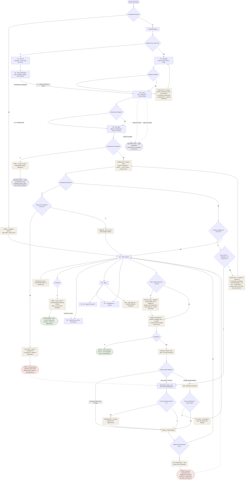
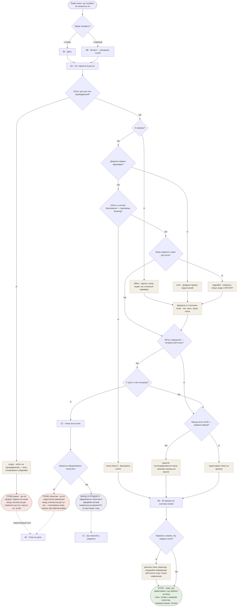
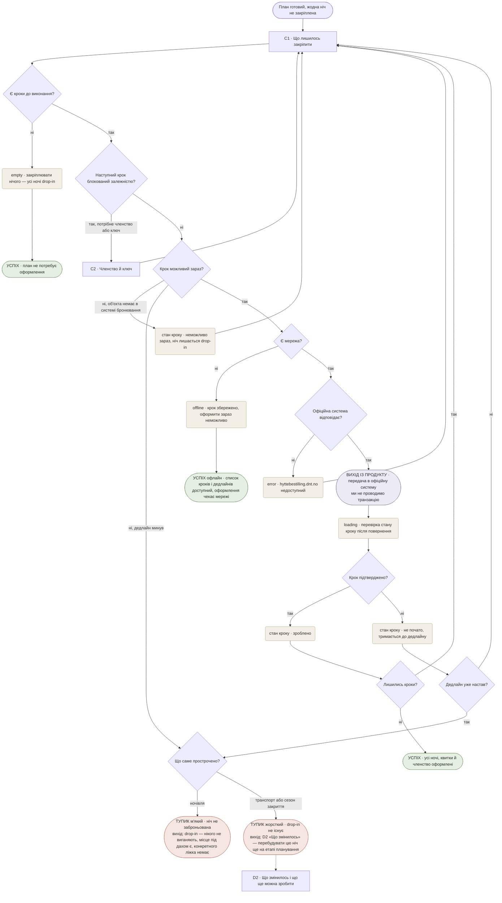
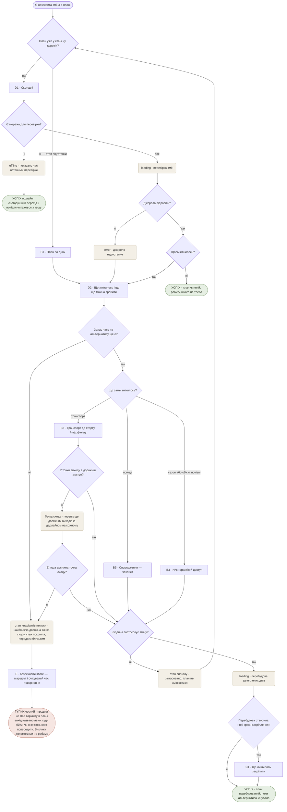
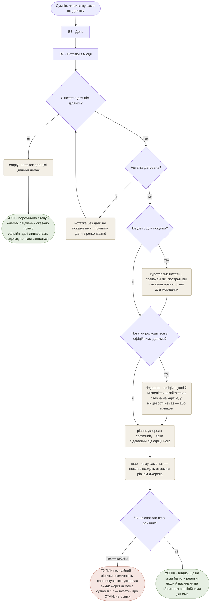
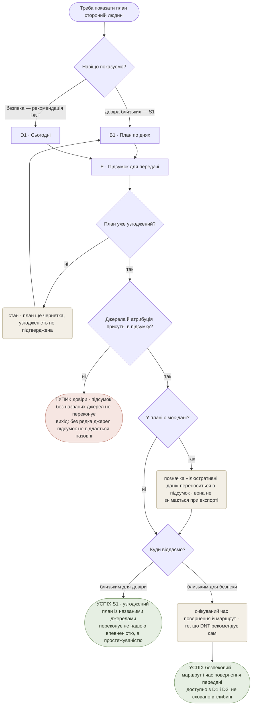

# User flows — Nestwood

**Крок 4, 2026-08-06.** Маршрути **primary-персони** (Kristin — член асоціації, знає систему) через екрани зі [sitemap.md](./sitemap.md). Нових екранів тут не вигадується: кожен вузол-екран існує в дереві кроку 2 або в навігації кроку 3.

**Ревізія після адверсарної критики (та сама дата).** Перша версія мала 7 тупиків без виходу й 7 відсутніх станів; найсерйозніший — аварійний вихід у flow R3+R6 вказував на об'єкт, якого в продукті не було. Що змінилось:

- **сутність 19 «Точка сходу»** піднята з «Під питанням» — тупик «запасу часу немає» тепер веде в стан `варіантів немає` на D2 з реальним наповненням;
- **D2 більше не прив'язаний до стану «у дорозі»** — R3 покриває й етап підготовки, а до правки тупик у flow R7 указував на недосяжний екран;
- **безпековий share виведений із «глибокого» в контекстне** — аварійний вміст не буває рідкісною дією;
- **перегенерація після розмовного уточнення отримала гілку відмови**, а сам шар — межі й два стани;
- **офлайн-сценарії тепер завершуються**, а не зациклюються на очікуванні мережі;
- **додано потоки S2 і S1** — раніше B7, E і стан `degraded` «розходження карти з місцевістю» не проходили через жоден потік, хоча останній є підставою існування B7.

**Ревізія 2026-08-13 (після відбору екранів для wireframes, [_screens.md](./_screens.md))**. Відбір знайшов дві дірки, яких не бачила ні матриця покриття, ні перша критика потоків — обидві в потоці MAIN, обидві про офлайн:

- **офлайн у візарді не існував**: генерація — серверний виклик, тобто без мережі плану не буде, а потік цього не моделював. Додано розвилку `Є мережа для генерації?` і **чесний кінець** «бриф збережено, генерація стартує сама»;
- **B6 стояв за розвилкою «Є мережа?»** і без мережі зникав — тобто екран, чия доказова база цілком складається з людей у дорозі, що економлять батарею, пропадав саме в дорозі. B6 виведено з-під розвилки й додано офлайн-читання з кешу;
- додано **перевірку свіжості одним запитом на весь план** при відкритті збереженого походу (а не запит на кожен день) — той самий виклик живить `Зміну/сигнал`.

**Ревізія 2026-08-13 (друга того дня) — UX-аудит проти стандартних евристик.** Десять прорахунків, повний список і рішення — [sitemap.md](./sitemap.md), «Рішення після UX-ревізії». Що змінилось у потоках:

- **`QAGREE` прибрано** — потік питав людину, чи чотири елементи узгоджені, тобто робив її інтеграційним шаром рівно в тому місці, де MAIN JOB обіцяє це зняти. Замість розвилки — обчислений **вердикт** і названий **конфлікт**;
- **тупик DEAD2 скасовано** — замість повернення в порожню форму 2–3 готові виходи з наслідком;
- **усі відмови генерації рендеряться на B1**, а не викидають людину у воронку;
- **додано розвилку горизонту прогнозу** — поза ~10 днями показується сезонна норма, поза вердиктом;
- **правка плану має три входи**, не тільки вільний текст, і зміна параметрів попереджає, що зламає в C1;
- **у візарді з'явився «зберегти й вийти»**;
- **вибір маршруту став першим кроком** *(рішення №20, того ж дня, після першого макета)* — з власним `empty`, коли в бриф не вкладається жоден маршрут;
- **відновлення з тупиків R2 переїхало в точку збою** — заміна ночі просто на B3.

**База**: [sitemap.md](./sitemap.md) (сутності, екрани, навігація, трасування), [../concept/jtbd.md](../concept/jtbd.md), [../concept/personas.md](../concept/personas.md).

## Як читати

| Форма | Значення |
|---|---|
| `[Прямокутник]` | **екран** — існує в sitemap.md |
| `{Ромб?}` | **точка рішення** — гілки «так» / «ні» |
| `(Заокруглений)` | **стан або шар** — `loading`, `error`, `empty`, `degraded`, `offline`, інлайн-шар |
| `([Овал])` | **кінець** — успіх, тупик або вихід із продукту |

**Правило тупика**: у кожного тупика названо **вихід**, і кожен названий вихід мусить існувати в sitemap. Вихід, якого немає в дереві, — не чесність, а дефект (саме на цьому впала перша версія).

**Правило офлайну**: жоден потік не зациклюється на очікуванні мережі. «Працюй із тим, що є» — це завершення сценарію.

---

## MAIN JOB — узгодженість чотирьох джерел

> *«Коли я планую багатоденний похід у горах, я хочу бути впевненою, що маршрут, ночівля, спорядження й погода узгоджені між собою, щоб не бути сама тим, хто зводить чотири розрізнені джерела в одне ціле.»*

**Рішення в потоці**

0а. **Людина знає, куди хоче?** *(нове, 2026-08-13, рішення №21)* — до цієї дати відповідь «ні» не мала в продукті шляху взагалі: воронка починалась із питання «регіон і місяць». Тепер «ні» веде в куровані регіони й картку маршруту, звідки людина виходить із **уже обраним маршрутом** одразу на W2.
0. **Маршрут обрано?** *(нове, 2026-08-13, рішення №20)* — **перше питання продукту**. Раніше вибору маршруту в потоці не існувало: візард питав дати, регіон і тривалість, а генерація мовчки обирала, де відбудеться похід. Наслідок був не косметичний — узгодженість чотирьох джерел стосувалась маршруту, якого людина не обирала. Гілка «ні» це не помилка, а нормальний результат: у цьому регіоні в цей місяць нічого не сходиться, і виходи названі одразу.
1. **Є збережений похід?** — визначає, чи людина взагалі бачить стартовий екран. Для primary з акаунтом типовий вхід — одразу B1, **через перевірку свіжості**: один запит на весь план, а не на кожен день (2026-08-13). Це той самий виклик, що живить `Зміну/сигнал`, тобто вхід у D2 береться звідси, а не з окремого механізму.
2. **Заповнювати бюджет?** — крок A6 опційний і пропускається за замовчуванням (рішення №6); типовий шлях показаний явно, щоб опційність не загубилась у макетах.
2а. **Є мережа для генерації?** *(нове, 2026-08-13)* — генерація це серверний виклик `claude-opus-5`, тому без мережі плану не буде **взагалі**. Кнопка «Скласти план» блокується, бриф зберігається, генерація стартує сама при появі мережі. ⚠️ Дія генерації стоїть **на різних екранах**: у primary з акаунтом на W1 (W2 і W3 приходять префілом — 3 тапи), на холодному старті на W3. Стан треба малювати на обох.
3. **Усі джерела відповіли?** → **Недоступне джерело критичне?** — без Kartverket/Lantmäteriet плану немає; без живої наявності ліжок план є, просто чесно неповний. **Виправлено 2026-08-13**: відмова рендериться **на B1**, там же, де показувався б результат (continuity of place), із повтором і переходом у параметри — а не викидає людину у форму після чотирьох тапів.
4. **Ночівля на кожну ніч?** → **Дати жорсткі?** — прапорець із W1 вирішує, що рухати: вікно чи маршрут. **Тупика тут більше немає** *(рішення №12)*: продукт знає причину, тому дає 2–3 конкретні виходи з наслідком у рядку, і тап одразу генерує.
5. **Дати в межах прогнозу?** *(нове, рішення №10)* — поза горизонтом met.no (~10 днів) граф «погода» показує **сезонну норму, явно позначену**, і вона **не входить у вердикт**. Інакше план стверджував би узгодженість із погодою на дати, для яких прогнозу не існує — тобто той самий Zillow-антипатерн, який ми критикуємо, на happy path.
6. **Є конфлікт?** *(замінило `QAGREE`, рішення №9)* — **головна правка всієї ревізії**. Раніше потік вів людину через B3, B5, B6 і потім питав її, чи все сходиться — тобто робив її інтеграційним шаром рівно там, де MAIN JOB обіцяє це зняти. Тепер узгодженість **обчислюється**: зведений вердикт зверху B1 плюс чотири сигнали в рядку кожного дня, а конфлікт названо конкретно.
7. **Яким входом правимо?** *(рішення №11)* — три входи за типом зміни: контекстна дія в місці наслідку, «Параметри походу» для дат/регіону/членства, вільний текст для складного. Розвилка **«є вже закріплені кроки в C1?»** обов'язкова: зміна дат після оформленої броні ламає R7, і людина мусить побачити це **до** застосування, а не після.
8. **Запит зрозумілий і в межах шару?** + **Правка дає розв'язний план?** — перша ловить запит поза межами шару (градація, транзакції, вигадані дані), друга — нерозв'язну конфігурацію. Друга тепер стосується **всіх трьох входів правки**, не лише текстового.

**Стани**: `loading` (генерація з названими етапами, перегенерація і **перевірка свіжості на вході**) · `error` (критичне джерело — **на B1**) · `error` шару (незрозумілий запит) · `неможливо` (правка нездійсненна) · `empty` (**план не склався в задані параметри — з готовими виходами**) · `degraded` (план із полем «чого в ньому немає») · **`норма замість прогнозу`** (дати поза горизонтом) · **`конфлікт` / `сходиться`** (вердикт узгодженості) · `offline` — **двох різних природ**: у візарді означає «плану не буде», у плані «читай те, що є» · **©Kartverket у хромі** — не крок потоку, а постійний елемент, тому підвішений ребром без напрямку.

**B1 має всі стани, і це наслідок рішення №13**: генерація, її відмови й результат живуть на одному екрані. Людину не викидає у форму, а екран, який ніс MAIN JOB, більше не існує тільки в успішному вигляді.

**Кінці**

- **Успіх** — план **сходиться, і це сказав продукт**, а не людина після обходу чотирьох екранів; далі C1, E або офлайн-пакет із встановленням.
- **Успіх офлайн** — окремий термінал, а не пауза: план, ночівлі **й останній відомий розклад транспорту** читаються з кешу, видно час останньої перевірки. До ревізії офлайн-гілка нікуди не вела, а B6 у неї не входив.
- **Чесний кінець** *(новий, 2026-08-13)* — мережі для генерації немає. **Єдина точка продукту, де офлайн не має продуктового результату**, і це межа архітектури, а не недоробка UI: генерація серверна, взятись плану нізвідки. Правило «офлайн-сценарій мусить завершуватись» виконано — людину відпускають із збереженим брифом, а не лишають чекати мережу. Хвіст: план, що чекає генерації, потребує стану у **F1 «Мої походи»**.
- **Тупик 1** — критичне джерело недоступне. Рендериться на B1, вихід — повтор або «Параметри походу». Здогад замість даних не підставляється. **Єдиний тупик, що лишився у воронці.**
- ~~**Тупик 2**~~ — **скасовано 2026-08-13 (рішення №12)**: жорстке вікно + маршрут, що не влазить, більше не тупик, а `empty` на B1 із 2–3 готовими виходами. Раніше продукт знав причину відмови й усе одно перекладав пошук розв'язку на людину — після чотирьох тапів інвестиції.
- **Тупик 3** — правка нездійсненна. Вихід: попередній план **лишається цілим**, і показано, що саме не сходиться. Найважливіша частина — не зламати вже наявний план невдалою правкою.

---

## R2 — що конкретно потрібно для кожної ночівлі *(Top Job #1)*

> *«Коли я не знаю (чи не до кінця знаю) локальну систему ночівлі — типи об'єктів, потребу в ключі чи членстві, правила й час приходу, — я хочу зрозуміти, що саме мені потрібно зробити на кожну ніч, щоб не опинитися без даху над головою й не порушити правила.»*

**Рішення в потоці** — це буквально **чотири змінні формули** з Ось A ([personas.md](../concept/personas.md)), розкладені в порядку, у якому вони звужують відповідь:

1. **Об'єкт підтверджений?** *(нове)* — flow MAIN дозволяє згенерувати план у `degraded`, тобто ніч без підтвердженого об'єкта потрапляє сюди легально. До ревізії не було визначено, що тоді показано.
2. **Мережа / джерело правил** *(нове)* — обидві відмови ведуть **одразу в статичну гілку**, минаючи питання про живу наявність. До ревізії офлайн-шлях вливався так, що далі було можливе «жива наявність доступна — так», чого офлайн не буває.
3. **Прапорець `Booking`** — тип об'єкта. Немає в системі бронювання (`rastskydd`, `vindskydd`, частина хиж) — уся гілка броні відпадає.
4. **Жива наявність доступна?** — єдине реально заблоковане поле. «Ні» не зупиняє потік: формула добудовується зі статичних полів публічної схеми NTB.
5. **Замкнений об'єкт + членство** — не ціна, а умова доступу: ключ DNT це ексклюзивна перевага членства.
6. **Час приходу 18:00** — шведське правило, що змінює зміст гарантії, а не факт її наявності.
7. **Мова правил** — розвилка з дослідження UiO/UiB і звіту іноземки 2022.

**Стани**: `empty` (об'єкт не підтверджений) · `error` (довідник правил) · `offline` · `degraded` (наявність очікує угоди).

**Кінці**

- **Успіх** — людина знає **обидві** частини: що гарантовано і що зробити на місці.
- **Вихід із продукту** — оформлення членства. Виправлено: раніше «оформлює членство?» було миттєвим «так», тоді як flow R7 показує той самий крок як передачу з перевіркою повернення. Один крок не може коштувати різного в двох потоках.
- **Тупик членства** — замкнена хижа + жодного члена + відмова оформлювати. **Виправлено 2026-08-13 (рішення №11)**: вихід більше не «піди на B1 і сформулюй це текстом», а **контекстна дія в точці збою** — заміна ночівлі просто на B3. Відновлення, що живе на іншому екрані та ще й через вільний текст, змушувало людину переформульовувати те, що продукт уже знає.
- **Тупик даних** — об'єкт не підтверджений навіть статично. Той самий вихід, той самий принцип.

---

## R7 — довести план до реально закріплених ночівель

> *«Коли мій план готовий, але жодна ніч ще нічим не закріплена, я хочу довести його до стану, коли ночівлі, квитки й членство справді оформлені, щоб не тримати в голові список із N окремих транзакцій.»*

**Рішення в потоці**

1. **Є кроки до виконання?** — `empty` тут не збій, а нормальний результат: маршрут виключно по drop-in-об'єктах закріплювати нічого.
2. **Крок блокований залежністю?** — членство → ключ → доступ до замкнених self/ubetjent хиж. Порядок іде з офіційної системи, не з нашого UI.
3. **Крок можливий зараз?** — три різні «ні»: об'єкта немає в системі бронювання (нормально), дедлайн минув (тупик), немає мережі (відкладено, але зі своїм успішним кінцем).
4. **Дедлайн уже настав?** *(нове)* — до ревізії «не почато» вело в тупик **безумовно**, тобто людина, що повертається завтра, у моделі такої можливості не мала.
5. **Що саме прострочено?** *(нове)* — раніше один вузол покривав і ночівлю, і транспорт. Пропущений потяг drop-in не має: тупики різні за жорсткістю й за виходом.

**Цикл, а не лінія**: потік повертається в C1 після кожного кроку, бо DNT вимагає *«complete the booking and payment for one cabin before proceeding to the next»*.

**Стани**: `empty` · `offline` · `error` · `loading` (перевірка після повернення) · стани кроку: «неможливо зараз», «зроблено», «не почато».

**Кінці**

- **Успіх A** — оформлювати не було чого. **Успіх B** — усі кроки закриті. **Успіх офлайн** — список і дедлайни доступні; оформлення чекає мережі.
- **Вихід із продукту** — передача в офіційну систему. Продуктова межа, не помилка.
- **Тупик м'який** — ніч не заброньована. Вихід чесний: нікого не виганяють.
- **Тупик жорсткий** — транспорт або сезон. Вихід у **D2**, і він тепер досяжний: до ревізії D2 був прив'язаний до стану «у дорозі», тобто вихід із тупика вів у замкнені двері.

---

## R3 + R6 — зміна погоди й транспорту, поки альтернатива ще існує

> *R3: «Коли прогноз погоди змінюється — **під час підготовки чи вже в дорозі**, — я хочу дізнатися, що саме в моєму поході це зачіпає, щоб встигнути відреагувати.»*
> *R6: «…я хочу знати, чи справді туди можна дістатись і повернутись у мої дати, щоб не залишитись відрізаною на місці без варіантів.»*

Обидва зведені в один потік свідомо: механізм спільний, і він **не про сповіщення, а про запас часу**.

**Рішення в потоці**

1. **План уже «у дорозі»?** *(нове)* — вхід роздвоєний. До ревізії потік починався тільки з D1, тобто зміни на етапі підготовки не мали куди приходити, хоча R3 прямо їх називає.
2. **Є мережа?** — перше рішення, а не останнє: offline-first обов'язковий, і D1 мусить бути корисним без мережі. Тепер офлайн має **свій успішний кінець**, а не повернення в ту саму перевірку.
3. **Запас часу на альтернативу ще є?** — **головне рішення продукту в цій частині**, і воно стоїть перед типом зміни. Elvah не потрібне було повідомлення в момент скасування: їй потрібен був сигнал за день-два, поки існував варіант звернути на Riksgränsen або Beisfjord.
4. **Дорожній доступ до точки виходу?** — розвилка, якої немає в жодного конкурента: замінний автобус до Katterat неможливий, бо дороги туди немає. Тепер вона веде не в глухий тупик, а в **перелік ще досяжних точок сходу** (сутність 19).
5. **Перебудова створила нові кроки закріплення?** *(нове)* — перебудований день може вимагати нової броні. До ревізії потік завершувався на B1, і R7 після перебудови не існував.

**Стани**: `offline` (зі своїм кінцем) · `loading` (перевірка й перебудова) · `error` (джерело недоступне — і саме воно **є** зміною плану, тому веде в D2, а не в глухий кут) · `варіантів немає` (новий стан D2) · стан сигналу «зігноровано».

**Кінці**

- **Успіх A** — змін немає. **Успіх B** — план перебудований, поки альтернатива існувала. **Успіх офлайн** — сьогоднішній перехід і ночівля з кешу.
- **Тупик чесний** — запасу часу немає. Це єдиний тупик продукту без продуктового розв'язання, і тепер у нього **існуючий** вихід: стан `варіантів немає` з найближчою досяжною точкою сходу, станом покриття й безпековим share. Раніше вихід складався з трьох речей, жодної з яких у продукті не було.

---

## S2 — чи це реально для людини як я

> *«Коли я не знаю, чи мій рівень підготовки підходить для такого походу, я хочу відчувати, що це реально для людини як я, а не тільки для досвідчених, щоб не почуватись одна в цьому рішенні.»*

Потік доданий після критики: B7 не проходив через жоден сценарій, а стан `degraded` «розходження офіційних даних із місцевістю» — **підстава існування цього екрана** — не був протрасований ніде.

**Рішення в потоці**

1. **Є нотатки для цієї ділянки?** — `empty` тут найімовірніший стан, а не крайній випадок: у продукту без користувачів своїх нотаток немає.
2. **Нотатка датована?** — правило дати з personas.md, застосоване як фільтр у продукті, а не тільки в дослідженні.
3. **Це демо для покупця?** — розвилка, яку sitemap вимагає прямо: вигаданих «відгуків користувачів» у демо бути не може, тому або кураторські й позначені, або слот.
4. **Розходження з офіційними даними?** — те, заради чого екран існує. Норвежці описують розходження в обидва боки й самі правлять Kartverket через «Rett i kartet».
5. **Чи не сповзло це в рейтинг?** — не UI-рішення, а контроль межі. Винесений у потік навмисно: це найтонша межа продукту, і зісковзнути з неї можна тихо.

**Стани**: `empty` (нотаток немає) · `degraded` (розходження карти з місцевістю) · відфільтрована нотатка без дати · кураторський режим демо.

**Кінці**

- **Успіх** — видно стан на місці й наскільки він збігається з офіційними даними.
- **Успіх порожнього стану** — окремий кінець: «свідчень немає» сказано прямо. Порожньо тут не збій.
- **Тупик позиційний** — не стан людини, а стан продукту: якщо шар сповз у рейтинги, ми втратили простежуваність джерела, тобто єдине, що продаємо.

---

## S1 — мати чим підтвердити реалістичність плану

> *«Коли близька людина висловлює сумнів у моєму рішенні йти в похід, я хочу мати щось конкретне, що підтверджує реалістичність мого плану, щоб не почуватися нерозважливою в її очах.»*

Потік доданий після критики: E не проходив через жоден сценарій, і саме на ньому виявилась суперечність рівнів — глибока рідкісна дія, яку інший потік називав аварійним виходом.

**Рішення в потоці**

1. **Навіщо показуємо?** — перша ж розвилка розділяє дві підстави, які sitemap просив не змішувати: S1 про довіру близьких, безпековий share про безпеку. Форма одна, входи різні, рівні різні.
2. **План уже узгоджений?** — чернетку віддавати назовні не можна: підсумок обіцяє реалістичність.
3. **Джерела й атрибуція присутні?** — підсумок без названих джерел не переконує **й порушує CC BY 4.0**, якщо містить дані Kartverket.
4. **Є мок-дані?** — позначка **переноситься в експорт**. Це найлегше місце випадково збрехати: усередині продукту позначка є, а у витягнутому підсумку її немає.

**Стани**: план-чернетка · перенесення мок-позначки в експорт.

**Кінці**

- **Успіх S1** — узгоджений план із названими джерелами; переконує простежуваність, не наша впевненість.
- **Успіх безпековий** — маршрут і очікуваний час повернення передані; доступно з D1 і D2.
- **Тупик довіри** — підсумок без рядка джерел назовні не віддається. Технічний тупик із коротким виходом, але записаний явно, бо це водночас юридична вимога.

---

## Що ці потоки показали окремо від діаграм

1. **Тупик «немає запасу часу» — єдиний без продуктового виходу**, і саме він виявив, що аварійний вміст був спроєктований найгірше з усього: вихід складався з трьох речей, жодної з яких не існувало. Наслідок ширший за один вузол — записане правило навігації №9: **аварійний вміст не буває глибоким**.
2. **`degraded` не блокує жоден потік.** Ні в MAIN, ні в R2 відсутність живої наявності не зупиняє людину. Прямий доказ тези CLAUDE.md: заблоковане рівно одне поле.
3. **R7 — єдиний потік із виходом із продукту**, і він циклічний через вимогу самої DNT. Найкраще місце в демо, щоб показати межу «ми не оператор ночівлі», не пояснюючи її словами.
4. **`empty` виявився нормальним результатом чотири рази**: закріплювати нічого, змін немає, нотаток для ділянки немає, об'єкт не підтверджений. Три перші потребують свого копірайтингу — «нічого не знайдено» тут неправильна інтонація.
5. **Офлайн має чотири різні успішні кінці**, а не один: план із кешу, ночівля з кешу, список кроків без оформлення, сьогоднішній перехід. Це підтверджує, що offline-first у нас справді констрейнт стеку, а не фіча — і що його не можна змоделювати одним станом.
6. **Один екран народився з навігації, а не з jobs** (B8) і **одна сутність — із критики потоків** (19, Точка сходу). Обидва механізми появи варто тримати видимими: перший — потреба структури, другий — дірка, знайдена перевіркою. Ні той, ні той не є голосом людини, тому обидва перші в черзі на перевірку.
7. **Офлайн виявився двома різними станами, а не одним** *(ревізія 2026-08-13)*. Скрізь у продукті офлайн означає «працюй із тим, що є» і має успішний кінець — а у візарді він означає «плану не буде», бо генерація серверна. Обидва чесні, але поведінка й копірайтинг у них протилежні, і зводити їх в один стан не можна. Механізм пропуску той самий, що з сутністю 19: **дірку знайшов не аудит потоків, а спроба скласти замовлення на макети** — перевірка «що саме тут малювати» ловить те, чого не ловить перевірка «чи є тут job».
