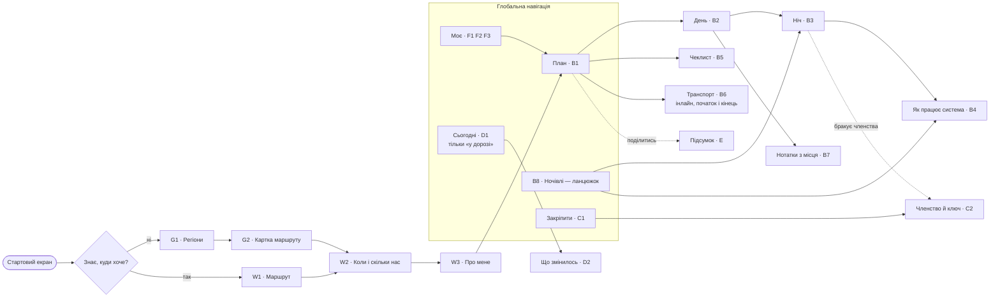
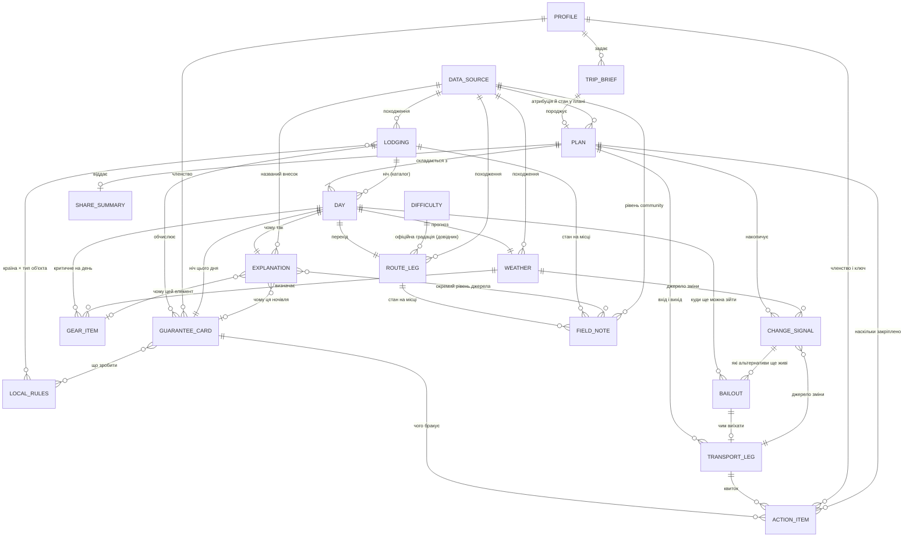

# Sitemap — Nestwood

**Статус**: чернетка. Заповнені **«Сутності»** (крок 1 — інвентаризація об'єктів), **«Екрани»** (крок 2 — дерево), **«Навігація»** (крок 3 — модель руху, рівні, глибина в тапах), **«Трасування»** (крок 5 — матриця job × екран зі списками сиріт) і **«Рішення, ухвалені перед екранами»**. Крок 4 — потоки з рішеннями, станами й тупиками — в окремому файлі [flows.md](./flows.md). Далі wireframes.

**Ревізія 2 (2026-08-06, після адверсарної критики потоків)**: піднято **сутність 19 «Точка сходу»** з «Під питанням» — аварійний вихід указував на неіснуючий об'єкт; **D2 відв'язано від стану «у дорозі»** — навігація відрізала половину формулювання R3; **безпековий share виведено з «глибокого» в контекстне**; визначено **межі й два стани розмовного шару**; додано стан **`варіантів немає`** на D2 і правила навігації №8–9. Деталі — у кінці розділу «Трасування» і в [flows.md](./flows.md).

**Ревізія 1 (2026-08-06, аудит документа проти jtbd.md / personas.md / CLAUDE.md)**: додано перевірку покриття **сутність → поверхня** (job-покриття перевірялось лише в один бік і пропустило сутність 14); візард добудований відсутніми полями `Запиту на похід`; виправлені персона-позначки на екранах спорядження; ER-діаграма приведена у відповідність до довідкової природи сутностей 6, 7 і 15. Три продуктові рішення, ухвалені при ревізії, — у кінці розділу «Рішення, ухвалені перед екранами».

База: [../concept/personas.md](../concept/personas.md), [../concept/jtbd.md](../concept/jtbd.md), [../research/research.md](../research/research.md), схема NTB із [github.com/Turistforeningen](https://github.com/Turistforeningen) (`Hytteadmin`/`Turadmin`, модель `cabin.js`).

---

## Сутності

### Правила, за якими складено список

1. **Кожна сутність має вказаний job з [jtbd.md](../concept/jtbd.md)**, який її породжує. Сутність без job — у розділ «Під питанням», не тут.
2. **`[?]`** — об'єкт, поле або зв'язок, який ми лише припускаємо: job є, але форма об'єкта з джерел не виводиться.
3. **Похідні сутності позначені окремо.** Частина об'єктів не зберігається, а обчислюється (картка гарантії, пояснення рішення) — але людина має справу саме з ними, тому вони в списку як сутності, не як поля.
4. **Дизайн-принципи ≠ jobs.** «Деградувати чесно», offline-first, «показувати офіційну градацію, не вигадувати свою» — це констрейнти, які проявляються **полями всередині** сутностей, а не окремими об'єктами. Там, де така вимога — єдина підстава для об'єкта, він у «Під питанням».
5. Назви полів для об'єктів ночівлі беруться з **реальної публічної схеми NTB**, а не вигадуються — щоб мок-шар мав форму справжніх відповідей (вимога CLAUDE.md).

---

### 1. Профіль хайкера

**Що це**: те, що продукт знає про людину, а не про конкретний похід.

**Склад:**
- Фізична форма / темп — у формі, яка **не перетворюється на власну шкалу складності** (див. констрейнт у сутності 6)
- Досвід у цьому домені — окремо від загального досвіду походів `[?]` за формою, але сама потреба доказана: 62-річний швед із трьома Гімалаями має нульову впевненість саме у фьєллі ([personas.md](../concept/personas.md), Живі голоси, п.2)
- Наявне спорядження — вхід для R4
- Уподобання (тип ночівлі, темп, комфорт)
- **Членство**: асоціація (DNT / STF / немає), номер членства, наявність DNT-ключа. Це не CRM-поле — це змінна №4 у формулі гарантії й умова доступу до замкнених хиж
- Мова інтерфейсу й мова, якою людина **не** читає (норвезька/шведська) — вхід для сутності 15
- **Персистентність (акаунт) — є, рішення 2026-08-05.** Обґрунтування нижче, і воно **не** «персоналізація»

**Job**: R1 (форма й час), R2 (членство як змінна доступу), R4 (наявне спорядження), E2 («враховує саме мою форму»), S2. Персистентність окремо — R7, R2, R3.

**Чому акаунт, і чому не через персоналізацію.** Персоналізація в нашому потоці забезпечується візардом у межах сесії й акаунта не потребує. Акаунт тримається на трьох інших jobs, і кожен з них — про те, що мусить **пережити закриту вкладку**:

| Що зберігається | Job | Чому це не може бути станом сесії |
|---|---|---|
| Стан закріплення плану (`Крок закріплення`, сутність 18) | **R7** | Ланцюжок хиж DNT — N послідовних транзакцій, які людина робить не за один раз: *«you must complete the booking and payment for one cabin before proceeding to the next»*. Стан, що обнуляється, робить сутність 18 безглуздою |
| Членство й номер членства, наявність DNT-ключа | **R2** | Це **credential доступу**, не преференція: від нього залежить формула гарантії, і логбук вимагає номер навіть після онлайн-броні |
| Канал доставки сигналу | **R3** | Сигнал із запасом часу («звернути на Riksgränsen за день до того») мусить дійти до людини, якої немає у вкладці браузера |
| Інвентар спорядження | **R4** | Спорядження довготривале, не на кожен похід. Переписувати щоразу — рівно те тертя, яке ми обіцяємо зняти |

**Наслідок для екранів, який з цього треба взяти буквально**: акаунт — сховище credential'а, інвентаря й стану закріплення, **а не екран преференцій**. Якби ми виправдали його персоналізацією, спроєктували б не те.

**Акаунт не є входом у продукт.** Реєстрація не стоїть перед цінністю: план генерується, і акаунт з'являється в момент, коли є що зберегти (закріплення, credential, доставка сигналу). Причина операційна й пітчева одночасно — демо перед покупцем не має починатися з форми реєстрації.

**Зв'язки**: живить `Запит на похід` → `План`; членство напряму визначає `Картка гарантії й доступу`; наявне спорядження порівнюється з `Чеклистом спорядження`.

---

### 2. Запит на похід (trip brief)

**Що це**: параметри **цього конкретного** походу — відділені від профілю свідомо, бо в Lukas'а вікно поїздки вже куплене й є жорстким констрейнтом, а не преференцією.

**Склад:**
- Вікно дат + **прапорець «жорстке / не рухається»** (куплений переліт — R3/R6 ламаються саме об нього)
- Регіон / країна (визначає, яка половина Ось A застосовується)
- Бажана тривалість і/або дистанція
- Точка старту й фінішу, або «кільце»
- Наявність запасного дня — прямо названо носієм болю: *«Korkat av mig att inte ha en reservdag»* (Elvah)
- **Іменований маршрут як заготовка параметрів** (Kungsleden, Aurlandsdalen, Hardangervidda hut-to-hut) — опційний вхід, ухвалено 2026-08-06. Це **не** каталожний об'єкт і не окрема сутність: обране ім'я лише заповнює регіон, старт/фініш і орієнтовну тривалість. Підстава — не job, а спосіб, у який Lukas формулює намір (див. «Під питанням»)
- Бюджет — **опційне** поле, ухвалено 2026-08-06. Підтвердженого болю під ним немає (H3), тому воно не стоїть бар'єром перед планом; job-підкріплена частина (ціна членства як частина варіанту ночівлі) живе в `Картці гарантії й доступу`, а не тут
- **Розмір групи — обовʼязкове поле, ухвалено 2026-08-13.** Було `[?]` під гіпотезою H1, і це була помилка категорії: ми виключили *персону-організатора* через брак доказів і разом із нею викинули **арифметику**. Бронь — це N ліжок, а не «місце»; формула гарантії має випадок «група без жодного члена асоціації»; частина спорядження спільна; квитки й вартість — на людину. Без цього поля Top Job #1 не рахується

**Job**: R1, R6 (чи взагалі можна дістатись у ці дати), MAIN.

**Поверхня**: крок A2 (дати, регіон) + крок A3 (що саме хочу пройти) + опційний A6 (бюджет). До ревізії 2026-08-06 у візарді була лише половина цих полів — старт/фініш, тривалість і запасний день не мали куди вводитись, хоча запасний день стоїть на прямому носії болю.

**Зв'язки**: `Профіль` + `Запит` → `План`; вікно дат → `Транспортне плече`, `Сезонні дати` в об'єкті ночівлі, `Прогноз погоди`.

---

### 3. План походу

**Що це**: контейнер, у якому чотири джерела нарешті узгоджені між собою. Головна сутність продукту — рівно тому, що MAIN JOB про узгодженість, а не про маршрут.

**Склад:**
- Упорядкований список `Днів плану`
- Підсумок: усього днів, км, набір висоти, кількість ночівель по типах
- Стан: чернетка / прийнятий / у дорозі
- **Час останньої перевірки** і стан свіжості даних — механізм live re-sync (research §4, №3)
- **Перелік того, чого в плані свідомо немає** (недоступне джерело, непідтверджена наявність) — не помилка, а поле першого класу
- **Наскільки план закріплений** — агрегат по `Крокам закріплення` (сутність 18)
- Належність до акаунта: план переживає сесію, бо стан закріплення накопичується днями (R7). Окремої сутності «збережений похід» це не створює — це той самий `План` із персистентністю
- `[?]` Версії / історія змін — потрібні, якщо розмовне уточнення переписує вже прийнятий план

**Job**: MAIN («щоб не бути сама тим, хто зводить чотири джерела»).

**Зв'язки**: `Дні` (1:N), `Транспортні плечі` (на вході й виході), `Зміни/сигнали` (N), `Поділюваний підсумок`, `Джерела даних`.

---

### 4. День плану

**Що це**: одиниця, у якій узгодження або відбувається, або ні. Усі чотири елементи MAIN JOB перетинаються саме тут.

**Склад:**
- Дата, номер дня
- Перехід: звідки → куди, дистанція, набір/скид висоти, оцінка часу
- **Офіційна градація складності** (сутність 6) — не наша оцінка
- Ночівля цієї ночі → `Об'єкт ночівлі` + `Картка гарантії й доступу`
- Погода цього дня → `Прогноз`
- Спорядження, критичне саме для цього дня (визначається погодою + типом ночівлі)
- `Пояснення рішення` — чому день саме такий
- Точка сходу / альтернатива на цей день → `Точка сходу` (сутність 19). **Знято `[?]` 2026-08-06**: об'єкт виведено в сутність після критики потоків
- `[?]` День відпочинку без переходу

**Job**: R1, R2, R3, R4, R5, MAIN.

**Зв'язки**: належить `Плану`; посилається на `Ділянку маршруту`, `Об'єкт ночівлі`, `Прогноз`, `Спорядження`, `Пояснення`.

---

### 5. Ділянка маршруту (трек)

**Що це**: геометрія переходу з власним походженням і власним застереженням про надійність.

**Склад:**
- Геометрія (GeoJSON), довжина, профіль висоти
- Джерело + обов'язкова атрибуція (©Kartverket, CC BY 4.0 / Lantmäteriet CC0) → `Джерело даних`
- Тип: офіційна маркована стежка / немаркована / поза стежкою
- **Стан маркування й розбіжність із місцевістю** — норвежці задокументували розходження в обидві сторони: позначені стежки не існують, існуючі не позначені ([jtbd.md](../concept/jtbd.md), «Деградувати чесно»). Це поле, а не примітка: обіцянка продукту — простежуваність джерела, не гарантія стану стежки
- Доступність офлайн

**Job**: R1 (скільки я пройду **на цьому рельєфі**), R5 (на чому стоїть порада).

**Зв'язки**: `День` → одна або кілька ділянок; ділянка → `Градація складності`, `Джерело даних`.

**Ризик моделі — знятий частково, 2026-08-06**: **іменований багатоденний маршрут** (Kungsleden, Aurlandsdalen, Hardangervidda hut-to-hut) Lukas тримає в голові як одиницю, але жоден job не формулює «вибери іменований маршрут». Рішення: він входить як **опційний вхід у візард** (заготовка параметрів `Запиту на похід`), а **не** як каталожна сутність і не як корінь навігації. Так закривається спосіб, у який людина формулює намір, і не заводиться структура конкурентів. Див. «Під питанням».

---

### 6. Офіційна градація складності

**Що це**: довідкова сутність, яку ми **посилаємось, а не обчислюємо**. Виділена окремо саме щоб зробити констрейнт структурним, а не пам'яткою в копірайті.

**Склад**: значення офіційної градації, назва системи градації, джерело, що воно означає людською мовою (у т.ч. перекладене), **і стан «не градуйовано»**.

**Джерело — перевірено ✓**: `gradering` є полем у відкритій **Turrutebasen** (Kartverket, живий WFS), коди за стандартом Merkehåndboka. Але заповнене нерівно: **Jotunheimen 1 із 92 фотрут, Hardangervidda 28 із 59, Narvik–Abisko 64 із 137** ([research.md](../research/research.md)). Тобто «не градуйовано» — типовий випадок, а не edge-case, і стан мусить бути спроєктований нарівні з рештою.

**Job**: R1 — **з жорстким констрейнтом**: DNT публічно заявив, що хоче зберегти єдину національну градацію й не створювати альтернативних систем. Персоналізація допускається в **підборі** маршруту під форму, і забороняється в **переоцінці** офіційної складності ([NRK, 2026-08-01](https://www.nrk.no/vestland/turister-far-trobbel-pa-tur-i-fjellet-i-norge---rode-kors-og-dnt-vil-se-pa-fjellvett-tiltak-1.17970478)).

**Зв'язки**: `Ділянка маршруту`, `День`, `Пояснення рішення` (як вхідний фактор, не як вихід).

**Примітка моделі**: технічно може лежати полем усередині `Ділянки маршруту`. Виділено окремо, бо продуктове правило «ніколи не власна шкала» має бути видимим у моделі даних, а не лише в документі.

---

### 7. Об'єкт ночівлі (хижа / fjällstuga / кемпінг)

**Що це**: статичний довідковий об'єкт офіційної інфраструктури. Джерело диференціатора: жоден generic-lodging suggester такої структури не має.

**Склад — поля з реальної публічної схеми NTB** (`cabin.js`), не вигадані:
- `betjeningsgrad`: Betjent / Servering / Selvbetjent / Ubetjent / Dagshytte / Nødbu / Stengt — **змінна №1 формули**
- `hyttetype`: DNT / Rabatt / Privat — приватні хижі зі знижкою для членів окремий випадок
- `nøkkel`: Ulåst / Spesialnøkkel / DNT-nøkkel
- `senger`: `{betjent, selvbetjent, ubetjent, vinter}` — місткість по рівнях обслуговування, включно з зимовою кімнатою
- `åpningstider`: `helårs` / `fra` / `til` — сезонні дати
- `fasiliteter`, у т.ч. прапорець `Booking` — чи об'єкт узагалі в системі бронювання
- `geojson` (Point), `fylke`, `kommune`, `juridisk_eier`, `vedlikeholdes_av`, `tilrettelegginger`, `ssr_id`, `tilkomst`
- **Шведський бік Ось A**: тип `fjällstuga` / `rastskydd` (лише аварійна ночівля) / `vindskydd` (без броні взагалі); обмежена кількість передбронюваних ліжок
- **Обмеження передброні (обидві країни)**: не всі ліжка доступні до передброні — частину тримають для drop-in
- **Стан живої наявності** — єдине реально заблоковане поле (закритий NTB). Має власний стан «недоступно», а не порожнє значення чи здогад

**Job**: R2 (Top Job #1).

**Зв'язки**: `День` (одна ніч → один об'єкт); живить `Картку гарантії й доступу`; тягне `Локальні правила`; посилається на `Джерело даних`.

---

### 8. Картка гарантії й доступу на ніч `похідна`

**Що це**: обчислена відповідь на R2 — найточніша форма нашого диференціатора. Не «ось хижа», а «ось що ти маєш зробити, і ось що тобі гарантовано».

**Склад:**
- **Вхід формули (чотири змінні)**: тип об'єкта × є бронь × час приходу × членство
- **Що гарантовано**: конкретне ліжко (є бронь) / місце під дахом, можливо матрац на підлозі (без броні). Спільний принцип обох країн: **нікого не виганяють** — у Швеції сформульовано прямо, у Норвегії як «у більшості випадків»
- **Дедлайн приходу**: 18:00 у Швеції (після — гарантія неспецифікованого місця)
- **Дії на місці, які бронь не закриває**: DNT-ключ (100 kr депозит, **виключно перевага членства**), логбук з іменем і номером членства навіть після онлайн-броні, самореєстрація й оплата в self-service
- **Умова, а не ціна**: група без жодного члена DNT не бачить замкнену self/ubetjent хижу як «доступну» — вона показується як «потрібне членство», з ціною членства як частиною варіанту
- Ступінь певності кожного рядка (статичний атрибут ✓ vs. жива наявність — недоступна)

**Job**: R2 (головний job MVP), E1 («не пропустила нічого важливого»).

**Зв'язки**: `День` × `Об'єкт ночівлі` × `Профіль (членство)` → картка; тягне `Локальні правила`; фігурує в `Поділюваному підсумку`.

**Чому окрема сутність, а не поля хижі**: об'єкт ночівлі однаковий для всіх, картка — різна для кожної людини й кожної ночі. Саме її не може виразити конкурент.

---

### 9. Прогноз погоди на день

**Склад:**
- Дата, джерело прогнозу, час отримання
- Температура, опади, вітер, видимість — на рівні, який впливає на рішення, не як мета-дані
- **Дельта від попередньої перевірки** — сама зміна є носієм цінності, не абсолютне значення
- Що саме в плані це зачіпає (перехід / ночівля / спорядження)

**Job**: R3, R4 (погода → спорядження).

**Джерело — перевірено ✓**: met.no Locationforecast 2.0 (CC BY 4.0, без ключа) і SMHI `snow1g` v1 (CC BY 4.0 SE). Два обмеження met.no ідуть прямо в архітектуру: ідентифікуючий `User-Agent` і заборона повторювати запит до часу з заголовка `Expires` — тобто **кеш обов'язковий, а не оптимізація**. Поза літом сюди ж додається лавинна небезпека: NVE Varsom (NLOD) у Норвегії, lavinprognoser.se (CC0, шість районів) у Швеції.

**Зв'язки**: `День` (1:1), живить `Спорядження` і `Зміну/сигнал`, входить у `Пояснення рішення` як названий фактор.

---

### 10. Зміна плану / сигнал із запасом часу

**Що це**: не «нотифікація». Носій болю сформулювала механізм точніше, ніж ми: сигнал у момент поломки безкорисний, потрібен сигнал **поки альтернатива ще існує** — *«I mitt huvud hade reservplanen varit att vika av mot Rikgränsen typ dagen innan, eller mot Beisfjord två dagar innan»* (Elvah, 2026-07-31).

**Склад:**
- Тип джерела зміни: погода / транспорт / сезон закриття об'єкта / джерело даних недоступне
- Коли виявлено; **скільки часу лишилось на реакцію** — поле першого класу, не побічне
- Які дні плану зачеплено
- Які альтернативи **ще** доступні (і які вже ні)
- Рекомендована дія
- Стан: побачено / застосовано / зігноровано

**Job**: R3 (як зміна погоди зачіпає вже складене), R6 (транспорт ламає жорсткий план).

**Зв'язки**: посилається на `План` і конкретні `Дні`; джерело — `Прогноз погоди`, `Транспортне плече`, `Джерело даних`; породжує нову версію `Плану`.

---

### 11. Спорядження: елемент і чеклист

**Склад:**
- Елемент: назва, категорія, критичність, **є в людини / потрібно взяти / потрібно купити**
- **Чому цей елемент у списку** — названий фактор: погода дня, тип ночівлі (у selvbetjent потрібен спальник, у betjent ні), рельєф, сезон
- Що можна **не** брати — job сформульований у два боки: «не тягнути зайве й не забути критичне»
- Прив'язка до дня, якщо критичність з'являється лише в конкретний день

**Job**: R4.

**Зв'язки**: `Профіль (наявне спорядження)` → різниця; `Прогноз погоди` і `Об'єкт ночівлі` → підстава; `Пояснення рішення`.

**Стан доказу**: у jtbd.md R4 позначений `[?]` по походженню — вихід продукту (чеклист) є, підтвердженого носія болю немає (єдина ілюстрація — 2017, США, похід із палаткою). Сутність лишається в основному списку, бо job у основному списку, але це перший кандидат на перевірку.

**Чия це потреба — виправлено 2026-08-06**: єдиний задокументований gear-фейл належить **secondary-персоні** (Lukas: дірка в каремат + дактейп, [personas.md](../concept/personas.md), «Болі»), а в Kristin job спорядження стоїть як `[?]`-гіпотеза з прямим застереженням «немає дослідження, як досвідчений член асоціації вирішує це завдання сьогодні». Екрани спорядження (A5, B5, F2) до ревізії були позначені як primary-only — це інвертувало доказову базу.

---

### 12. Транспортне плече до/від маршруту

**Що це**: окрема сутність, а не примітка до плану — три незалежні шведські голоси за один тиждень, і один задокументований випадок **відмови від регіону** через транспорт.

**Склад:**
- Напрямок: до старту / від фінішу
- Вид (потяг, автобус), оператор, рейс, час
- **Чи трейлхед має дорожній доступ** — критичне поле, а не деталь: замінний автобус до Katterat неможливий, бо дороги туди немає (*«men då Katterat inte har väg så blev det väldigt konstigt»*)
- Чи існує замінний транспорт і чи він фізично застосовний
- Альтернативні точки входу/виходу як план Б (Riksgränsen, Beisfjord)
- Стан: за розписом / затримка / скасовано
- `[?]` Реальний вплив на батарею й потребу зв'язку — задокументовано (*«det gäller att spara batteri till sådant om man ska åka tåg»*), але як поле сутності це припущення

**Job**: R6.

**Зв'язки**: `План` (початок і кінець), `Запит на похід` (жорстке вікно), породжує `Зміну/сигнал`.

**Джерело — перевірено ✓**: **Entur** JourneyPlanner v3 (NLOD, без ключа, обов'язковий `ET-Client-Name`) у Норвегії; **ResRobot v2.1** (CC0, ключ, 45 запитів/хв безкоштовно) плюс **Trafikverket** (CC0) у Швеції. Katterat є в наборі як `NSR:StopPlace:58610` з полями `cancellation`, `aimedDepartureTime`, `expectedDepartureTime` — механізм «сигнал із запасом часу» будується прямо на них.

⚠️ **Нюанс, який треба закласти в дизайн**: на Katterat `realtime: false`, на Oslo S — `true`. Тобто **саме там, де біль задокументований, живого потоку немає** — є розклад. Стан «останнє відоме за розкладом, живих даних немає» мусить існувати як окреме значення, а не мовчазно виглядати як підтверджений факт.

**Що не знаємо**: `[?]` чи це специфіка Malmbanan, чи властивість nordic-трейлхедів загалом. Для Норвегії свідчень цього рівня немає.

---

### 13. Пояснення рішення (named-contributor breakdown) `похідна`

**Склад:**
- Рішення, яке пояснюється (довжина дня, вибір хижі, елемент спорядження)
- Названі фактори з внеском: форма → довжина переходу, погода → спорядження, рельєф → хижа, офіційна градація → відбір
- Джерело кожного фактора → `Джерело даних`
- Що **не** враховано і чому (дані недоступні / не підтверджено)

**Job**: R5, E2, S1.

**Зв'язки**: `День`, `Спорядження`, `Картка гарантії`, `Джерело даних`, `Профіль`.

**Стан підстави — важливо не забути**: R5 знижений із «підтверджено національними даними про довіру до AI» до **«наша ставка»**. Скандинавського AI-скандалу не існує; SAR-критика — канадська. Механізм лишається (дешевий, не шкодить, поле вільне), але проєктувати його як центр продукту не можна, і в пітчі це ставка, не потреба.

---

### 14. Джерело даних і його стан

**Що це**: об'єкт, який людина реально бачить — бо саме на нього спирається обіцянка продукту й саме він іноді відсутній.

**Склад:**
- Назва (Kartverket, Lantmäteriet, DNT/UT.no, met.no), ліцензія й **рядок атрибуції** (©Kartverket — обов'язковий за CC BY 4.0)
- Час останнього оновлення
- Стан доступності: доступно / недоступно / **очікує угоди про дані з DNT/STF**
- **Позначка «ілюстративні мок-дані»** — жорстка вимога: демо ніколи не вдає живу наявність
- Відоме застереження про надійність (розбіжність карти й місцевості)

**Підстава — три різні за природою, і їх не можна зводити до одної (уточнено 2026-08-06):**

| Підстава | Природа | Наслідок |
|---|---|---|
| R5 («на чому стоїть порада») | job — але **найслабший у наборі**, наша ставка | Може бути покритий шаром, не потребує власного екрана |
| **Атрибуція ©Kartverket** | **юридичне зобов'язання** CC BY 4.0 (CLAUDE.md, «Why now, why here») | Мусить бути видимим у продукті завжди, незалежно від сили R5 |
| **Позначка «ілюстративні мок-дані»** | **жорстке правило CLAUDE.md**: демо ніколи не вдає живу наявність | Те саме — і це умова того, щоб покупець не прочитав демо як введення в оману |

Раніше сутність трималась лише на R5. Це була помилка: **найжорсткіші зовнішні зобов'язання продукту успадковували статус найслабшого job'а** й тому випали з дерева екранів разом із ним. Два нижні рядки — констрейнти, а не jobs (правило 4), але констрейнти обов'язкові до виконання, тому сутність лишається в основному списку з явно розділеними підставами.

**Поверхня (ухвалено 2026-08-06)**: **персистентний рядок джерел** на B1/B2/B3, що розкривається в `шар` «Звідки це взято». Не стан і не окремий екран — присутній і в happy path, не лише в `degraded`. Причина: окремий екран легко не показати на демо, а стан з'являється лише коли щось зламалось — тоді як атрибуція є зобов'язанням у нормальному режимі теж.

**Зв'язки**: посилається з `Ділянки маршруту`, `Об'єкта ночівлі`, `Прогнозу`, `Пояснення`; недоступність породжує `Зміну/сигнал` і поле «чого в плані немає» в `Плані`.

---

### 15. Локальні правила й неписані норми

**Що це**: культурно-мовний шар. Найсильніше інституційно підтверджена сутність у списку — і єдина, яка **не лежить у жодному API**, ні відкритому, ні закритому.

**Склад:**
- Правило + до чого застосовується (країна × тип об'єкта)
- Категорія: прибирання за собою, взуття/тапочки, як діляться спальні місця, преміса honor-system (сам реєструєшся, сам платиш, сам прибираєш), логбук, поводження з провізією в self-service, fjellvett
- **Оригінал + переклад**: операційна інформація self-service хиж існує **тільки норвезькою** — задокументований бар'єр, не гіпотеза
- Джерело правила (офіційна сторінка / дослідження / асоціація)

**Job**: E1 («не пропустила нічого важливого в системі, якої не знаю»), R2.

**Зв'язки**: `Об'єкт ночівлі` (за типом), `Картка гарантії й доступу`, `День`.

**Чому це в основному списку, а не серед «приємно мати»**: академічне дослідження UiO/UiB (2021) показало, що приїжджий спотикається саме тут, а не на таксономії хиж; генсек DNT назвав це своєю нерозв'язаною задачею; заявлений засіб DNT — *«turveiledning og informasjon på flere språk»*. Тобто сутність — прямий аргумент у пітчі для DNT.

---

### 16. Поділюваний підсумок плану

**Склад:**
- Компактне представлення плану: дні, переходи, ночівлі, офіційна градація
- Що робить його **переконливим для сторонньої людини** — узгодженість і названі джерела, не наша впевненість
- Очікуваний час повернення й маршрут — у формі, придатній для передачі близьким
- Стан: чим поділились, з ким, коли `[?]`

**Job**: S1 («мати щось конкретне, що підтверджує реалістичність мого плану»).

**Зв'язки**: похідне від `Плану`, тягне `Пояснення рішення` і `Джерела даних`.

**Подвійна підстава — тримати роздільно**: половина цієї сутності (поділитись маршрутом і часом повернення) походить **не з job'а, а з рекомендації DNT** ([NRK, 2026-08-05](https://www.nrk.no/vestland/telenor-ut-mot-dnt-etter-redningsaksjonar-i-fjellet_-_-marknadsforer-omrade-utan-dekning-1.17973749)). Job S1 — про довіру близьких, безпековий share — про безпеку. Форма може бути одна, підстави різні, і плутати їх не варто.

---

### 17. Польова нотатка спільноти

**Що це**: свідчення реальної людини про **стан на місці** — те, чого немає й не буде в жодному офіційному наборі. Підвищено з `[?]` у основний список рішенням 2026-08-05.

**Склад:**
- Автор: рівень досвіду, порівнюваність із читачем (для S2), **без рейтингу й без оцінки**
- Дата й ділянка/об'єкт, до якого прив'язано — нотатка без дати не має цінності (правило дати з personas.md)
- Тип спостереження: стан стежки, реальне маркування, вода, брід, сніг, погода на місці, стан хижі, транспорт
- **Розходження з офіційними даними, якщо є** — прямий випадок «на карті стежка є, у місцевості нема» і навпаки
- Рівень джерела: **community**, явно позначений і візуально відділений від офіційного

**Job**: S2 («відчувати, що це реально для людини як я»), плюс підпирає R1 і принцип «деградувати чесно».

**Зв'язки**: `Ділянка маршруту`, `Об'єкт ночівлі`, `Транспортне плече`; входить у `Пояснення рішення` **окремим рівнем джерела**; посилається на `Джерело даних` з типом community.

**Три підстави, у порядку сили** (S2 — найслабша з них, і це важливо не переплутати):
1. **Розходження офіційних даних із місцевістю** — найсильніша. Норвежці описують його в обидві сторони й самі правлять Kartverket через «Rett i kartet». Це структурна діра в нашому головному активі, і закрити її офіційними даними неможливо за визначенням.
2. **Соціальна ціна наявної альтернативи** — StorUgglan новачкові: *«En sådan trådstart känns inte seriös»*. «Спитай спільноту» працює, але з ризиком бути осадженим. Це визначає **форму**: ми вбираємо функцію в себе, а не відправляємо на форум.
3. **S2** — трипрепорт як peer-precedent (*«If she can do it, I can do it»*). Механізм задокументований, але неоднорідний, і є контрприклад.

**Жорстка межа, переписана 2026-08-13 (рішення №21)**: нотатка — це **стан** («міст знесло, брід по пояс»), відгук — це **думка** («красиво, але людно»). Обидва тепер існують, але як **дві різні сутності в двох різних місцях**: нотатка тут (17, на ділянці й обʼєкті), відгук — сутність 22 на G2 і B3. Раніше межа трималась тим, що відгуків не існувало; тепер вона тримається роздільністю. Що не змінилось: community ніколи не змішується з офіційним в одному рівні довіри — інакше ми втрачаємо єдину річ, яку продаємо.

**Що це означає для демо (наслідок, який не обійти)**: у продукту без користувачів немає своїх нотаток. Отже або нотатки в демо **кураторські й позначені як ілюстративні** (за тим самим правилом, що й мок-дані про хижі), або шар показується як слот. Вигаданих «відгуків користувачів» у демо для покупця бути не може — це рівно той антипатерн, за який ми критикуємо конкурентів.

---

### 18. Крок закріплення (action item)

**Що це**: сутність, що з'явилась разом із R7. План перестає бути картинкою й стає списком того, що реально треба оформити.

**Склад:**
- Що закріпити: ніч у конкретному об'єкті / квиток на транспорт / членство в асоціації / ключ
- Де це робиться — **офіційна система з передачею** (`hyttebestilling.dnt.no`, оператор транспорту, оформлення членства)
- Стан: не почато / зроблено / не потрібно / **неможливо зараз** (об'єкт не в системі бронювання — прапорець `Booking`)
- **Порядок і залежності** — не косметика: DNT-ланцюжок вимагає завершити оплату однієї хижі перед переходом до наступної, тобто послідовність є властивістю офіційної системи, а не нашою вигадкою
- Дедлайн (сезонні дати відкриття, час приходу 18:00, дата відправлення транспорту)
- Що з цього стає **умовою для інших кроків**: членство → доступ до ключа → замкнені self/ubetjent хижі
- Вартість кроку, де вона є (членство, квиток, депозит за ключ)

**Job**: R7.

**Зв'язки**: походить із `Картки гарантії й доступу` (що саме бракує), `Транспортного плеча`, `Профілю` (членство є / немає); агрегується в `Плані` як стан «наскільки план закріплений».

**Продуктова межа**: ми **не проводимо транзакцію**. Крок доводить людину до офіційної системи й тримає стан — юридичної відповідальності за доступність ліжок не виникає (research §2).

---

### 19. Точка сходу (bail-out) `додано 2026-08-06`

**Що це**: місце й момент, у якому маршрут можна залишити, не доходячи до запланованого фінішу.

**Чому піднято з «Під питанням»**: сутність лежала там з умовою — *«виносити в сутність, лише якщо wireframes покажуть, що людина порівнює альтернативи між собою»*. Критика потоків показала це раніше за wireframes: у flow R3+R6 тупик «запасу часу немає» вів у «найближчу точку виходу», якої в продукті не існувало. Тобто найнебезпечніша точка продукту спиралась на об'єкт, який ми свідомо не будували.

**Склад:**
- Де: точка на маршруті або поза ним (станція, селище, дорога)
- **Дорожній доступ** — окреме поле, не атрибут: Katterat довів, що станція без дороги робить замінний транспорт фізично неможливим
- Скільки до неї від поточної позиції: відстань, набір висоти, оцінка часу
- **До якого дня плану вона ще досяжна** — момент, після якого варіант зникає. Це і є «запас часу» у формі поля, а не в формі повідомлення
- Чим виїхати → `Транспортне плече`
- Стан покриття зв'язку — **поле є, джерела немає**: ні Nkom, ні PTS не публікують покриття як придатний геопросторовий шар, лише статистику по домогосподарствах ([research.md](../research/research.md)). Показуємо «невідоме, перевірте в оператора» — це не тимчасова заглушка, а постійний стан

**Джерело даних для дорожнього доступу — перевірено ✓**: NVDB API Les v4 (NLOD, без автентифікації) віддає **нуль дорожніх сегментів навколо Katterat** проти п'ятнадцяти навколо сусідньої Bjørnfjell. Головна технічна невідомість цієї сутності закрита: прапорець обчислюється з відкритих даних.

**Job**: R3, R6.

**Поверхня**: D2 (перелік «які альтернативи ще доступні і які вже ні») і `День` на B2. **Власного екрана не отримує** — інакше з'явився б каталог виходів без job'а під ним.

**Зв'язки**: `День`, `Зміна/сигнал`, `Транспортне плече`, `План`.

**Доказова база**: Elvah порівнювала два виходи між собою, і **в кожного був свій дедлайн** — *«vika av mot Rikgränsen typ dagen innan, eller mot Beisfjord två dagar innan»*. Це буквально порівняння альтернатив із часовим вікном на кожній. Katterat додає доказ, що дорожній доступ мусить бути окремим полем.

**Жорстка межа**: це **не** аварійна кнопка й не SOS. Продукт показує, куди ще можна зійти й доки цей варіант живий. Виклик допомоги — не наша функція й не наша відповідальність.

---

### 20. Маршрут-кандидат `додано 2026-08-13`

**Що це**: багатоденний маршрут як **обʼєкт, який людина обирає**, — до того, як продукт починає зводити чотири джерела. Не ділянка (сутність 5) і не план (сутність 3): це те, **де** відбуватиметься похід.

**Чому піднято з «Під питанням»**: сутність лежала там із записаним ризиком — *«без цього обʼєкта генерація може виглядати відірваною від того, як людина шукає»*. Ризик підтвердився при першому ж макеті: візард питав дати, регіон і тривалість, а потім віддавав готовий план — тобто **вибір маршруту продукт робив непомітно для людини**. Наслідок серйозніший за незручність: якщо маршрут обрано неправильно, «чотири джерела узгоджені» нічого не варте — ми акуратно узгодили погоду й ночівлі навколо походу, якого людина не обирала.

**Склад:**
- Назва, якщо маршрут іменований (Kungsleden, Aurlandsdalen, Hardangervidda hut-to-hut) — **або** її відсутність: маршрут, зібраний із ділянок під бриф, рівноправний
- Геометрія цілого маршруту + **профіль висоти** — не ілюстрація, а те, чим людина оцінює «чи це той похід»
- Довжина, сумарний набір, орієнтовна кількість денних переходів
- **Офіційна градація по ділянках** (сутність 6) — показуємо, ніколи не перераховуємо
- Обʼєкти ночівлі вздовж маршруту → `Обʼєкт ночівлі` (сутність 7), із їхнім типом і сезоном
- Сезонне вікно: коли цей маршрут узагалі має сенс
- Дорожній доступ до входу й виходу → `Транспортне плече` (12), `Точка сходу` (19)
- Джерело й атрибуція → `Джерело даних` (14)

**Чого в складі немає — і це межа, а не пропуск**: рейтингу, популярності, кількості проходжень, фотографій-краєвидів. Рейтинг — центральна сутність AllTrails без жодного нашого job'а; фотознімків маршруту в нас **немає джерела** (Kartverket їх не дає, знімки STF/DNT не наші, користувачів у продукту ще немає). Єдине легітимне зображення — **знімок стану** в польовій нотатці (сутність 17): «міст знесло», «сніг на перевалі».

**Job**: R1 (скільки я реально пройду **на цьому маршруті**), MAIN (без обраного маршруту нема чого узгоджувати).

**Поверхня**: **W1 «Маршрут»** — перший крок візарда, з картою й профілем; зведено вгорі **B1** з дією «змінити маршрут».

**Зв'язки**: `Маршрут-кандидат` → `Запит на похід` (заповнює регіон, старт/фініш, орієнтовну тривалість) → `План`; посилається на `Ділянки`, `Обʼєкти ночівлі`, `Градацію`, `Джерело даних`.

---

### 21. Фотографія `додано 2026-08-13`

**Що це**: знімок, привʼязаний до маршруту, обʼєкта ночівлі або стану на місці. Раніше був у забороненому списку — **заборону знято рішенням №21**.

**Чому раніше не було, і чому це не було помилкою**: підстава була не «фото це погано», а **немає джерела**. Kartverket знімків не дає, фото DNT/STF не наші, користувачів у продукту немає. Тепер, коли інтеграції вважаємо робочими, джерела називаються явно — і кожне тягне свою ліцензію.

**Склад:**
- Зображення + **джерело й ліцензія** (обовʼязково, як у сутності 14): офіційний банк туристичної ради, асоціація за угодою, Wikimedia Commons із сумісною ліцензією, або користувач
- Автор і дата зйомки; **геотег**, якщо є
- **Рівень**: `офіційне` / `спільнота` / `свідчення стану` — три різні речі, які не можна показувати як одну
- До чого привʼязане: `Маршрут-кандидат`, `Обʼєкт ночівлі`, `Ділянка`, `Польова нотатка`

**Три правила, без яких фото зламає нашу ж обіцянку:**
1. **Кожне фото несе джерело й ліцензію на самому знімку**, а не в загальному копірайті. Це та сама механіка, що з атрибуцією ©Kartverket, і вона перетворює фото з ризику на **підтвердження** простежуваності.
2. **Фото не замінює карту й профіль у прийнятті рішення.** Красивий кадр із перевалу не каже, чи витягне людина 22 км. Фото відповідає на «як це виглядає», карта — на «чи я туди дійду».
3. **Знімок стану обовʼязково датований** — недатоване фото броду гірше за його відсутність.

**Job**: S2 («чи це реально для людини як я»), R1 (оцінка рельєфу очима), E1.

---

### 22. Оцінка й відгук `додано 2026-08-13`

**Що це**: оцінка маршруту або обʼєкта ночівлі людиною, що там була, з текстом. **Пряме скасування власної заборони** — до 2026-08-13 у документі стояло «рейтингів немає й не буде».

**Чому заборона була, і що з неї лишається чинним.** Аргумент був: рейтинг — центральна сутність AllTrails, під ним немає нашого job'а, і він розмиває простежуваність джерела. Перше й третє лишаються правдою. Але з цього не випливало «не робити» — з цього випливає **де саме тримати межу**, і тепер вона тримається правилами нижче, а не відсутністю сутності.

**Склад:**
- Оцінка (1–5) + текст
- **Коли людина там була** — окремо від дати публікації. Відгук без цієї дати не показується, за тим самим правилом, що й польова нотатка
- Досвід автора в домені — для порівнюваності (S2)
- До чого привʼязано: `Маршрут-кандидат` або `Обʼєкт ночівлі`
- **Рівень джерела: `спільнота`** — завжди, без винятків

**Чотири жорсткі межі:**
1. **Оцінка ніколи не впливає на вердикт узгодженості.** Вердикт рахується з даних, не з думок.
2. **Оцінка ніколи не змінює офіційну градацію складності** — це публічна позиція DNT і наш констрейнт.
3. **Оцінка не сортує маршрути у W1.** Сортування за рейтингом — це і є перетворення планувальника на машину популярності. У W1 маршрути впорядковані за **відповідністю брифу**; рейтинг видно, але він не ранжує.
4. **Відгук ≠ польова нотатка.** Відгук — це *думка* («красиво, але людно»), нотатка — це *стан* («міст знесло, брід по пояс»). Дві різні сутності, два різні місця, і змішувати їх не можна навіть візуально.

**Job**: S2 (головний), E1.

---

### 23. Умова на ділянці `додано 2026-08-13`

**Що це**: **структурована** характеристика ділянки, а не вільний текст: вода, брід, сніжник, характер поверхні, відкритість, мобільне покриття.

**Чому окремо від польової нотатки (17)**: нотатка — свідчення однієї людини в один день. Умова — характеристика, яку можна показати на всьому маршруті одразу, порівняти між маршрутами й покласти в основу підбору спорядження. Komoot має розбивку по поверхні, AllTrails — теги стану; у нас цього не було взагалі, і при цьому **DNT і Røde Kors публічно кажуть, що приїжджі недооцінюють саме характер норвезького рельєфу** — тобто це не «як у конкурентів», а буквально та інформація, брак якої наші таргети називають причиною аварій.

**Склад:**
- Тип: вода / брід / сніжник / поверхня / відкритість / покриття звʼязку
- Прив'язка до ділянки (сутність 5) і кілометражу
- **Джерело**: офіційне (Turrutebasen, оператор) / спільнота / обчислене з рельєфу — з різною вагою
- Сезонність: коли ця умова взагалі актуальна
- Ступінь певності

**Job**: R1, R4 (умова → спорядження), E1. Підпирає «деградувати чесно».

---

## Під питанням

Об'єкти, у яких **немає власного job'а** — або job є лише в гіпотезах. Тут вони свідомо, щоб не потрапити в модель даних непоміченими.

| Об'єкт | Чому не в основному списку |
|---|---|
| **Розмовне уточнення плану** (реплика/сесія уточнень) | Рішення про патерн ухвалене (research «Питання 3»: візард — каркас, розмовний шар — надбудова над **уже згенерованим** планом). Але job'а під ним немає: ситуація «коли мені показують план і хочу його змінити» **провалює тест ситуації №1 з jtbd.md** — вона не існує без нашого продукту. Це фіча, ухвалена з пітч-логіки (усі чотири AI-гравці категорії пішли в розмовний бік), а не з болю. Тримати як фічу, не як сутність, породжену людиною. |
| **Бюджет / кошторис походу** | H3: єдине джерело — назва вхідного поля в CLAUDE.md; ні персона, ні дослідження не документують болю навколо бюджету. **Але вузька, job-підкріплена частина існує** — ціна членства як частина варіанту ночівлі, і вона вже живе в `Картці гарантії й доступу` (сутність 8). Повноцінна сутність «бюджет» — ні. **Рішення 2026-08-06**: як вхід лишається, але **опційним** (крок A6, пропускається за замовчуванням) — гіпотезу не видаляємо й не робимо бар'єром перед цінністю. CLAUDE.md виправлено відповідно. |
| **Група / учасники** | H1: персону-організатора виключено з personas.md через брак даних; єдина дотична знахідка — загальна корпоративна порада Komoot. |
| **Шаблон походу для повторного планування** (не збережений похід) | Межу тут треба тримати точно, бо вона зсунулась. **Збережений похід і збережений профіль — job-підкріплені** (R7: стан закріплення переживає сесію; R2: членство як credential) і живуть у сутностях 3 і 1, окремої сутності не потребують. **Гіпотезою лишається саме шаблон/реюз** — «не починати з нуля щоразу» (H2): повторюваність «щороку» в дослідженні не задокументована. Тобто акаунт є, а «створити новий похід на базі минулого» — ще ні. |
| **Покрокове підтвердження готовності** | H4, і є **контрсигнал**: єдине свіже датоване джерело про перший похід показує інший механізм подолання тривоги — питання живій спільноті, а не покрокове підтвердження від інструменту. |
| **Офлайн-пакет плану** | Offline-first — обов'язковий констрейнт (DNT/NRK; шведи пішли з офіційного застосунку Lantmäteriet саме через відсутність офлайну на iOS), але жоден job не описує його як об'єкт, з яким людина має справу. Проявляється **полем доступності офлайн** у `Ділянці маршруту`, `Дні` й `Плані`. |
| ~~**Іменований багатоденний маршрут як каталожний об'єкт**~~ | **Виведено звідси 2026-08-13 → сутність 20 «Маршрут-кандидат».** Рішення 2026-08-06 («опційне поле в A3») виявилось половинчастим: воно закрило спосіб, у який людина *називає* намір, і не закрило те, що вона мусить маршрут **обрати**. Ризик, який ми самі тут записали, справдився на першому макеті. Межа лишається та сама й тепер тримається явно: маршрут — **крок потоку, а не корінь навігації**, без рейтингів, популярності й фотокарток. |
| **Відгук / рейтинг / оцінка користувача** | **Жодного job'а — і межа тут тонка, тому названа явно.** Комюніті-шар ми будуємо (сутність 17), але як **польові нотатки про стан**, не як рейтинги. Рейтинг — центральна сутність AllTrails; наша обіцянка стоїть на простежуваності джерела, і зірочки її розмивають. Не додавати «бо так у конкурентів» і не дозволяти сутності 17 сповзти в рейтинг. |
| **Внесок користувача в комюніті-шар** (написати свою нотатку) | Читання нотаток job має (S2), **написання — ні**: жодне джерело не описує людину, яка хоче звітувати. Акаунт цього більше не блокує (він тепер є), але підстава лишилась та сама — немає носія — плюс модерація й наповнення, яких у демо не буде. У v1 шар односторонній. |
| **Бронювання як транзакція** | Ми свідомо **не оператор ночівлі** (research §2: orchestration-шар без юридичної відповідальності за доступність ліжок). Бронь існує в моделі як **змінна стану** в `Картці гарантії й доступу` («є бронь / немає»), а не як наша транзакція. Якщо це зміниться — зміниться бізнес-модель, не лише сутність. |
| ~~**Точка сходу / bail-out як самостійний об'єкт**~~ | **Виведено звідси 2026-08-06 → сутність 19.** Умова, яку ми самі поставили («лише якщо покажуть, що людина порівнює альтернативи»), виконалась раніше за wireframes: критика потоків знайшла, що аварійний вихід у flow R3+R6 указував на неіснуючий об'єкт, а Elvah порівнює два виходи з різними дедлайнами на кожному. |

---

## Екрани

**Чернетка, крок 2.** Глибина свідомо мінімальна — рівні додаються на кроці 3. Дерево виведене з того, що людина намагається зробити, і з сутностей вище; структура конкурентів із [research.md](../research/research.md) не переносилась (перевірка: у нас немає ні окремого пошуку/каталогу трейлів як кореня, ні картки маршруту з рейтингом — двох речей, на яких тримаються UT.no, Komoot і AllTrails).

### Позначки

| | Значення |
|---|---|
| **P** | Потрібен primary-персоні (Kristin — член асоціації, знає систему) |
| **S** | Потрібен secondary-персоні (Lukas — приїжджий, системи не знає) |
| `шар` | Інлайн-шар усередині екрана, **не окремий екран** (і не стан) |
| **[СИРОТА]** | Job'а немає — підстава інша, названа явно |

**Jobs**: [MAIN](../concept/jtbd.md#main-job) · [R1](../concept/jtbd.md#r1-скільки-я-реально-пройду) · [R2](../concept/jtbd.md#r2-що-конкретно-потрібно-для-кожної-ночівлі) · [R3](../concept/jtbd.md#r3-як-зміна-погоди-зачіпає-вже-складене) · [R4](../concept/jtbd.md#r4-чи-спорядження-відповідає-маршруту-й-погоді) · [R5](../concept/jtbd.md#r5-на-чому-стоїть-порада-якій-я-довіряю-свою-безпеку) · [R6](../concept/jtbd.md#r6-як-я-взагалі-дістануся-до-початку-й-від-кінця-маршруту) · [R7](../concept/jtbd.md#r7-довести-план-до-реально-закріплених-ночівель) · [E1, E2](../concept/jtbd.md#emotional-jobs) · [S1, S2](../concept/jtbd.md#social-jobs)

### Дерево

- **0. Вхід у продукт**
  - **Стартовий екран** — обіцянка, тон, вхід у візард · **[СИРОТА]** · P S
    *Підстава не job, а рішення про пакування: CLAUDE.md вимагає повний застосунок з онбордингом, а не вбудований віджет. Тримати мінімальним — це не місце, де закривається біль.*
    ⚠️ **Нуль функціональних елементів підтверджено 2026-08-13 (рішення №14)**: встановлення PWA, яке CLAUDE.md ставив сюди як навмисний виняток, **перенесено на B1** — прохання про інсталяцію до будь-якої отриманої цінності є антипатерном і суперечило нашому ж правилу «акаунт ніколи не стоїть перед цінністю».

- **G. «Куди піти» — вибір маршруту** *(новий кластер, 2026-08-13, рішення №21)*
  > З'явився, бо воронка починалась із питання «регіон і місяць» — тобто працювала тільки для того, хто вже знає, куди хоче. Lukas за визначенням не знає норвезьких регіонів. **Межа з каталогом конкурентів тримається не відсутністю розділу, а курованістю**: 10–20 багатоденних маршрутів на країну, згрупованих по регіонах, і жодного сортування за популярністю.
  - **G1. Регіони** — куровані регіони з відповіддю «коли туди має сенс» і 3–8 маршрутами в кожному · R1 · P **S**
    *Для S це єдиний вхід у продукт узагалі: він не знає ні регіонів, ні що там можна пройти.*
  - **G2. Картка маршруту** — карта, профіль, умови на ділянках, хижі вздовж, **фото**, **оцінки й відгуки**, скільки людей пройшли за 30 днів · R1, S2, E1 · P S
    *Це та сама «картка маршруту», яку ми свідомо не робили. Тепер робимо — див. рішення №21 і межі в сутностях 21–22. Вихід: «спланувати цей маршрут» → одразу W2, бо маршрут уже обрано.*
  - **G3. Карта** — повноекранна поверхня із шарами: маршрут, хижі за типом обслуговування, точки сходу, транспортні вузли, вода й броди · R1, R2, R6 · P S
    *Вхід із G2, B1, B2 і D1. **Не корінь навігації** — поверхня, а не розділ. Підстава: наш головний актив — офіційні гео-дані, а поверхні під них не було; сутність 5 несе геометрію й профіль і жила «всередині B2».*

- **A. «Куди я йду і хто я» — візард** *(каркас потоку; кроки, не пункти призначення)*
  > **Кроки A1–A7 — це схема вводу, не сім екранів.** Навігація пакує їх у три екрани — див. «Навігація», підрахунок тапів. ID кроків не змінюються, бо на них зав'язані таблиці покриття.
  >
  > **Перепаковано 2026-08-13 (рішення №20).** Було: W1 «Куди і коли» = A2+A3, W2 «Хто я» = A1+A5, W3 «Де ночую» = A4+A6. Стало: **W1 «Маршрут» = A7 + регіон із A2** · **W2 «Коли» = дати з A2 + A3** · **W3 «Про мене» = A1+A5+A4+A6**. Останній екран зібрано за принципом «усе, що приходить із акаунта, живе в одному місці» — саме тому кількість екранів не зросла, хоча кроків стало більше.
  - **A1. Форма, темп, досвід у цьому домені** · R1, E2 · P S
  - **A2. Вікно дат і регіон** — з прапорцем «дати не рухаються» · R1, R6 · P **S**
    *Жорстке вікно — біль саме приїжджого (куплений переліт), але R6 його ділять обидві.*
  - **A7. Вибір маршруту** — карта регіону, орієнтовний місяць, і на ній **маршрути, що вкладаються в бриф**: іменовані (Kungsleden, Aurlandsdalen) нарівні з зібраними під запит. Профіль висоти, довжина, офіційна градація по ділянках, хижі вздовж. Вихід — обраний `Маршрут-кандидат` (сутність 20) · R1, MAIN · P S *(додано 2026-08-13)*
    *Це найперший екран продукту після старту, і він відповідає на питання, якого раніше ніхто не ставив уголос: **де саме відбудеться цей похід**. Без нього узгодження чотирьох джерел стосується маршруту, якого людина не обирала. Місяць питається тут, а не пізніше, бо без нього неможливо показати, які маршрути взагалі мають сенс у сезон.*
    ⚠️ **Межа**: сюди не потрапляють рейтинги, популярність, «топ-10» і фотокартки. Показуємо тільки те, що вкладається в бриф, — це крок потоку, а не каталог.
  - **A8. Скільки нас** — розмір групи й скільки з них члени асоціації · R2, R7 · P S *(додано 2026-08-13)*
    *Не преференція, а арифметика: бронь це N ліжок, спорядження частково спільне, квитки й вартість на людину, і формула гарантії має випадок «група без жодного члена».*
  - **A9. Гнучкі дати** — сітка тижнів × наявність ліжок / погода / транспорт, із підсвіченим найкращим. Показується **тільки якщо прапорець «дати не рухаються» знято** · R1, R2, R3, R6 · P S *(додано 2026-08-13)*
    *Найдешевша з наших переваг: усе, що ми вже зводимо, залежить від тижня, а в категорії цього немає ні в кого. Патерн узятий у Skyscanner/Google Flights свідомо.*
  - **A3. Скільки й коли саме** — бажана тривалість чи дистанція, запасний день; старт/фініш або кільце, якщо маршрут не іменований · R1, R6 · P **S** *(перечитано 2026-08-13: вибір маршруту переїхав у A7, тут лишився розмір походу)*
    *Без цього кроку людина не могла сказати продукту, що вона хоче пройти: вікно дат ≠ тривалість треку (у Lukas'а куплені два тижні, а трек — п'ять днів). Запасний день — не деталь, а прямий носій болю: «Korkat av mig att inte ha en reservdag» (Elvah). Іменований маршрут тут — спосіб формулювання наміру приїжджого, **не** каталог.*
  - **A4. Режим ночівлі й членство** — DNT / STF / немає · R2 · P S
  - **A5. Наявне спорядження** · R4 · P **S**
    *Позначка виправлена 2026-08-06: єдиний задокументований gear-фейл — у secondary (Lukas, 2017), у Kristin цей job стоїть як `[?]`. Раніше крок був позначений primary-only, що інвертувало доказову базу.*
  - **A6. Бюджет** — **опційний, пропускається за замовчуванням** · **[СИРОТА]** · P S
    *H3: єдина підстава — назва поля в CLAUDE.md, підтвердженого болю немає. **Рішення 2026-08-06**: не видаляємо (гіпотеза може підтвердитись) і не робимо бар'єром перед цінністю. Сирітський статус лишається явним, поки під ним не з'явиться носій.*

- **B. «Ось план — і чи він тримається купи»**
  - **B1. План по днях** — огляд, узгодженість чотирьох елементів · MAIN · P S
    - `зона` **зведення маршруту** — карта, профіль, «змінити маршрут» · MAIN, R1 · P S *(2026-08-13)*
    - `зона` **скільки це коштує** — ночі + членство + транспорт, на групу й на людину · R7 · P S *(2026-08-13, D7)*
    - `дія` **експорт GPX / на годинник** · R3, R6 · P S *(2026-08-13, D3)*
    - `дія` **зберегти й дублювати похід** · R7 · **P** *(2026-08-13, D8)*
    - `шар` розмовне уточнення («зроби день 3 коротшим») · **[СИРОТА]** · P S
      *Ухвалений патерн (research «Питання 3»), але job'а під ним немає: ситуація «коли мені показують план» провалює тест ситуації. Свідома фіча, не потреба людини.*
      **Межі шару, визначені 2026-08-06** (до того були невизначені — а шар стоїть на головному шляху MAIN, тобто найменш визначена частина продукту тримала найважливіший потік):
      **Може** — змінювати параметри вже згенерованого плану: довжину дня, тип ночівлі, заміну конкретного об'єкта, темп, перерозподіл днів.
      **Не може** — змінювати офіційну градацію (констрейнт DNT), проводити транзакції (межа R7), вигадувати дані замість недоступних (принцип «деградувати чесно»), створювати альтернативний план на порівняння (рішення №3).
      **Мусить мати два стани**: `error` «не зрозуміли запит» і **`неможливо`** «таку зміну план не витримує» — з поверненням до попереднього плану, а не з поламаним. Друге не косметика: уточнення може дати нерозв'язну конфігурацію ночівель, і до критики потоків цієї гілки не існувало.
    - `шар` **«Звідки це взято»** — джерела, ліцензії, час оновлення, стан «очікує угоди з DNT/STF», позначка ілюстративних мок-даних · R5 + **констрейнт** · P S *(додано 2026-08-06)*
      *Сюди розкривається **персистентний рядок джерел**, який стоїть на B1, B2 і B3 постійно — не в стані `degraded`, а завжди. Дві з трьох підстав — не jobs, а зобов'язання: атрибуція ©Kartverket юридично обов'язкова за CC BY 4.0, позначка мок-даних — жорстка вимога CLAUDE.md. До ревізії 2026-08-06 сутність 14 трималась лише на R5 і тому не мала в дереві жодної поверхні: **найжорсткіші зобов'язання продукту випали разом із найслабшим job'ом**.*
  - **B2. День** — перехід, погода, що критично саме сьогодні · R1, R3, R4 · P S
    - `зона` **умови на ділянках дня** (сутність 23): вода, броди, сніжники, поверхня, покриття · R1, R4 · P S *(додано 2026-08-13)*
    - `зона` карта дня → G3 · R1 · P S
    - `шар` офіційна градація складності — показується, ніколи не перераховується · R1 · P S
    - `шар` чому саме так (named-contributor breakdown) · R5, E2 · P S
      *R5 свідомо покритий **лише шаром**, а не власним екраном: це наша ставка, не підтверджена потреба — робити з неї пункт призначення означало б будувати продукт навколо найслабшого доказу.*
  - **B3. Ніч: гарантія й доступ** — формула тип × бронь × час приходу × членство · R2, E1 · P S
    - `зона` **фото обʼєкта** (сутність 21) і **відгуки про хижу** (сутність 22), явно на рівні `спільнота` · S2, E1 · P S *(додано 2026-08-13)*
    *Головний диференціюючий екран. Тут же живе стан «наявність очікує угоди з DNT» — це стан цього екрана, не окремий екран.*
  - **B4. Як працює ця система ночівлі** — правила, неписані норми, оригінал + переклад · E1, R2 · **S** · P (низько)
    *Виведено в окремий екран, а не в шар: це і найсильніший пітч-аргумент (DNT сам назвав «informasjon på flere språk» своєю нерозв'язаною задачею), і єдиний вміст, якого немає в жодному API. Закопаний у шар — втрачається.*
  - **B5. Спорядження — чеклист** — що взяти, що не брати, чому · R4 · P **S**
    *Позначка виправлена 2026-08-06 — див. A5: носій задокументованого болю тут secondary, не primary.*
  - **B6. Транспорт до старту й від фінішу** · R6 · P S
    *Доказова база — шведські місцеві (P), але жорстке вікно поїздки робить його критичним і для S.*
  - **B8. Ночівлі — ланцюжок ночей** — усі ночі походу поруч, із чотирма змінними формули на кожній · R2, R7 · P S *(додано 2026-08-06, крок 3)*
    *Не новий вміст, а **поперечний зріз** тих самих `Об'єктів ночівлі` й `Карток гарантії`: через день (B1 → B2 → B3) видно одну ніч, тут — усі. Підстава не «зручно», а властивість офіційної системи: DNT оформлює ланцюжок послідовно, по одній транзакції, і людина мусить бачити ланцюг цілком. Виявлений при проєктуванні навігації — глобальна вкладка «Ночівлі» посилалась на поверхню, якої в дереві не було.*
  - **B7. Нотатки з місця** — стан стежки, маркування, вода, погода на місці · **розходження офіційних даних із місцевістю** (головна підстава) + S2, **R1** · P S
    *Окремий, явно позначений рівень джерела. **Тут — стан, не думка**: відгуки й оцінки живуть на G2 (маршрут) і B3 (хижа), сутність 22.*
    *Підстава переписана 2026-08-06. Сутність 17 доводить, що **S2 — найслабша** з трьох її підстав, а найсильніша — структурна діра в нашому головному активі (позначені стежки не існують, існуючі не позначені). У дереві екран був підписаний лише S2, і це змінює зміст: B7 змістовно зчеплений із `degraded`-станом B2 і з персистентним рядком джерел, а не з соціальним job'ом. Підстава — не job, тому формально екран сирітський за правилами розділу «Сутності»; тримаємо це видимим, а не ховаємо за S2.*

- **C. «Довести план до реальності»**
  - **C1. Що лишилось закріпити** — кроки з порядком, залежностями й дедлайнами · R7 · **P**
    *Порядок — не косметика: DNT вимагає завершити оплату однієї хижі перед наступною. Передача в офіційну систему — **вихід із продукту**, не наш екран.*
  - **C2. Членство й ключ** — умова доступу, не додаткова покупка · R2, R7 · P **S**
    *Для S це рішення «купувати членство чи ні», для P — керування наявним.*

- **D. «План уже живе, а світ змінився»** *(тонкий шар у дорозі — рішення №2)*
  - **D1. Сьогодні** — поточний перехід, ночівля на цю ніч, офлайн · R3, R6 · P S
    - `зона` **позиція на карті офлайн** → G3 у польовому режимі · R3, R6 · P S *(2026-08-13, D3)*
    *Без цього наш сигнал із запасом часу не доставляється: людина в горах відкриє той застосунок, у якому видно, де вона.*
    *Окремий екран, а не стан B2: інший вміст і інші вимоги (офлайн, економія батареї), не той самий макет у іншому стані.* **Лишається умовним — доступний тільки у стані «у дорозі».**
  - **D2. Що змінилось і що ще можна зробити** · R3, R6 · P S
    *Центральне поле — **скільки часу лишилось на реакцію**, а не факт зміни. Механізм описаний носієм болю: сигнал потрібен був за день-два, поки існував варіант звернути на Riksgränsen.*
    ⚠️ **Доступність виправлена 2026-08-06.** D2 більше **не** прив'язаний до стану «у дорозі»: він відкривається щоразу, коли є незакрита `Зміна/сигнал`, зокрема на етапі планування — вхід із B1 і з C1. Причина в формулюванні самого job'а, яке навігація відрізала: R3 це *«коли прогноз змінюється — **під час підготовки чи вже в дорозі**»*, а сезон закриття об'єкта й недоступність джерела трапляються саме до виходу. Умовним лишається тільки D1.
    *Стан «варіантів немає» — див. «Стани, а не екрани»: це найнебезпечніша точка продукту, і вона мусить бути спроєктована, а не з'явитись сама.*

- **E. «Показати іншим»**
  - **Підсумок для передачі** — маршрут, ночівлі, очікуваний час повернення · S1 · P S
    - `дія` **PDF / друк** — паперова резервна копія на випадок мертвого телефона · S1, R3 · P S *(2026-08-13, D10)*
    *Дві різні підстави в одній формі: S1 — довіра близьких; «поділись маршрутом і часом повернення» — рекомендація самого DNT. Не змішувати в копірайтингу.*
    ⚠️ **Рівень розділено 2026-08-06.** Дві підстави мають різну частоту й різну ціну помилки, тому й рівні різні: **S1-підсумок лишається глибокою дією** (раз на похід, вхід із B1), а **безпековий share стає контекстним із постійним входом із D1 і D2**. До правки безпековий вміст лежав на рівні «рідкісна глибока дія» — і водночас був названий виходом з аварійного тупика. Це суперечність, а не нюанс.

- **F. «Моє»** *(акаунт — не вхід у продукт; з'являється, коли є що зберегти)*
  - **F1. Мої походи** — плюс **дублювати похід** і **збережені маршрути** · R7 · **P** *(розширено 2026-08-13, D8)*
    *Існує тому, що стан закріплення накопичується днями, а не тому, що H2 (реюз) підтверджений.*
  - **F2. Моє спорядження** · R4 · P **S**
    *Позначка виправлена 2026-08-06 — див. A5.*
  - **F3. Я** — форма, мова, членство; **імпорт активності зі Strava/Garmin** як фактичне джерело форми замість самооцінки · R1, R2, E2 · P S *(розширено 2026-08-13, D11)*
    *Не дубль A1/A4/A5: це ті самі дані **поза контекстом конкретного походу**. Кандидат на злиття з F2 на кроці 3.*

### Покриття jobs

Компактний зріз. **Повна матриця job × екран, з підрахунком і списками сиріт — розділ [«Трасування»](#трасування) нижче**; при розбіжності авторитетна вона.

Таблиця звірена з деревом 2026-08-06 — до того вона писалась вручну й розійшлася з ним у трьох місцях (C2 мав R7, F3 мав R1 і E2, у рядках їх не було).

| Job | Екрани | Стан |
|---|---|---|
| MAIN | B1 | ✓ — свідомо один екран, див. «Чого матриця не показує» |
| R1 | **G1, G2, G3**, A7 (W1), A1, A2, A3, B2 (+ шар градації), B7, F3 | ✓ — найширше покритий job після рішення №21 |
| R2 | A4, B3, B4, B8, C2, F3 | ✓ — найгустіше покритий, і це правильно (Top Job #1) |
| R3 | B2, D1, D2 | ✓ |
| R4 | A5, B5, F2, **B2 (умови → спорядження)** | ✓ — доказова база job'а найслабша, але тепер під нею є структурні дані, а не лише погода |
| R5 | **тільки `шар`** у B2 + шар «Звідки це взято» на B1 | ✓ свідомо без власного екрана |
| R6 | A2, A3, B6, D1, D2 | ✓ |
| R7 | B8, C1, C2, F1 | ✓ |
| E1 | B3, B4 | ✓ |
| E2 | A1, шар у B2, F3 | ✓ |
| S1 | E — Підсумок для передачі | ✓ |
| S2 | B7, **G2 (відгуки, фото, скільки пройшли за 30 днів)**, B3 | ✓ — після рішення №21 покритий трьома поверхнями, і це найбільша зміна покриття за весь цикл |

### Покриття сутностей

Друга перевірка, додана 2026-08-06. Job-покриття зроблене лише в один бік і тому пропустило сутність, яка не має власного сильного job'а, зате несе два зовнішні зобов'язання.

| Сутність | Поверхня |
|---|---|
| 1 Профіль хайкера | A1, A4, A5, F2, F3 |
| 2 Запит на похід | A2, A3, A6 *(до ревізії — лише половина полів)* |
| 3 План походу | B1 |
| 4 День плану | B2 |
| 5 Ділянка маршруту | всередині B2; розходження з місцевістю — стан `degraded` на B2/B7 |
| 6 Офіційна градація | `шар` у B2 |
| 7 Об'єкт ночівлі | B3, B8 |
| 8 Картка гарантії й доступу | B3, B8 |
| 9 Прогноз погоди | B2, D1 |
| 10 Зміна / сигнал | D2 |
| 11 Спорядження | B5, F2 |
| 12 Транспортне плече | B6 |
| 13 Пояснення рішення | `шар` у B2 |
| **14 Джерело даних і його стан** | **персистентний рядок на B1/B2/B3 + `шар` «Звідки це взято»** *(поверхні не було до 2026-08-06)* |
| 15 Локальні правила | B4 |
| 16 Поділюваний підсумок | E |
| 17 Польова нотатка | B7 |
| 18 Крок закріплення | C1 |
| 19 Точка сходу *(додано 2026-08-06)* | D2 — зокрема стан «варіантів немає»; поле дня на B2 |
| **20 Маршрут-кандидат** *(додано 2026-08-13)* | **G2 «Картка маршруту»**, W1 «Маршрут»; зведення вгорі B1 з дією «змінити маршрут» |
| **21 Фотографія** *(2026-08-13)* | G1 (регіон), G2 (галерея маршруту), B3 (обʼєкт ночівлі), B7 (свідчення стану) |
| **22 Оцінка й відгук** *(2026-08-13)* | G2 (маршрут), B3 (хижа) — завжди на рівні `спільнота`, візуально відділено |
| **23 Умова на ділянці** *(2026-08-13)* | G2 (по всьому маршруту), B2 (по днях), G3 (шар на карті) |

**Сиріт у дереві чотири, і жодна з них не екран у чистому вигляді** — рахувати треба роздільно, бо `шар` за легендою екраном не є:

| Поверхня | Тип | Не-job підстава |
|---|---|---|
| Стартовий екран | екран | пакування як повний застосунок (CLAUDE.md) |
| A6 Бюджет | крок візарда | H3, гіпотеза зі специфікації; тепер опційний |
| `шар` розмовне уточнення | шар | ухвалений патерн із пітч-логіки (research «Питання 3») |
| `шар` «Звідки це взято» | шар | юридичне зобов'язання (CC BY 4.0) + правило демо (CLAUDE.md) |

Тобто **сирітських екранів два, сирітських шарів два** — раніше тут стояло «екранів-сиріт три», що зараховувало шар до екранів усупереч власній легенді.

### Стани, а не екрани

Щоб не розповзлось на кроці 3 — це стани перелічених вище екранів:

- **empty** — немає жодного плану (F1), немає нотаток з місця для цієї ділянки (B7), **рейсів у ці дати немає (B6)**, **план не склався в задані параметри (B1) — з 2–3 готовими виходами, не з поверненням у форму** *(рішення №12, №13)*
- **норма замість прогнозу** *(рішення №10)* — на B1 (сигнал дня) і B2: дати поза горизонтом met.no. Не `degraded` і не помилка — **окремий рівень довіри**, який не входить у вердикт узгодженості
- **конфлікт** *(рішення №9)* — стан плану на B1: продукт сам назвав, у якому дні й між якими елементами не сходиться. Протилежний стан — «сходиться» — теж явний, а не мовчазний
- **loading** — генерація плану (**після останнього пройденого кроку візарда**, а не між конкретними кроками: A6 опційний і пропускається за замовчуванням, тому зашивати «останній крок = бюджет» у потік не можна), перевірка змін (D2), **перевірка свіжості при відкритті збереженого плану — один запит на весь план, не на кожен день** (2026-08-13; той самий виклик живить `Зміну/сигнал`, тому B2 власного `loading` не має), **стан рейсу при відкритті B6**
- **error** — джерело даних недоступне; **на B6 — тільки якщо кешу теж немає** (інакше це `offline`/`degraded`)
- **degraded** — «наявність ліжок очікує угоди з DNT/STF» на B3; розходження офіційних даних із місцевістю на B2/B7. **Обов'язковий** з першого дня, не пізніший edge-case — вимога [README.md](./README.md).
  ⚠️ **Атрибуція й позначка мок-даних — не цей стан.** Вони персистентні (див. `шар` «Звідки це взято»): `degraded` показує, що щось зламалось, а зобов'язання діють і коли все працює.
- **offline** — на B1, B2, B3, **B6** *(додано 2026-08-13: останній відомий розклад із кешу — екран, чия доказова база складається з людей у дорозі, не має зникати саме в дорозі)*, D1. **Мусить мати завершення, а не петлю**: «працюй із тим, що є» — це нормальний кінець сценарію, а не очікування мережі
  ⚠️ **У візарді offline має протилежний зміст** *(додано 2026-08-13)*: генерація — серверний виклик, тож без мережі плану не буде взагалі. «Скласти план» блокується, бриф зберігається, генерація стартує сама при появі мережі. Стан живе на екрані з дією генерації — **W1 у primary з акаунтом, W3 на холодному старті**. Це єдина точка продукту, де офлайн не має продуктового результату, і зводити її з «працюй із тим, що є» в один стан не можна
- **у дорозі** — стан `Плану`, який робить доступним **D1** (виправлено 2026-08-06: D2 від цього стану більше не залежить)
- **варіантів немає** — стан D2, доданий 2026-08-06 після критики потоків. Найнебезпечніша точка продукту: зміна сталась, а запас часу на альтернативу вичерпано. Наповнення фіксоване й проєктується явно — **найближча досяжна `Точка сходу` (сутність 19), стан покриття зв'язку, передати маршрут і час повернення близьким**. Чого в ньому нема й не буде: виклику допомоги — це не наша функція (межа сутності 19)

### Чого в дереві немає — свідомо

- **Екрана порівняння варіантів плану** — рішення №3, жоден job не вимагає
- **Реєстрації перед планом** — рішення №5, акаунт не є входом
- ~~**Рейтингів, зірочок, відгуків**~~ — **скасовано 2026-08-13 (рішення №21)**: тепер є, як сутність 22, із чотирма жорсткими межами. Головна з них — рейтинг **не сортує маршрути**: у W1 і G1 порядок задає відповідність брифу, а не популярність
- **Написання власної нотатки** — S2 покриває читання, не писання. *Уточнення 2026-08-13*: разом із рейтингами зʼявляється **написання відгуку** — це різні речі, і межа лишається: відгук про враження писати можна, польову нотатку про стан у v1 — ні, бо вона потребує модерації й перевірки
- **«Створити похід на базі минулого»** — H2 не підтверджений
- **Каталогу/пошуку трейлів як кореня навігації** — це структура конкурентів; наш корінь — намір людини, а не база маршрутів. **Переписано 2026-08-13**: вибір маршруту тепер є, і він перший — але як **крок воронки**, а не як розділ. Межа проходить по чотирьох речах, яких у W1 немає й не буде: рейтингів, популярності, «топ-10» і фотокарток. Плюс W1 показує **тільки те, що вкладається в бриф**, а не все, що існує в регіоні — саме це відрізняє крок від каталогу

---

## Навігація

**Крок 3, 2026-08-06.** Дерево з кроку 2 не змінюється — жодного нового екрана тут не з'являється. Додається **модель руху**: що видно завжди, що виникає в потоці, що лежить глибоко, і скільки тапів коштує кожен job.

**Що саме міряємо.** Ціль «≤3 тапи» застосована до **MAIN JOB** із [jtbd.md](../concept/jtbd.md): *«коли я планую багатоденний похід у горах, я хочу бути впевненою, що маршрут, ночівля, спорядження й погода узгоджені між собою, щоб не бути сама тим, хто зводить чотири розрізнені джерела в одне ціле»*. Його екран — **B1**, бо це єдине місце, де чотири елементи видно разом.

Другою колонкою рахую **R2 / Top Job #1** (екран **B3**) — не як альтернативний main job, а тому що це найгустіше покритий job набору й наш диференціатор: якщо він глибокий, диференціатор не працює незалежно від того, як швидко відкривається план.

**Одиниця виміру**: 1 тап = одна навмисна дія, що змінює екран. Заповнення полів усередині кроку не рахується; перехід «Далі» — рахується.

### 1. Глобальна навігація — чотири пункти + один умовний

Кожен пункт — вхід у **кластер jobs**, не в розділ контенту. Пункт, під яким не стоїть кластер, у глобальну навігацію не потрапляє, навіть якщо він є у всіх конкурентів.

| Пункт | Кластер jobs | Екрани | Чому це заслуговує на глобальний рівень |
|---|---|---|---|
| **План** | **MAIN**, R1, R3, R4, R5, R6, S2 | B1 → B2 → B5, B6, B7 + шари | Дім продукту. MAIN JOB — про **узгодженість чотирьох елементів**, і єдине місце, де їх видно разом, мусить бути доступне звідусіль за один тап. Це також єдиний пункт, який існує з моменту генерації плану |
| **Ночівлі** | **R2 (Top Job #1)**, E1, R7 | B8 → B3, B4, C2 | Наш диференціатор і найгустіше покритий job. Але підстава не «він важливий» — а те, що **ночівлі є ланцюжком, а не властивістю окремого дня**: DNT змушує оформлювати їх послідовно, по одній транзакції, і людина мусить бачити ланцюг цілком. Через день (B1 → B2 → B3) видно одну ніч; тут — усі, з їхніми чотирма змінними поруч |
| **Закріпити** | **R7**, R2, R6 | C1 → C2, передача в офіційні системи | Єдиний пункт із **лічильником** (скільки кроків лишилось). Лічильник виправданий рівно тут і ніде більше: стан накопичується днями й переживає сесію (рішення №5), тобто це не бейдж заради уваги, а відображення реального стану |
| **Моє** | R7 (стан), R2 (credential), R4 (інвентар) | F1, F2, F3 | Сховище credential'а, інвентаря й збережених походів — **не екран преференцій** (сутність 1). Видимий завжди, але до появи акаунта показує `empty`: акаунт не є входом у продукт (рішення №5) |
| **Сьогодні** *(умовний)* | **R3, R6** | D1 → D2 | З'являється **тільки** у стані плану «у дорозі» й тоді **стає домом замість «Плану»** (План лишається доступним одним тапом). Підстава — не «зручно», а механізм цінності: сигнал вартий чогось, лише поки альтернатива ще існує (Elvah: звернути на Riksgränsen треба було за день до того). Захований на другий рівень, він приходить пізно за визначенням. **Виправлено 2026-08-06**: умовний тут лише **D1**. **D2 доступний завжди, коли є незакрита зміна** — входом із B1 і C1, бо R3 покриває й етап підготовки |

**Чого в глобальній навігації свідомо немає:**

- **Пошуку / каталогу маршрутів** — корінь навігації в нас намір людини, а не база маршрутів (див. «Чого в дереві немає»). Іменований маршрут лишається опційним полем у A3.
- **«Спільноти» як вкладки** — B7 прив'язаний до ділянки й до об'єкта ночівлі. Глобальна стрічка нотаток перетворила б рівень джерела на контент-продукт і за один крок сповзла б у рейтинги (жорстка межа сутності 17).
- **«Спорядження»** — R4 має найслабшу доказову базу з усіх покритих jobs. Дати йому глобальний рівень означало б надати найслабшій гіпотезі найдорожчу нерухомість. Живе в потоці (B5) і в акаунті (F2).
- **«Транспорт»** — тут навпаки: доказова база R6 найсильніша у всьому дослідженні, і все одно пункт глобальним не стає. **Сила доказу ≠ частота доступу**: транспортне плече — дві точки плану (початок і кінець), а не поверхня, у якій живуть. Вимога інша — його має бути **неможливо пропустити**, тому B6 стоїть інлайн першим і останнім елементом списку днів на B1, а не в меню.

### 2. Глибина: підрахунок тапів

**До MAIN JOB (B1 — план, узгодженість чотирьох елементів):**

| Сценарій | Шлях | Тапів |
|---|---|---|
| Primary, є збережений похід | запуск → відновлення останнього плану | **0** |
| Primary, кілька походів | запуск → **Моє** → похід | **2** |
| **Primary, новий похід** (акаунт заповнений) | «Новий похід» → W1 «Маршрут» → W2 «Коли» → **«Скласти план»** | **3** ✓ |
| Перший запуск, людина знає маршрут | Стартовий → W1 → W2 → W3 → *(генерація)* | **4** ⚠️ |
| **Перший запуск, людина не знає, куди** *(2026-08-13)* | Стартовий → **G1 Регіони** → **G2 Картка маршруту** → «спланувати» → W2 → W3 → *(генерація)* | **5** ⚠️ |

**До R2 / Top Job #1 (B3 — гарантія й доступ на ніч), як контрольна метрика диференціатора:**

| Сценарій | Шлях | Тапів |
|---|---|---|
| З будь-якого місця продукту | **Ночівлі** → ніч | **2** ✓ |
| Через день (той самий екран, інший вхід) | B1 → B2 → ніч | **2** ✓ |

**Решта jobs, від дому:** «Закріпити» → C1 = **1** (R7) · **Сьогодні** → D2 = **2**, а з сигналу — **1** (R3/R6) · B1 → транспортне плече інлайн = **1** (R6) · B1 → чеклист = **1** (R4) · **Ночівлі** → «Як працює ця система» = **2** (E1 — головний пітч-екран) · B2 → нотатки на цій ділянці = **2** (S2) · B1 → поділитись = **1** (S1).

**Жоден job усередині продукту не глибший за 2 тапи.** Порушує ціль тільки холодний старт — і це навмисно.

#### Компроміс, який тут ухвалено явно

Візард має девʼять кроків (A1–A9). Девʼять екранів підряд дали б **10 тапів** до першого плану. Навігація пакує їх у **три екрани**, зберігаючи кроки як схему вводу (ID A1–A6 не змінюються — це пакування, не нове дерево):

| Екран візарда | Кроки | Для primary з акаунтом |
|---|---|---|
| **W1. Маршрут** | A7 (карта, місяць, вибір маршруту) + регіон із A2 | заповнює щоразу — це і є новий похід |
| **W2. Коли і скільки нас** | дати з A2 (з прапорцем «не рухаються») + A3 (тривалість, запасний день) + **A8 (розмір групи)** + **A9 (гнучкі дати, якщо вікно рухається)** | заповнює щоразу |
| **W3. Про мене** | A1 (форма, темп, досвід) + A5 (спорядження) + A4 (режим ночівлі, членство) + A6 (бюджет, опційний) | **префіл із F3/F2 цілком**, згорнуто в рядок-підтвердження |

**Перепаковано 2026-08-13 (рішення №20).** Кроків стало сім, а екранів лишилось три — бо W3 зібрано за одним принципом: **усе, що приходить із акаунта, живе в одному місці**. Різниця 3 проти 4 тепер читається ще пряміше: у primary весь W3 приходить із акаунта й не коштує тапу — рівно та причина, з якої акаунт існує (рішення №5).

**Четвертий тап не скорочуємо, і ось ціна альтернативи.** Щоб дійти до трьох на холодному старті, довелось би генерувати план **не знаючи членства**. Членство — змінна №4 формули гарантії; без неї B3 відкривається в деградованому стані («невідомо, чи маєте доступ до замкненої хижі») на першому ж показі диференціатора. Один зайвий тап дешевший за диференціатор, який не працює на першому рендері. **Стеля — чотири для того, хто знає маршрут.**

⚠️ **Уточнено 2026-08-13 (рішення №21).** Зʼявився пʼятий тап — і він **не порушення стелі, а інший сценарій**: людина, яка не знає, куди йти, раніше не мала в продукті шляху взагалі. Порівнювати треба не «4 проти 5», а «5 проти неможливо». Стеля лишається чинною для свого випадку: хто знає маршрут — заходить через W1 і платить чотири.

⚠️ **Обґрунтування стелі перечитано 2026-08-13.** Раніше воно спиралось на «аудиторія — покупець на пітчі». Пітч-логіку як підставу для продуктових рішень знято; стеля лишається, але вже з іншої причини — **кожен крок мусить мати видимий сенс для людини**, а не тому, що демо не має розбрідатись. Три з наших обмежень стояли саме на пітчі й підлягають такому ж перечитуванню: заборона навігації у візарді (правило №1, уже пом'якшено), відмова від порівняння варіантів (рішення №3) і заморожений стартовий екран.

### 3. Глобальне / контекстне / глибоке

| Рівень | Що це | Склад |
|---|---|---|
| **Глобальне** — видно завжди | Пункти, у яких людина живе, і зобов'язання, що діють постійно | **План** · **Ночівлі** · **Закріпити** · **Моє** · **Сьогодні** (у стані «у дорозі») · **персистентний рядок джерел** на B1/B2/B3 (не пункт навігації, а обов'язковий елемент хрому — рішення №8) · індикатор `offline` |
| **Контекстне** — з'являється в потоці | Прив'язане до об'єкта чи моменту, поза ним не має сенсу | B2 (день зі списку) · **B5 (два входи: з B1 і з B2 — обидва рівноправні)** · **B6 (інлайн на початку й у кінці списку днів)** · B7 (нотатки на ділянці / об'єкті) · B4 (з B3, плюс постійний вхід із шапки «Ночівель») · C2 (з C1 і з B3, коли членства бракує) · **D2 (коли є незакрита зміна — з B1 і C1)** · **безпековий share із D1 і D2** · `шар` градації і `шар` «чому саме так» на B2 · `шар` розмовного уточнення на B1 · стан `degraded` там, де він застосовний |
| **Глибоке** — рідкісні дії | Роблять раз або зрідка; вартість «трьох тапів» тут прийнятна | E як **S1-підсумок для близьких** (раз на похід, вхід із B1) · F3 «Я» · редагування інвентаря у F2 · оформлення членства через C2 · розкритий `шар` «Звідки це взято» (сам рядок глобальний, розгортка — глибока) · перегляд «чого в плані свідомо немає» |

⚠️ **Правка 2026-08-06 після критики потоків**: E раніше стояв цілком у «глибокому», хоча flow R3+R6 називав його виходом з аварійного тупика. Безпековий контент на рівні «раз на похід» — суперечність. Тепер рівень визначає **підстава, а не екран**: S1-підсумок глибокий, безпековий share контекстний. Форма може лишитись одна — рівні різні.

### 4. Правила руху

1. **Під час візарда глобальної навігації немає.** Це воронка, не навігація: живе демо не має розбрідатись. **Пом'якшено 2026-08-13 (рішення №15)**: до «назад» і «скласти план» додано **«зберегти й вийти»**, індикатор «крок 1 з 3» і автозбереження брифу після кожного екрана. Відсутність глобальної навігації ≠ ув'язнення: людина мусить могти вийти, не втративши введеного, і повернутись із F1.
2. **Стартовий екран поза навігацією** — він не пункт, а поріг; після першого плану на нього не повертаються.
3. **«Сьогодні» перехоплює дім у стані «у дорозі»**, але «План» не ховається — D1 і B1 різні за вмістом і за вимогами (офлайн, економія батареї), а не два стани одного макета. **Умовність стосується D1, не D2**: незакрита зміна відкриває D2 і на етапі планування (виправлено 2026-08-06).
8. **Офлайн-сценарій мусить завершуватись.** Жоден потік не має права зациклитись на очікуванні мережі: «читай те, що є, ось час останньої перевірки» — це кінець сценарію, а не пауза в ньому.
9. **Аварійний вміст не буває глибоким.** Якщо поверхня названа виходом із тупика, вона за визначенням не може лежати на рівні «рідкісна дія». Правило записане, щоб помилка з E не повторилась на іншому екрані.
4. **B3 має два входи** (з ланцюжка ночей і з дня) — і це один екран, не два. Дублювання поверхонь заборонене; дублювання **входів** — навпаки, спосіб не змушувати вгадувати ментальну модель.
5. **«Назад» після генерації веде в план, не у візард** — але правити план можна **трьома входами, а не одним** *(пом'якшено 2026-08-13, рішення №11)*: контекстна дія в місці наслідку, екран **«Параметри походу»** (ті самі W1–W3, але як екран редагування, а не воронка) і розмовний шар. Єдиний вільнотекстовий вхід був порушенням recognition-over-recall: людина мусила вгадувати, що взагалі можна попросити, а помилкову дату виправляла діалогом.
6. **Акаунт ніколи не стоїть перед цінністю.** «Моє» видиме завжди, але запит на реєстрацію виникає тільки в момент, коли є що зберегти: закріплення, credential, канал сигналу, інвентар.
7. **Офлайн не змінює навігацію** — змінює вміст. B1, B2, B3, **B6** і D1 лишаються доступними; недоступне позначається, а не ховається (принцип «деградувати чесно»). **Виняток один — візард**: там офлайн не «змінює вміст», а зупиняє генерацію, бо плану без сервера не існує (2026-08-13).

---

## Трасування

**Крок 5, 2026-08-06.** Усі jobs із [jtbd.md](../concept/jtbd.md) × усі екрани цього документа. `✓` ставиться, тільки якщо екран **реально бере участь у закритті** job'а — не «дотичний» і не «міг би».

**Що не є рядком**: гіпотези H1–H4 (не jobs за визначенням) і дизайн-принципи («деградувати чесно», offline-first, офіційна градація) — вони констрейнти, що проявляються полями всередині сутностей.

**Що не є стовпцем**: шари. За легендою `шар` — не екран, тому вони винесені в окрему третю матрицю. Це не формальність: саме через це видно, що **один job закритий виключно шарами**.

Матриця розбита на дві частини по кластерах — щоб читалась, а не щоб щось сховати.

### Матриця A · вхід і план

| Job | Старт | G1 | G2 | G3 | W1 | W2 | W3 | B1 | B2 | B3 | B4 | B5 | B6 | B7 | B8 |
|---|:-:|:-:|:-:|:-:|:-:|:-:|:-:|:-:|:-:|:-:|:-:|:-:|:-:|:-:|:-:|
| **MAIN** | | | | | | | | ✓ | | | | | | | |
| R1 | | ✓ | ✓ | ✓ | ✓ | ✓ | ✓ | | ✓ | | | | | ✓ | |
| R2 | | | | | | | ✓ | | | ✓ | ✓ | | | | ✓ |
| R3 | | | | | | | | | ✓ | | | | | | |
| R4 | | | | | | | ✓ | | ✓ | | | ✓ | | | |
| **R5** | | | | | | | | | | | | | | | |
| R6 | | | | ✓ | | ✓ | | | | | | | ✓ | | |
| R7 | | | | | | ✓ | | | | | | | | | ✓ |
| E1 | | | ✓ | | | | | | | ✓ | ✓ | | | | |
| E2 | | | | | | | ✓ | | | | | | | | |
| S1 | | | | | | | | | | | | | | | |
| S2 | | | ✓ | | | | | | | | | | | ✓ | |

### Матриця B · закріплення, дорога, показ іншим, акаунт

| Job | C1 | C2 | D1 | D2 | E | F1 | F2 | F3 |
|---|:-:|:-:|:-:|:-:|:-:|:-:|:-:|:-:|
| **MAIN** | | | | | | | | |
| R1 | | | | | | | | ✓ |
| R2 | | ✓ | | | | | | ✓ |
| R3 | | | ✓ | ✓ | | | | |
| R4 | | | | | | | ✓ | |
| **R5** | | | | | | | | |
| R6 | | | ✓ | ✓ | | | | |
| R7 | ✓ | ✓ | | | | ✓ | | |
| E1 | | | | | | | | |
| E2 | | | | | | | | ✓ |
| S1 | | | | | ✓ | | | |
| S2 | | | | | | | | |

### Матриця C · шари (не екрани)

| Job | шар градації | шар «чому саме так» | шар «Звідки це взято» | шар розмовного уточнення |
|---|:-:|:-:|:-:|:-:|
| R1 | ✓ | | | |
| **R5** | | ✓ | ✓ | |
| E2 | | ✓ | | |

### Підрахунок

| | Значення |
|---|---|
| Jobs (рядків) | 12 — MAIN, R1–R7, E1, E2, S1, S2 |
| Екранів (стовпців) | 23 |
| Шарів | 4 |
| Порожніх рядків у матрицях A+B | **1** — R5 |
| Порожніх стовпців | **1** — Стартовий екран |
| Порожніх шарів | **1** — розмовне уточнення |
| Jobs з покриттям рівно на одному екрані | **2** — MAIN (B1), S1 (E). *S2 вийшов із цього списку 2026-08-13: G2 і B3 дали йому ще дві поверхні* |

---

### Дефект 1 · ЕКРАНИ-СИРОТИ — стовпці без жодного ✓

| Сирота | Навіщо існує | Рішення |
|---|---|---|
| **Стартовий екран** | Не job, а **рішення про пакування**: CLAUDE.md вимагає повний застосунок із власним іменем, іконкою й онбордингом, а не вбудований віджет. Для пітчу це вимога, для людини — ні | **Лишити, але заморозити обсяг.** Один екран, обіцянка й вхід у візард; **жодного функціонального елемента він не отримує ніколи** — усе, що там з'явиться, за визначенням не закриває job'а. Тригер на перегляд: якщо на wireframes він почне рости, це сигнал, що ми будуємо маркетинг замість продукту |
| **A6 «Бюджет»** *(крок усередині W3, не окремий екран)* | H3 — єдине джерело гіпотези назва вхідного поля в CLAUDE.md | **Backlog із датою перевірки.** Уже опційний (рішення №6). Видаляємо, якщо до старту wireframes не з'явиться носій болю. Важлива деталь трасування: **сирота тут крок, а не екран** — W3 закриває R2 через членство, тому стовпець не порожній, і дефект легко було б не помітити |
| **шар розмовного уточнення** | Ухвалений патерн (research «Питання 3»): усі чотири AI-гравці категорії пішли в розмовний бік. Пітч-логіка, не потреба людини — ситуація «коли мені показують план» провалює тест ситуації з jtbd.md | **Прив'язати й обмежити.** Лишається шаром над B1, **власного місця в навігації не отримує**. Тригер: якщо на wireframes він вимагатиме окремого екрана — це доказ, що рішення №3 було неправильне, і його треба переглядати, а не обслуговувати |

**Стовпців, які треба видалити, немає.** Обидва екранні сироти мають названу зовнішню підставу — пакування й пітч, — і обидві задокументовані до того, як я їх перевірив. Це не «нормально», але й не помилка: це два місця, де продукт свідомо служить покупцю, а не хайкеру, і саме тому вони обмежені в обсязі.

### Дефект 2 · JOBS-СИРОТИ — рядки без жодного ✓

| Сирота | Де людина має це робити | Рішення |
|---|---|---|
| **R5** — «на чому стоїть порада, якій я довіряю свою безпеку» | Закритий **виключно шарами**: `шар «чому саме так»` на B2 і `шар «Звідки це взято»` на B1/B2/B3 (плюс персистентний рядок джерел). Тобто діри в продукті немає — є свідома відмова від власного екрана | **Прив'язати до наявного, екран не додавати.** R5 знижений із «підтверджено національними даними про довіру до AI» до «наша ставка»: скандинавського AI-скандалу не існує, SAR-критика канадська. Робити з найслабшого доказу пункт призначення означало б будувати продукт навколо нього. **Тригер на перегляд**: якщо знайдеться живий скандинавський голос, який справді вимагає пояснення рішень (діра №2 у списку jtbd.md), R5 отримує власний екран у тому ж циклі |

**Рядків без покриття взагалі — жодного.** Це не збіг: усі 12 jobs проходили через інвентаризацію сутностей, і кожна сутність отримала поверхню на кроці 3.

### Чого матриця не показує, але видно з підрахунку

1. **MAIN закритий одним екраном — і це структурний ризик, а не тонке покриття.** B1 єдине місце, де чотири елементи видно разом; це прямо випливає з формулювання MAIN JOB і тому правильно. Наслідок, який треба прийняти: **у MAIN немає запасного шляху.** Якщо B1 не читається з першого погляду, продукт не має другої поверхні, яка б це врятувала — на відміну від R2, у якого шість.
2. **R2 має 6 ✓ проти 1 у MAIN.** Асиметрія навмисна (Top Job #1, диференціатор), але варто бачити її прямо: найгустіше покритий job — не головний.
3. **S1 і S2 покриті одним екраном кожен** — і обидва стоять на найслабших джерелах набору (S1 — США, не Скандинавія; S2 — механізм неоднорідний, з контрприкладом). Одна поверхня на слабкий доказ — правильна пропорція; додавати їм екранів не треба.
4. **E1 не має жодного ✓ у матриці B.** Emotional job приїжджого закривається тільки в кластері плану (B3, B4) і зникає з кластера «Закріпити». Це не діра — але при wireframes варто перевірити, чи C1/C2 не мають тривожити людину, яка вперше проходить чужу систему оформлення.
5. **Розбіжність, знайдена самим трасуванням і виправлена**: сутність 17 заявляла, що польова нотатка підпирає **R1**, а екран B7 у дереві був підписаний лише S2. Виправлено — B7 тепер несе S2 і R1, і це додало ✓ у рядок R1. Механізм помилки той самий, що з сутністю 14: анотація екрана й анотація сутності писались окремо й розійшлись.

### Кінцевий стан

**Порожніх рядків — жодного** (R5 закритий шарами, свідомо і з тригером перегляду). **Порожній стовпець лишається один** — Стартовий екран, і він лишається порожнім навмисно: його підстава зовнішня (пакування як повний застосунок), і будь-який `✓` у цьому стовпці означав би, що ми дали пакувальному екрану функцію, якої він не повинен мати.

### Ревізія після адверсарної критики потоків (та сама дата)

Матриця не змінилась — жодного нового екрана не додано. Змінилось те, що вона **не вміла ловити**, і це варто записати як обмеження методу:

| Що матриця не побачила | Чому | Чим це тепер ловиться |
|---|---|---|
| **Тупик, вихід якого вказує на неіснуючий об'єкт** (аварійний вихід у flow R3+R6) | Матриця перевіряє «екран ↔ job», а не «вихід ↔ існує». Обидва кінці зв'язку були правильні, зв'язок — ні | Правило потоків: кожен названий вихід мусить існувати в sitemap. Наслідок — сутність 19 |
| **Екран, недосяжний зі свого ж тупика** (D2 із C1) | Досяжність не є вимірюваною величиною матриці — вона знає, що D2 закриває R3, і не знає, що D2 було замкнено станом | Правило навігації №3, виправлене: умовний лише D1 |
| **Правильний вміст на неправильному рівні** (E як аварійний вихід, класифікований «рідкісною дією») | Рівень задається в навігації, покриття — у матриці; зв'язку між ними не було | Правило навігації №9: аварійний вміст не буває глибоким |
| **Відсутність станів** | Матриця оперує екранами цілком, стани в неї не входять узагалі | Потоки — після ревізії кожен має `empty`/`error`/`loading`/`offline` там, де вони можливі |
| **Екрани з job'ом, але без жодного сценарію** (B7, E) | `✓` у матриці означає «має підставу», не «перевірений» | Потоки S2 і S1, додані в [flows.md](./flows.md). Без потоку свідомо лишаються тільки F1–F3 — це керування збереженим, не job-шлях |

**Висновок про сам метод**: матриця покриття ловить **сироти**, і не ловить **розриви**. Другі виявились небезпечнішими — усі чотири серйозні дефекти цієї ревізії були розривами між правильно заповненими клітинками, а не порожніми клітинками.

---

## Карта зв'язків (чернетка)

**Переглянута 2026-08-06.** Головна правка — **довідкові об'єкти більше не належать плану**. Раніше діаграма читалась як «день володіє хижею» і «ділянка володіє градацією», що суперечило сутностям 6 і 7, де вони прямо названі довідковими, і суперечило правилу 5 (мок-шар має форму справжніх відповідей NTB, тобто каталог за `ssr_id`). Хижа спільна для всіх планів; напрямок обернено.

**Що змінилось і чому — щоб не відкотили назад:**

- **`DAY` → `LODGING` обернено на `LODGING` → багато `DAY`.** Хижа — довідковий каталожний об'єкт зі своїм `ssr_id`, спільний для всіх планів, а не власність дня. Раніше модель читалась як «день володіє хижею».
- **`ROUTE_LEG` → `DIFFICULTY` обернено на `DIFFICULTY` → багато `ROUTE_LEG`.** Градація — довідник (сутність 6). Власна копія градації на кожну ділянку — це рівно та «власна шкала», якої DNT просив не заводити.
- **`LODGING` ↔ `LOCAL_RULES` стало many-to-many.** Правило застосовується до **класу** об'єктів (країна × тип), а не належить конкретній хижі. Те саме для `GUARANTEE_CARD` ↔ `LOCAL_RULES`.
- **`EXPLANATION` отримало зв'язки з `GEAR_ITEM` і `GUARANTEE_CARD`.** Сутність 13 декларує їх у тексті («довжина дня, вибір хижі, елемент спорядження»), у діаграмі був лише день.
- **`TRIP_BRIEF` → `PLAN` більше не обов'язковий з обох боків.** Бриф існує до генерації — інакше стан `loading` не виражається моделлю.
- **`DATA_SOURCE` пов'язаний із `PLAN`.** Атрибуція й позначка мок-даних живуть на рівні плану, а не лише окремих об'єктів — це прямий наслідок рішення №8.
- **Додано `BAILOUT`** (сутність 19, 2026-08-06): належить дню, перелічується сигналом зміни, посилається на транспортне плече. До того «куди ще можна зійти» не існувало в моделі, хоча потік на нього спирався.
- **`EXPLANATION` ↔ `FIELD_NOTE` стало many-to-many** замість «нотатка володіє поясненнями»: пояснення цитує кілька нотаток, нотатка фігурує в кількох поясненнях.

---

## Рішення, ухвалені перед екранами (2026-08-05)

Чотири структурні розвилки, закриті до проєктування, щоб карта екранів не переписувалась потім.

| # | Рішення | Що з нього випливає для екранів |
|---|---|---|
| 1 | **R7 зафіксований як job**, і під нього — guidance-шар **без власних транзакцій** | З'являється сутність 18 (`Крок закріплення`) і поверхня «що зробити далі» з передачею в офіційні системи. Рішення research §2 (не оператор ночівлі) лишається чинним |
| 2 | **Планування + тонкий шар «у дорозі»** | Механізм live re-sync живе в продукті, а не на слайді. Мінімум: стан плану в дорозі + `Зміна/сигнал` із **запасом часу** (не з моментом поломки). **Нових сутностей не потребує** — `Плану` вистачає поля стану, а `Зміна/сигнал` уже є. Це добра ознака: модель витримала розширення обсягу |
| 3 | **Один план + розмовне уточнення**, не кілька варіантів на порівняння | Немає екрана порівняння — жоден job його не вимагає. Збігається з ухваленим патерном: візард — каркас, розмовний шар — над **уже згенерованим** планом |
| 4 | **Комюніті-шар входить у набір** (сутність 17), односторонній, польові нотатки про стан. ⚠️ **Частково переглянуто 2026-08-13 (№21)**: односторонніми лишаються *нотатки про стан* (модерація й перевірка), а **відгуки писати можна** — це сутність 22 | S2 покривається. Не рейтинги. Community — окремий, явно позначений рівень джерела в `Пояснення рішення`. Тягне за собою перегляд `benchmark.md` (зроблено) і правило про кураторські позначені нотатки в демо |
| 5 | **Акаунт у v1 є**, але **не як вхід у продукт** — з'являється в момент, коли є що зберегти | З'являються екрани «мої походи» й керування credential'ом (членство, ключ, інвентар спорядження). Реєстрація **не** стоїть перед згенерованим планом — демо починається з суті, а не з форми. Обґрунтування — R7 (стан закріплення переживає сесію), R2 (членство як credential), R3 (доставка сигналу), R4 (інвентар). **Не** персоналізацією: її забезпечує візард у межах сесії |

### Рішення, ухвалені при ревізії 2026-08-06

| # | Рішення | Що з нього випливає для екранів |
|---|---|---|
| 6 | **Бюджет лишається входом, але опційним** | Крок A6, пропускається за замовчуванням; `loading` більше не прив'язаний до конкретного кроку. Сирітський статус лишається явним. CLAUDE.md виправлено: бюджет — опційний вхід, не обов'язковий |
| 7 | **Іменований маршрут — опційний вхід у візард, не каталожна сутність** | Крок A3 приймає ім'я маршруту як заготовку параметрів. Каталог трейлів коренем навігації не стає — структура конкурентів не переноситься. Сутності 19 не заводимо |
| 8 | **Атрибуція й позначка мок-даних — персистентний елемент, не стан** | Рядок джерел на B1/B2/B3 + `шар` «Звідки це взято». Присутній у happy path, а не лише в `degraded`. Сутність 14 виведена з-під R5: два її обов'язкові рядки — юридичне зобов'язання й правило демо, а не job |

### Рішення після UX-ревізії 2026-08-13

Десять прорахунків проти стандартних евристик, знайдених при складанні замовлення на макети ([_screens.md](./_screens.md)). Жодне рішення не додає екрана — але чотири з них правлять уже ухвалене, тому записані тут, а не в замовленні.

| # | Рішення | Що з нього випливає для екранів |
|---|---|---|
| 9 | **Узгодженість стверджує продукт, а не людина** | Розвилка `QAGREE` («чотири елементи узгоджені?») **прибрана з потоку** — вона питала людину рівно те, що MAIN JOB обіцяє зняти. Замість неї: **зведений вердикт зверху B1** + **чотири сигнали в рядку кожного дня** (маршрут · ночівля · спорядження · погода), і конфлікт названо конкретно («день 3: ночівля без броні + дощ 18 мм»). Це перше місце в дереві, де диференціатор має **форму**, а не лише вміст |
| 10 | **Сезонна норма — окремий рівень довіри** | Прогноз met.no живе ~10 днів, а Kristin планує за місяці. Поза горизонтом граф «погода» показує **норму, явно позначену як норму**, і вона **не входить у вердикт узгодженості**. Продукт сам повертається з реальним прогнозом за ~10 днів до виходу — тобто дірка стає точкою повернення й живить R3. Сутність 9 отримує поле «рівень: прогноз / норма» |
| 11 | **Три входи правки плану замість одного** | Правило №5 пом'якшено: контекстні дії в місці наслідку («день коротше», «замінити цю ніч»), **екран «Параметри походу»** (W1–W3 у режимі редагування, не воронка) для дат/регіону/членства, і розмовний шар для складних формулювань. Зміна параметрів після закріплення показує **попередження, що саме зламається в C1** |
| 12 | **Тупик параметрів дає готові виходи** | `DEAD2` як тупик **скасовано**: замість повернення в порожню форму — 2–3 конкретні виходи з наслідком у рядку («на день коротше — 64 км», «інший фініш», «зрушити дати, якщо вони все ж рухаються»), тап генерує. Тупиком лишається тільки недоступність критичного джерела |
| 13 | **Усі відмови генерації рендеряться на B1** | Continuity of place: там, де streaming показує результат, показуються і його відмови. Наслідок для замовлення — **B1 отримує всі чотири стани**, і людину більше не викидає у форму після чотирьох тапів |
| 14 | **Встановлення PWA переїжджає зі старту на B1** | Стартовий екран повертається до **нуля функціональних елементів** — попередній виняток скасовано. Пропозиція з'являється разом з офлайн-пакетом, коли є що зберігати. CLAUDE.md виправлено |
| 15 | **Візард: прогрес, автозбереження, явний вихід** | «Крок 1 з 3», бриф зберігається після кожного екрана, «зберегти й вийти» без втрати введеного. Правило №1 пом'якшено: глобальної навігації у воронці досі немає, але людина в ній не ув'язнена |
| 16 | **Генерація показує оркестрацію** | `loading` на B1 — названі етапи з джерелами (стежки Turrutebasen → ночівлі → ключі й сезон → погода met.no), дні наповнюються знизу, є скасування. Те, що ми продаємо, стає видимим саме тоді, коли працює |
| 17 | **Атрибуція й мок-позначка розведені** | Рішення №8 уточнено: ©Kartverket лишається компактно в хромі (юридична вимога виконана), а **«ілюстративні дані» переїжджають на саме поле** — рядок наявності ліжок на B3, нотатки на B7. Плашка, яка завжди на екрані, перестає читатись, тобто ціль правила не досягалась |
| 18 | **Польовий режим — властивість стану «у дорозі»** | Не властивість екрана D1. У цьому стані в польовий режим (темний, контрастний, економний) переходять **усі екрани з офлайн-станом** — B1, B2, B3, B6, D1, D2; візард і акаунт ні. Це прямий наслідок того, що ми самі дали цим екранам офлайн |
| 21 | **Знімаємо дві власні заборони — фото й рейтинги — і додаємо все, чого бракувало проти конкурентів** | Перевірка каркаса проти пʼятьох хард-конкурентів ([_gaps.md](./_gaps.md)) знайшла шість критичних дірок, і всі шість закриваються. З'являються: **кластер G** (G1 Регіони · G2 Картка маршруту · G3 Карта), **сутності 21 Фотографія, 22 Оцінка й відгук, 23 Умова на ділянці**, **розмір групи** як обовʼязкове поле, **сітка гнучких дат** на W2, **позиція на карті офлайн і експорт GPX** на D1/B1, **вартість зведенням** на B1, **збереження й дублювання**, **PDF-версія**, **імпорт форми зі Strava/Garmin**. **Що саме змінилось у позиції, і це варто прочитати прямо**: ми більше не визначаємо себе через *відсутність* того, що є в конкурентів. Рейтинг і фото були єдиними двома речами, які ми називали «принципово не робимо» — і жодна з підстав не витримала перевірки: у фото підставою була **відсутність джерела** (а не шкода), у рейтингів — **ризик розмити простежуваність** (а не брак потреби: S2 стоїть саме на цьому). Ризик реальний і тепер тримається **чотирма явними межами** в сутності 22, а не відсутністю сутності. Що лишається недоторканим: **вердикт рахується з даних, не з думок; офіційна градація не перераховується; рейтинг не сортує маршрути; відгук ≠ польова нотатка** |
| 20 | **Вибір маршруту — перший крок продукту, а не побічний ефект генерації** | З'являється **сутність 20 «Маршрут-кандидат»** і **W1 «Маршрут»**: карта регіону, місяць, і на ній маршрути, що вкладаються в бриф — іменовані нарівні з зібраними під запит, із профілем висоти й офіційною градацією. Візард перепаковано (W1 Маршрут · W2 Коли · W3 Про мене), кількість екранів не зросла. B1 отримує зведення маршруту вгорі з дією «змінити маршрут». **Межа тримається явно**: це крок потоку, а не корінь навігації — без рейтингів, популярності й фотокарток. Підстава — не нова ідея, а ризик, який ми самі записали 2026-08-06 і який справдився на першому ж макеті: продукт обирав маршрут непомітно, тобто узгоджував чотири джерела навколо походу, якого людина не обирала |
| 19 | **Форму питаємо поведінкою й самооцінкою разом** | W2: якірне фактичне питання («найдовший денний перехід за минулий рік», вага рюкзака) **плюс** шкала самооцінки. Розбіжність між ними не докоряє людині — вона входить у `шар` «чому саме так» як названий фактор. Констрейнт DNT не порушено: ми питаємо факти про людину, а не переоцінюємо складність маршруту |

**Свідомо не покрито поверхнями**: нічого. Після рішення №4 усі jobs з основного списку `jtbd.md` мають хоча б одну сутність, а після ревізій 2026-08-13 усі 23 сутності мають поверхню в дереві (таблиця «Покриття сутностей»). Найслабше стоять `Пояснення рішення` (R5 — наша ставка) і `Спорядження` (R4 — вихід без підтвердженого носія болю) — їх покриваємо, але не робимо центром продукту.

---

## Що ця інвентаризація показала окремо від списку

1. **Дві сутності несуть увесь диференціатор**, і обидві похідні, а не завантажені з API: `Картка гарантії й доступу` (формула тип × бронь × час × членство) і `Локальні правила й неписані норми`. Перша не виражається жодним generic-lodging suggester'ом, друга не лежить у жодному API. Це збігається з тим, що дослідження назвало нашим справжнім розривом.
2. **Заблоковано рівно одне поле** — жива наявність ліжок в `Об'єкті ночівлі`. Усі інші поля формули (`nøkkel`, `senger`, `åpningstider`, `Booking`) статичні й мають публічну схему. Тобто Top Job #1 будується майже цілком.
3. **Два jobs не походять із CLAUDE.md — і обидва знайшлись тут.** `Транспортне плече` (R6) стоїть на найсильніших свіжих доказах усього дослідження (три голоси за тиждень, задокументована відмова від регіону). `Крок закріплення` (R7) був власним job'ом Kristin у personas.md, але в jtbd.md розтягнувся між MAIN JOB і R2 й тому не мав номера. Системне застереження jtbd.md попереджало саме про такий шостий job — він знайшовся, і сьомий разом із ним.
4. **Найслабша ланка не там, де здавалось**: `Пояснення рішення` (R5) — наша ставка, а не потреба, а `Спорядження` (R4) має вихід продукту без підтвердженого носія болю. Обидві сутності — перші кандидати на перевірку перед wireframes.
5. **Ухвалений патерн інтерфейсу не має job'а під собою** (розмовне уточнення). Це не помилка рішення — воно ухвалене з пітч-логіки свідомо — але варто знати, що з боку людини воно не витребуване.
6. **Односторонньої перевірки покриття недостатньо** (знайдено при аудиті 2026-08-06). Покриття перевірялось лише як job → екран, і сутність 14 (`Джерело даних`) провалилась крізь цю сітку разом із двома зобов'язаннями, які взагалі не є jobs: юридичною атрибуцією ©Kartverket і позначкою мок-даних. Механізм помилки варто запам'ятати: **об'єкт повісили на найслабший job, і він успадкував право не мати екрана.** Звідси правило — перевіряти покриття в обидва боки, і констрейнти не прив'язувати до jobs, щоб вони не тонули разом із ними.
7. **Комюніті-шар виявився не тим, чим здавався.** Найсильніша підстава під ним — не соціальний job S2, а **діра в нашому головному активі**: офіційні трейл-дані розходяться з місцевістю в обидві сторони, і закрити це офіційними даними неможливо за визначенням. Тобто community — не «приємно мати як у конкурентів», а компенсація конкретної, задокументованої слабкості нашого позиціонування. І формулювати його в пітчі треба саме так.
